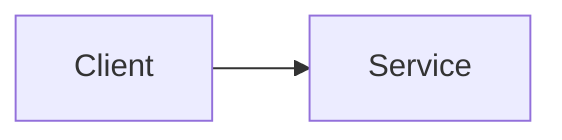

# NN — Fundamental name

> **Tier:** 1 | 2 | 3 · **Milestone:** Mn · **Status:** planned | implemented

## What

One paragraph: what the fundamental is, in plain words.

## Why

The problem it solves, and what goes wrong without it.

## How it's built here

Which components implement it in this repo. Link code and manifests with absolute GitHub URLs, e.g. `https://github.com/Eyal-Avni/microservices-lab/blob/main/services/catalog/...`.

**Diagram description:** What the diagram shows, in prose, for readers who can't see it (the learning pack is text-only).

## See it

Commands, URLs and dashboards that show it working.

## Break it

The lab(s) for this fundamental, linked relatively (for example `../labs/<lab-name>.md`).

## Trade-offs

Costs, failure modes, when not to use it, and the alternatives.

## Big-tech examples

Who uses it and how, with sources.

## Further reading

- A book, article or talk, with a link.

## Check your understanding

1. A question answerable from this page.
2. A second question.
3. A third question.
