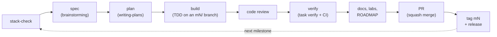

# How we work

This page covers the development workflow and the tooling that keeps code and docs in step. Update it whenever `scripts/`, `.claude/`, `.github/`, `Taskfile.yml` or the `Tiltfile` change; the docs-freshness checks point here.

## The milestone loop

**Diagram description:** Every milestone runs the same loop.

1. `stack-check` confirms the current versions of the components involved.
2. A design spec is brainstormed, then turned into a step-by-step plan.
3. The plan is built test-first on a milestone branch and reviewed.
4. The result is verified with `task verify` and CI.
5. The docs, labs and the ROADMAP are updated.
6. The work is squash-merged through a pull request, then tagged and released.

The next milestone starts again with `stack-check`.

## Branches, commits and pull requests

- `main` is protected. Changes land through pull requests only, and the `ci-ok` check must pass.
- Branches are named `mN/<slug>`, for example `m1/walking-skeleton`.
- Commits follow Conventional Commits, with the service or area as the scope (`feat(catalog): …`, `docs: …`, `ci: …`).
- Pull requests are squash-merged. Each milestone ends with a tag `mN` and a GitHub Release.

## Docs freshness: five layers

| Layer | Where | Behaviour |
|---|---|---|
| 1. Claude Code hook | `.claude/hooks/docs-guard.mjs` (PreToolUse on Bash and PowerShell) | On `main`, denies a `git commit` that changes code without docs, and suggests pages. On other branches it allows the commit and reminds Claude. |
| 2. git hook | `.githooks/commit-msg` runs `scripts/docs-drift.mjs --staged` | The same rule for every local commit. `task setup` enables it. |
| 3. CI | the `docs-drift` job in `ci.yml` (`--range origin/main...HEAD`) | Fails a PR that changes code without docs, unless the PR has the `skip-docs` label. Required through `ci-ok`. |
| 4. Generated references | regenerate-and-diff in CI | Starts once generated docs exist (M1 and later). |
| 5. Semantic audit | the `docs-auditor` agent, plus the PR template checklist | Run before every milestone PR. |

How paths are classified:

- **Code:** `services/`, `libs/`, `proto/`, `deploy/`, `infra/`, `scripts/`, `.github/`, `.claude/`, `Taskfile.yml`, `Tiltfile`.
- **Docs:** `docs/` (except `docs/superpowers/`), `ROADMAP.md`, `README.md`.

To skip the check for a single commit, put `[skip-docs]` in its message.

## Claude Code tooling

| Kind | Name | Purpose |
|---|---|---|
| Hook | `session-context` | At session start, prints the current milestone, open DoD items, spec and plan (read from ROADMAP.md) |
| Hook | `docs-guard` | Docs-freshness layer 1 (above) |
| Skill | `roadmap` (manual: `/roadmap`) | Start, finish or defer a milestone without breaking ROADMAP.md's format |
| Skill | `adr` | Record a decision as a numbered MADR record |
| Skill | `update-docs` | Update the right pages after a change |
| Skill | `stack-check` | Verify versions, licenses and maintenance status before a milestone |
| Agent | `docs-auditor` | Read-only audit of the docs against the code before a PR |
| Rules | `.claude/rules/docs.md`, `.claude/rules/github-actions.md`, `.claude/rules/stack-tools.md` | Conventions loaded when editing matching files. `stack-tools` keeps [Tools explained](tools-explained.md) current whenever a tool is added, replaced or removed. |
| MCP | Context7 (`.mcp.json`) | Up-to-date library documentation |
| Settings | `.claude/settings.json` | Explanatory output style; deny rules for force-push, `--no-verify` and `.env` reads; hook registration |

## CI

| Workflow | Job | What it does |
|---|---|---|
| `ci.yml` | `changes` | Path filters decide which jobs run |
| `ci.yml` | `docs` | markdownlint, Docusaurus build |
| `ci.yml` | `docs-drift` | On pull requests only: code changes need docs changes |
| `ci.yml` | `tooling` | `node --test` for the scripts and the hooks |
| `ci.yml` | `ci-ok` | Always runs; fails if any job failed or was cancelled. This is the only required check. |
| `pages.yml` | build + deploy | Publishes the site to GitHub Pages when a push to `main` changes the docs or the site, or on demand |
| `links.yml` | lychee | External link check: weekly, on demand, and on pull requests that change Markdown. Not required. |

## Commands

| Command | Purpose |
|---|---|
| `task setup` | One-time: git hooks path, `autocrlf=false`, `pnpm install` |
| `task test` | All automated tests |
| `task docs:lint`, `task docs:build`, `task docs:dev` | Docs lint, site build, live site |
| `task verify` | The current milestone's proof |
| `node scripts/docs-drift.mjs --staged` | Shows what the docs guard sees for the staged change |

## Windows notes

- The repo path has no spaces on purpose, and line endings are LF (enforced by `.gitattributes`).
- In PowerShell use `curl.exe`, not `curl`. `jq` isn't installed: parse JSON with Node or `gh --jq`.
- A newly installed tool only appears in new terminals, so restart VS Code after installing.
