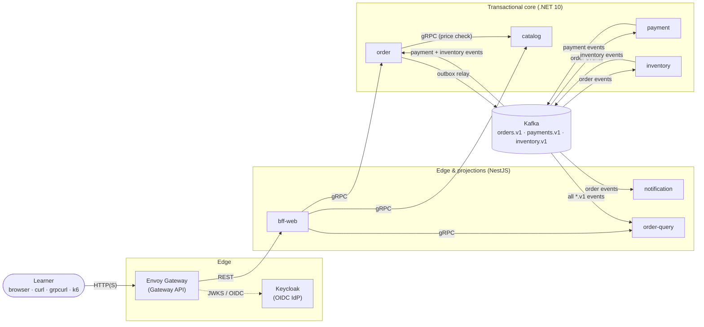

# Architecture overview

The Microservices Lab is a toy commerce system split into seven small services: catalog, orders, payments, inventory and notifications, plus a BFF and a query service. The business rules are trivial on purpose. The services exist to give real patterns something to act on:

- synchronous gRPC calls and an event backbone;
- a saga with compensations, and CQRS;
- caching, and an API gateway with authentication and rate limits;
- a service mesh, observability and GitOps.

> **Status (M0):** nothing runs yet. This page describes the target architecture, and each milestone in the [roadmap](https://github.com/Eyal-Avni/microservices-lab/blob/main/ROADMAP.md) builds a slice of it. The full design is in the [system design spec](../superpowers/specs/2026-09-30-microservices-lab-design.md).

## The big picture

**Diagram description:**

- Clients reach the system only through the Envoy-based gateway. The gateway checks identity against Keycloak and forwards REST calls to bff-web.
- bff-web calls catalog, order and order-query synchronously over gRPC, and order calls catalog to check prices.
- Everything after an order is placed is asynchronous, through Kafka:
  - order publishes order events through its transactional outbox;
  - payment and inventory react to those events and publish their own results;
  - order consumes the results to confirm or cancel the order;
  - notification reacts to final order events;
  - order-query consumes every `*.v1` topic to build a read model.
- Each service's private database and cache are not drawn.

## Services

| Service | Language | Role | Talks to |
|---|---|---|---|
| bff-web | Node 24 + NestJS | Backend-for-frontend: the REST API for clients; combines data from several services | catalog, order, order-query (gRPC) |
| catalog | .NET 10 | Products and prices, with a cache | — |
| order | .NET 10 | Places orders and decides the saga's outcome | catalog (gRPC), Kafka |
| payment | .NET 10 | Authorizes and refunds payments | Kafka |
| inventory | .NET 10 | Reserves and releases stock | Kafka |
| notification | Node 24 + NestJS | Reacts to final order outcomes | Kafka |
| order-query | Node 24 + NestJS | CQRS read model: an order timeline built from all events | Kafka |

Every service exposes the same small contract:

- `/info` (metadata and status), `/healthz` and `/readyz`;
- HTTP on port 8080 and gRPC on port 8081;
- OpenTelemetry traces, metrics and logs;
- graceful shutdown.

## How an order flows

1. A client calls the API gateway. The gateway checks the token and rate limits, then routes the call to bff-web.
2. bff-web calls the services it needs over gRPC, each call with a deadline.
3. Placing an order returns immediately with **202 Accepted**. The rest happens asynchronously, as a choreographed saga:
   1. order publishes an event through its outbox;
   2. payment and inventory react in parallel;
   3. order confirms or cancels the order.
4. notification and order-query consume the same events. notification "sends" (logs) messages; order-query builds the timeline you can query.

## The platform around the services

| Concern | Tooling | Arrives in |
|---|---|---|
| Local Kubernetes | kind, Tilt, Taskfile | M1 |
| Edge | Gateway API + Envoy Gateway | M1 (auth and rate limits in M7) |
| Contracts | Protobuf + Buf | M1 |
| Observability | OpenTelemetry → Prometheus, Loki, Tempo, Grafana | M2 |
| Data | PostgreSQL (CloudNativePG), Valkey | M3 |
| Events | Kafka (Strimzi), Apicurio schema registry | M4 |
| Delivery | GitHub Actions + GHCR (M1), Argo CD (M9), Argo Rollouts (M10), OpenTofu (M9, M14) | M1–M14 |
| Mesh | Istio ambient, Kiali | M11 |
| Security and policy | External Secrets + OpenBao, cosign, Kyverno | M12 |

Versions and licenses are on the [tech stack](tech-stack.md) page.
