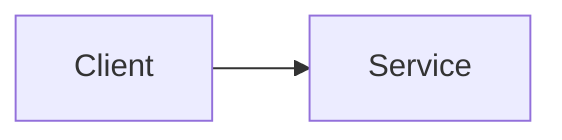
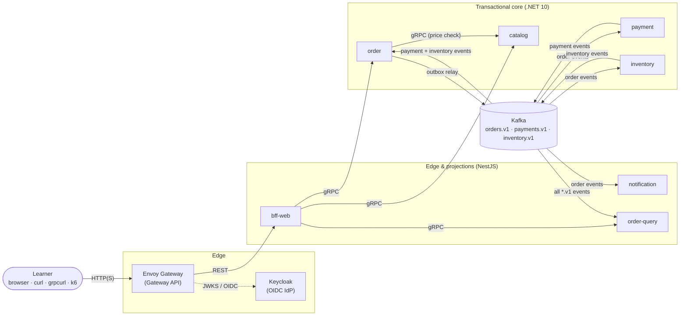
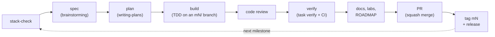

# M0 Foundation Implementation Plan

> **For agentic workers:** REQUIRED SUB-SKILL: Use superpowers:executing-plans (the learner chose **Native** execution) to implement this plan task-by-task. Steps use checkbox (`- [ ]`) syntax for tracking. After the last task on the branch, run one whole-branch review with superpowers:requesting-code-review before opening the PR.

**Goal:** Turn the empty `C:\microservices-lab` repo into a documented, tool-guarded, CI-checked public GitHub project: toolchain, ROADMAP, docs site, ADRs, docs-freshness enforcement, Claude Code tooling. No product code yet.

**Architecture:**
- Docs live in `docs/`, are published by a Docusaurus site in `website/`, and are guarded by dependency-free Node scripts in `scripts/`.
- Those scripts are shared by three docs-freshness layers: a Claude Code hook, a git `commit-msg` hook, and CI.
- `ROADMAP.md` is a parseable contract. The SessionStart hook reads it, and a contract test in `task test` guards its format. Later, `task doctor` (M1) and `docs-check` (M2) read it too.

**Trimmed scope (the learner's choice, 2026-10-01):** `task doctor` moves to M1 and `docs-check` to M2, and the skills are proven through real use instead of formal subagent tests. Tasks 8 and 9 stay as short "moved" notes, so the task numbers don't change.

**Tech stack:**

| Area | Choice |
|---|---|
| Tooling scripts | Node 24 (`node:test`, `node:util` `parseArgs`, `import.meta.main`) |
| Package manager | pnpm 12.8.1 |
| Task runner | Task (go-task) |
| Docs site | Docusaurus 3.10.2 with Mermaid and `@docusaurus/faster` |
| Docs lint | markdownlint-cli2 0.23.3 |
| CI and hosting | GitHub Actions (actions pinned by SHA), GitHub Pages, gh CLI |

**Spec:** `docs/superpowers/specs/2026-09-30-microservices-lab-design.md`. Its M0 row in §14 and §12, §13 and §17 are the requirements. The approved master plan is `docs/superpowers/plans/2026-09-30-microservices-lab-plan.md`.

## Global Constraints

**Repository**
- Repo root: `C:\microservices-lab`. GitHub: `Eyal-Avni/microservices-lab`, public. Docs site: `https://eyal-avni.github.io/microservices-lab/`.
- Line endings are LF (`.gitattributes` already enforces it). The repo-local `core.autocrlf` is `false`.

**Branch and commits**
- Work branch: `m0/foundation`. Only Task 2 commits directly to `main` (before protection exists). Task 16 uses `m0/close`.
- Every commit uses Conventional Commits (`feat|fix|docs|ci|chore(<scope>): …`) and ends with this trailer line, passed as a second `-m`:
  `Co-Authored-By: Claude Opus 5.5 (1M context) <noreply@anthropic.com>`
- PR bodies end with `🤖 Generated with [Claude Code](https://claude.com/claude-code)`.

**Versions (verified 2026-10-01)**

| Item | Version |
|---|---|
| Node | ≥ 24.2 (installed: 24.21.0) |
| pnpm | 12.8.1 |
| `@docusaurus/*` | 3.10.2 |
| react / react-dom | 19.3.0 |
| prism-react-renderer | 2.4.1 |
| @mdx-js/react | 3.1.1 |
| clsx | 2.1.1 |
| markdownlint-cli2 | 0.23.3 |

**Action pins** (`uses: owner/repo@<sha> # <tag>`):

| Action | Tag | SHA |
|---|---|---|
| actions/checkout | v7.0.1 | `3d3c42e5aac5ba805825da76410c181273ba90b1` |
| actions/setup-node | v7.0.0 | `820762786026740c76f36085b0efc47a31fe5020` |
| pnpm/action-setup | v6.1.0 | `ea17c68df8912ef543352723c149a84f56e3d413` |
| dorny/paths-filter | v4.0.3 | `ceb8a2b8f2d89434be7ff52d3de7ec3738c5cc9d` |
| actions/configure-pages | v6.0.0 | `45bfe0192ca1faeb007ade9deae92b16b8254a0d` |
| actions/upload-pages-artifact | v5.0.0 | `fc324d3547104276b827a68afc52ff2a11cc49c9` |
| actions/deploy-pages | v5.0.1 | `368f82528645a54fb793d4d04e342629a3f51346` |
| lycheeverse/lychee-action | v2.9.0 | `e7477775783ea5526144ba13e8db5eec57747ce8` |

**Scripts and tooling**
- `scripts/**` and `.claude/hooks/**` use Node built-ins only: no npm dependencies. Tests are `*.test.mjs`, run with `node --test`.
- `jq` is not installed. Parse JSON with Node or `gh … --jq`.
- In PowerShell, call `curl.exe`, never `curl` (an alias for `Invoke-WebRequest`).
- Tools installed into new PATH directories show up only in new processes. In a command that needs them, refresh first:
  `$env:Path = [Environment]::GetEnvironmentVariable('Path','Machine') + ';' + [Environment]::GetEnvironmentVariable('Path','User')`

**Docs rules (spec §12)**
- Every Mermaid block is followed by a paragraph starting `**Diagram description:**`.
- Pages inside `docs/` link to each other relatively. They never use a relative link to a file outside `docs/`: use `https://github.com/Eyal-Avni/microservices-lab/blob/main/<path>` instead.
- `docs/_templates/` is excluded from the site, because of Docusaurus's default `_` exclude.

**ROADMAP contract**
- Line 3 (after `# Roadmap` and a blank line) is: `**Current milestone:** M<n> — <goal> · <status>`.
- Statuses: `planned`, `in-progress`, `done`, `deferred`.
- Table header: `| M | Goal | Fundamentals | Status | Spec | Plan | Tag |`.
- This is a small, deliberate clarification of the spec's "first line" wording, so that markdownlint and GitHub rendering keep a title. Task 5 updates the spec sentence.

## Review Focus

Most likely first:

1. **Unusual `git commit` shapes.** For example `git -C "C:/microservices-lab" commit -q -F -`, `git add -A && git commit -m …`, PowerShell `git -C 'C:\…' commit -m '…'`, and `git commit -am`. The docs guard must recognise all of them and must not trigger on `git commit-tree` or `git log --grep commit`. Tests are in Task 6.
2. **Windows inputs.** Backslash paths and CRLF files (ROADMAP edited by a Windows tool) must classify and parse the same as POSIX/LF. Tests are in Task 3 and Task 5.
3. **Repository states.** No commits yet, a detached HEAD, or a cwd that is not a git repo. The guard must fail open (no output, exit 0) and the CLI must not crash. Tests are in Task 4 and Task 6.
4. **ROADMAP edits that break the contract.** A missing current line, two `in-progress` rows, an unknown status, or a current line that disagrees with its row. The roadmap parser must report each one. Tests are in Task 5.
5. **A ROADMAP-only change.** Someone edits only `ROADMAP.md` and breaks its format. CI must still run the contract test, so the `tooling` path filter includes `ROADMAP.md` (Task 14).

## File Structure

| File | Responsibility | Task |
|---|---|---|
| `scripts/lib/docs-rules.mjs` | Classify paths (code / docs / other) and suggest docs pages | 3 |
| `scripts/lib/git.mjs` | Thin git wrappers: branch, staged, worktree, range | 4 |
| `scripts/lib/testing.mjs` | Test helper: temporary git repos | 4 |
| `scripts/docs-drift.mjs` | CLI used by the git hook and CI (`--staged`, `--range`) | 4 |
| `.githooks/commit-msg` | Docs-freshness layer 2 | 4 |
| `package.json`, `pnpm-workspace.yaml`, `.nvmrc`, `.editorconfig`, `Taskfile.yml` | Repo tooling root | 4, extended in 8, 9 and 13 |
| `scripts/lib/roadmap.mjs` | Parse ROADMAP; open DoD items; session summary | 5 |
| `ROADMAP.md` | The plan of plans | 5 |
| `.claude/hooks/session-context.mjs` | SessionStart hook | 5 |
| `.claude/hooks/docs-guard.mjs` | PreToolUse hook, docs-freshness layer 1 | 6 |
| `.claude/settings.json` | Output style, deny rules, hook registration | 6 |
| `docs/**` (start page, templates, architecture, fundamentals index, glossary, runbook, `_category_.json`) | Docs skeleton | 7 |
| `scripts/lib/docs-checks.mjs`, `scripts/docs-check.mjs` | Structural docs checks | moved to M2 |
| `scripts/doctor.mjs` | Toolchain and environment checks | moved to M1 |
| `docs/adr/*` | ADR index and ADRs 0001–0012 | 10 |
| `docs/architecture/tools-explained.md` | Every tool in plain words (the learner's rule) | written in stage 1, committed in 7 |
| `CLAUDE.md`, `.claude/rules/*.md` (`docs`, `github-actions`, `stack-tools`), `.mcp.json`, `README.md`, `LICENSE` | Claude guidance and repo front door | 11 |
| `.claude/skills/{roadmap,adr,update-docs,stack-check}/SKILL.md`, `.claude/agents/docs-auditor.md` | Claude skills and agent | 12 |
| `website/*`, `.markdownlint-cli2.jsonc` | Docs site and lint | 13 |
| `.github/workflows/{ci,pages,links}.yml`, `.github/pull_request_template.md` | CI | 14 |

Task order: 1 toolchain → 2 publish → 3–6 guard libraries and hooks → 7 docs → (8 and 9 moved to M2 and M1) → 10–12 content and Claude tooling → 13 site → 14 CI and PR → 15 merge and protect → 16 new-session proof, close and tag.

---

### Task 1: Install the toolchain

Changes the machine only; no repo files. Every install asks for the learner's approval.

**Interfaces:**
- **Produces** these commands on PATH: `node` ≥ 24.2, `pnpm` 12.8.1, `task`, `dotnet` (SDK 10), `kubectl`, `kind`, `helm`, `buf`, `grpcurl`, `k9s`, `tilt`.

- [x] **Step 1: Install the winget packages.** Done 2026-10-01, every installer hash verified.

| Package | Installed version |
|---|---|
| kubectl | 1.37.1 |
| kind | 0.33.0 |
| Helm | 4.3.0 |
| Task | 3.53.1 |
| Buf | 1.73.0 |
| grpcurl | 1.9.3 |
| k9s | 0.51.0 |
| .NET SDK | 10.0.401 | Use PowerShell. These install to user scope; the .NET SDK may show a UAC prompt.

```powershell
$ids = 'Microsoft.DotNet.SDK.10','Kubernetes.kubectl','Kubernetes.kind','Helm.Helm','Task.Task','bufbuild.buf','fullstorydev.grpcurl','Derailed.k9s'
foreach ($id in $ids) { winget install --id $id --exact --source winget --accept-package-agreements --accept-source-agreements --disable-interactivity }
```

Expected: each package reports `Successfully installed` or `Found an existing package already installed`.

- [x] **Step 2: Install Node 24 and pnpm.** Done 2026-10-01:
  - Node v24.21.0 is active through nvm 1.2.2; Node 20.17.0 is kept.
  - pnpm 12.8.1 was installed globally into `%APPDATA%\npm`.
  - `npm` resolves to the npm 11.0.0 in that same folder, which was installed earlier. `nvm use` may show a UAC prompt, because nvm-windows switches a symlink.

```powershell
nvm install 24.21.0
nvm use 24.21.0
npm install --global pnpm@12.8.1
node --version; pnpm --version
```

Expected: `v24.21.0` and `12.8.1`.

- [x] **Step 3: Install Tilt.** Done 2026-10-01: v0.37.8, checksum verified.

The official `install.ps1` was read first. It puts `tilt.exe` in `$HOME\bin`, leaves temporary files in the current folder, and does **not** add `$HOME\bin` to PATH. So the same steps were run by hand: download the release from GitHub, check its SHA-256 against the release's `checksums.txt`, copy `tilt.exe` to `$HOME\bin`, and append `$HOME\bin` to the user PATH. The PATH value keeps its `ExpandString` registry type.

```powershell
$tag = gh api repos/tilt-dev/tilt/releases/latest --jq .tag_name; $ver = $tag.TrimStart('v')
$zip = "tilt.$ver.windows.x86_64.zip"
gh release download $tag --repo tilt-dev/tilt --pattern $zip --pattern 'checksums.txt' --dir $env:TEMP\tilt --clobber
# compare (Get-FileHash $env:TEMP\tilt\$zip -Algorithm SHA256).Hash with the line for $zip in checksums.txt
Expand-Archive $env:TEMP\tilt\$zip $env:TEMP\tilt\x -Force; New-Item -ItemType Directory -Force $HOME\bin | Out-Null
Copy-Item $env:TEMP\tilt\x\tilt.exe $HOME\bin -Force
```

- [x] **Step 4: Verify every tool from a refreshed PATH.** Done 2026-10-01. Every tool answered, and `kubectl` resolves to `…\WinGet\Links\kubectl.exe`.

```powershell
$env:Path = [Environment]::GetEnvironmentVariable('Path','Machine') + ';' + [Environment]::GetEnvironmentVariable('Path','User')
node --version; pnpm --version; task --version; dotnet --list-sdks
kubectl version --client; (Get-Command kubectl).Source
kind version; helm version --short; buf --version; grpcurl --version; k9s version --short; tilt version
```

Expected:

| Tool | Expected output |
|---|---|
| node | `v24.21.0` |
| pnpm | `12.8.1` |
| task | Task 3.x |
| dotnet | a `10.0.x` SDK line |
| kubectl | client v1.36 or newer, with `Source` under `…\WinGet\Links\` (not `…\Docker\…`) |
| kind | v0.30 or newer |
| helm | v4.x |
| buf, grpcurl, k9s, tilt | each prints a version |

If a tool is "not recognized", re-run its winget command once. If it still fails, stop and report the exact output.

### Task 2: Publish the repo and start the M0 branch

**Files:**
- Create: `docs/superpowers/plans/2026-10-01-m0-foundation.md` (a copy of this plan file)
- Commit: the untracked `docs/superpowers/plans/2026-09-30-microservices-lab-plan.md`. It is a byte-identical copy of the approved master plan, verified 2026-10-01.

**Interfaces:**
- **Produces:**
  - remote `origin` = `https://github.com/Eyal-Avni/microservices-lab.git`;
  - branch `m0/foundation` tracking `origin/m0/foundation`;
  - repo settings: squash-only merges, branches deleted on merge, secret scanning and push protection on, read-only default `GITHUB_TOKEN`.

- [ ] **Step 1: Save this plan into the repo**

```powershell
Copy-Item 'C:\Users\eyal6\.claude\plans\pasted-content-id-093c-this-is-humble-fountain.md' 'C:\microservices-lab\docs\superpowers\plans\2026-10-01-m0-foundation.md'
```

- [ ] **Step 2: Commit both plans on `main`**

```powershell
git -C C:\microservices-lab add docs/superpowers/plans
git -C C:\microservices-lab commit -m "docs: add approved master plan and M0 implementation plan" -m "Co-Authored-By: Claude Opus 5.5 (1M context) <noreply@anthropic.com>"
```

Expected: `2 files changed`.

- [ ] **Step 3: Create the public GitHub repo and push**

```powershell
Set-Location C:\microservices-lab
gh repo create microservices-lab --public --source . --remote origin --push --description "Educational microservices lab: .NET + NestJS services on Kubernetes with Kafka, Envoy Gateway, Istio, OpenTelemetry and GitOps. Every pattern has docs and a break-it lab."
```

Expected: `✓ Created repository Eyal-Avni/microservices-lab on GitHub`, then `✓ Pushed commits`.

- [ ] **Step 4: Configure merge rules, secret scanning and token permissions**

```powershell
gh api -X PATCH repos/Eyal-Avni/microservices-lab -F allow_squash_merge=true -F allow_merge_commit=false -F allow_rebase_merge=false -F delete_branch_on_merge=true -f squash_merge_commit_title=PR_TITLE -f squash_merge_commit_message=PR_BODY -F has_wiki=false -F has_projects=false | Out-Null
'{"security_and_analysis":{"secret_scanning":{"status":"enabled"},"secret_scanning_push_protection":{"status":"enabled"}}}' | gh api -X PATCH repos/Eyal-Avni/microservices-lab --input - | Out-Null
gh api -X PUT repos/Eyal-Avni/microservices-lab/actions/permissions/workflow -f default_workflow_permissions=read -F can_approve_pull_request_reviews=false
```

- [ ] **Step 5: Verify the settings**

```powershell
gh api repos/Eyal-Avni/microservices-lab --jq '{visibility, squash: .allow_squash_merge, merge: .allow_merge_commit, rebase: .allow_rebase_merge, delete_branch: .delete_branch_on_merge, scanning: .security_and_analysis.secret_scanning.status, push_protection: .security_and_analysis.secret_scanning_push_protection.status}'
gh api repos/Eyal-Avni/microservices-lab/actions/permissions/workflow --jq .default_workflow_permissions
```

Expected:
- `{"delete_branch":true,"merge":false,"push_protection":"enabled","rebase":false,"scanning":"enabled","squash":true,"visibility":"public"}`
- then `read`.

- [ ] **Step 6: Create the M0 branch**

```powershell
git -C C:\microservices-lab switch -c m0/foundation
git -C C:\microservices-lab push -u origin m0/foundation
```

Expected: `branch 'm0/foundation' set up to track 'origin/m0/foundation'`.

### Task 3: Docs-rules library (path classification and suggestions)

**Files:**
- Create: `scripts/lib/docs-rules.mjs`
- Test: `scripts/lib/docs-rules.test.mjs`

**Interfaces:**
- **Produces:**
  - `normalizePath(p: string): string`
  - `classify(p: string): 'code' | 'docs' | 'other'`
  - `evaluate(paths: string[]): { code: string[], docs: string[], needsDocs: boolean }`
  - `suggestDocs(codePaths: string[]): string[]`
  - `SKIP_MARKER = '[skip-docs]'`

- [ ] **Step 1: Write the failing test**

```js
// scripts/lib/docs-rules.test.mjs
import { test } from 'node:test';
import assert from 'node:assert/strict';
import { classify, evaluate, normalizePath, suggestDocs, SKIP_MARKER } from './docs-rules.mjs';

test('code paths are classified as code', () => {
  for (const p of [
    'services/catalog/src/Program.cs', 'libs/node/platform/index.ts', 'proto/buf.yaml',
    'deploy/kind/cluster.yaml', 'infra/tofu/local/main.tf', 'scripts/docs-drift.mjs',
    '.github/workflows/ci.yml', '.claude/settings.json', '.claude/hooks/docs-guard.mjs',
    'Taskfile.yml', 'Tiltfile',
  ]) assert.equal(classify(p), 'code', p);
});

test('docs paths are classified as docs', () => {
  for (const p of ['docs/architecture/overview.md', 'docs/adr/0001-x.md', 'docs/_templates/lab.md',
    'docs/fundamentals/_category_.json', 'ROADMAP.md', 'README.md']) assert.equal(classify(p), 'docs', p);
});

test('specs and plans are design history, not docs', () => {
  assert.equal(classify('docs/superpowers/specs/2026-09-30-x.md'), 'other');
  assert.equal(classify('docs/superpowers/plans/2026-10-01-y.md'), 'other');
});

test('everything else is other', () => {
  for (const p of ['.gitignore', 'package.json', 'pnpm-lock.yaml', 'website/docusaurus.config.js',
    '.claude/settings.local.json', 'CLAUDE.md', '']) assert.equal(classify(p), 'other', p);
});

test('windows separators and ./ prefixes are normalized', () => {
  assert.equal(normalizePath('.\\services\\catalog\\a.cs'), 'services/catalog/a.cs');
  assert.equal(classify('services\\catalog\\a.cs'), 'code');
  assert.equal(classify('./docs/index.md'), 'docs');
});

test('evaluate: code without docs needs docs', () => {
  const r = evaluate(['scripts/x.mjs', 'package.json']);
  assert.deepEqual(r.code, ['scripts/x.mjs']);
  assert.deepEqual(r.docs, []);
  assert.equal(r.needsDocs, true);
});

test('evaluate: code with docs, docs only, or other only never needs docs', () => {
  assert.equal(evaluate(['scripts/x.mjs', 'docs/architecture/dev-workflow.md']).needsDocs, false);
  assert.equal(evaluate(['docs/index.md']).needsDocs, false);
  assert.equal(evaluate(['package.json', 'docs/superpowers/plans/p.md']).needsDocs, false);
  assert.equal(evaluate([]).needsDocs, false);
});

test('suggestDocs maps code areas to pages and de-duplicates', () => {
  assert.deepEqual(suggestDocs(['services/catalog/a.cs', 'services/catalog/b.cs']), ['docs/services/catalog.md']);
  assert.deepEqual(suggestDocs(['deploy/platform/envoy-gateway/values.yaml']),
    ['docs/fundamentals/ (concept page for envoy-gateway)']);
  assert.deepEqual(suggestDocs(['deploy/kind/cluster.yaml']), ['docs/architecture/environments.md']);
  assert.deepEqual(suggestDocs(['scripts/a.mjs', '.claude/hooks/b.mjs', 'Taskfile.yml', '.github/workflows/ci.yml']),
    ['docs/architecture/dev-workflow.md']);
  assert.deepEqual(suggestDocs(['proto/commerce/catalog/v1/catalog.proto']),
    ['docs/reference/ (regenerate the API reference)']);
});

test('skip marker is [skip-docs]', () => assert.equal(SKIP_MARKER, '[skip-docs]'));
```

- [ ] **Step 2: Run the test and see it fail**

Run: `node --test scripts/lib/docs-rules.test.mjs`

Expected: FAIL with `Cannot find module '…/docs-rules.mjs'`.

- [ ] **Step 3: Write the implementation**

```js
// scripts/lib/docs-rules.mjs
// Shared rules for the docs-freshness checks (spec §12.6): which paths are "code", which are "docs",
// and which docs pages a code change probably affects. Used by docs-drift.mjs (git hook + CI)
// and by the Claude Code docs-guard hook.

export const SKIP_MARKER = '[skip-docs]';

const CODE_PREFIXES = ['services/', 'libs/', 'proto/', 'deploy/', 'infra/', 'scripts/', '.github/', '.claude/'];
const CODE_FILES = new Set(['Taskfile.yml', 'Tiltfile']);
const DOC_FILES = new Set(['ROADMAP.md', 'README.md']);
const IGNORED = new Set(['.claude/settings.local.json']);

export function normalizePath(p) {
  return String(p).trim().replace(/\\/g, '/').replace(/^\.\//, '');
}

export function classify(path) {
  const p = normalizePath(path);
  if (p === '' || IGNORED.has(p)) return 'other';
  if (DOC_FILES.has(p)) return 'docs';
  if (p.startsWith('docs/')) return p.startsWith('docs/superpowers/') ? 'other' : 'docs';
  if (CODE_FILES.has(p) || CODE_PREFIXES.some((prefix) => p.startsWith(prefix))) return 'code';
  return 'other';
}

export function evaluate(paths) {
  const code = [];
  const docs = [];
  for (const raw of paths) {
    const p = normalizePath(raw);
    const kind = classify(p);
    if (kind === 'code') code.push(p);
    else if (kind === 'docs') docs.push(p);
  }
  return { code, docs, needsDocs: code.length > 0 && docs.length === 0 };
}

// First matching rule wins, so specific rules come before general ones.
const SUGGESTIONS = [
  [/^services\/([^/]+)\//, (m) => `docs/services/${m[1]}.md`],
  [/^libs\//, () => 'docs/architecture/overview.md'],
  [/^proto\//, () => 'docs/reference/ (regenerate the API reference)'],
  [/^deploy\/platform\/([^/]+)\//, (m) => `docs/fundamentals/ (concept page for ${m[1]})`],
  [/^deploy\//, () => 'docs/architecture/environments.md'],
  [/^infra\//, () => 'docs/architecture/environments.md and docs/runbooks/'],
  [/^(?:scripts\/|\.claude\/|\.github\/|Taskfile\.yml$|Tiltfile$)/, () => 'docs/architecture/dev-workflow.md'],
];

export function suggestDocs(codePaths) {
  const out = new Set();
  for (const raw of codePaths) {
    const p = normalizePath(raw);
    for (const [re, toPage] of SUGGESTIONS) {
      const m = p.match(re);
      if (m) {
        out.add(toPage(m));
        break;
      }
    }
  }
  return [...out];
}
```

- [ ] **Step 4: Run the test and see it pass**

Run: `node --test scripts/lib/docs-rules.test.mjs`

Expected: `# pass 9`, `# fail 0`.

- [ ] **Step 5: Commit**

```powershell
git add scripts/lib/docs-rules.mjs scripts/lib/docs-rules.test.mjs
git commit -m "feat(tooling): add docs-rules path classification for docs freshness checks" -m "Co-Authored-By: Claude Opus 5.5 (1M context) <noreply@anthropic.com>"
```

### Task 4: Git helpers, `docs-drift` CLI, git `commit-msg` hook, repo tooling root

**Files:**
- Create: `package.json`, `pnpm-workspace.yaml`, `.nvmrc`, `.editorconfig`, `Taskfile.yml`
- Create: `scripts/lib/git.mjs`, `scripts/lib/testing.mjs`, `scripts/docs-drift.mjs`, `.githooks/commit-msg`
- Test: `scripts/lib/git.test.mjs`, `scripts/docs-drift.test.mjs`

**Interfaces:**
- **Consumes** from Task 3: `evaluate`, `suggestDocs`, `SKIP_MARKER`.
- **Produces:**
  - From `git.mjs`, all with `cwd` defaulting to `process.cwd()`:
    - `git(args: string[], cwd?): string`
    - `currentBranch(cwd?): string`, which returns `'HEAD'` when detached and works before the first commit
    - `stagedFiles(cwd?): string[]`
    - `worktreeChanges(cwd?): string[]` (modified, untracked and renamed-to paths)
    - `rangeFiles(range: string, cwd?): string[]`
  - From `testing.mjs`: `makeTempRepo(t): { dir: string, run(...args): string, write(path, content?): void }`. The repo is on `main` with one initial commit.
  - From `docs-drift.mjs`:
    - `decide({ files, branch?, message?, mode: 'staged'|'range' }): { exitCode: 0|1, text: string }`
    - `main(argv: string[]): 0|1|2`
  - The `Taskfile.yml` tasks `default`, `setup` and `test`.

- [ ] **Step 1: Create the repo tooling root files**

`package.json`:

```json
{
  "name": "microservices-lab",
  "private": true,
  "description": "Educational microservices lab: tooling root for the docs site and docs lint",
  "packageManager": "pnpm@12.8.1",
  "engines": {
    "node": ">=24.2"
  }
}
```

`pnpm-workspace.yaml`:

```yaml
# pnpm workspace. M0 has only the docs site; later milestones add libs/node/* and the Node services.
packages:
  - website
```

`.nvmrc`:

```text
24
```

`.editorconfig`:

```ini
root = true

[*]
charset = utf-8
end_of_line = lf
insert_final_newline = true
indent_style = space
indent_size = 2
trim_trailing_whitespace = true

[*.md]
trim_trailing_whitespace = false

[*.{ps1,cmd,bat}]
end_of_line = crlf

[*.{cs,csproj,props,targets}]
indent_size = 4
```

- [ ] **Step 2: Write the test helper**

This is not itself a test file; the name does not match `*.test.mjs`.

```js
// scripts/lib/testing.mjs
// Test-only helpers: throwaway git repositories in the OS temp folder, removed after each test.
import { execFileSync } from 'node:child_process';
import { mkdirSync, mkdtempSync, rmSync, writeFileSync } from 'node:fs';
import { tmpdir } from 'node:os';
import { dirname, join } from 'node:path';

export function makeTempRepo(t) {
  const dir = mkdtempSync(join(tmpdir(), 'mslab-'));
  t.after(() => rmSync(dir, { recursive: true, force: true }));
  const run = (...args) =>
    execFileSync('git', args, { cwd: dir, encoding: 'utf8', stdio: ['ignore', 'pipe', 'pipe'] });
  const write = (path, content = 'x\n') => {
    const full = join(dir, path);
    mkdirSync(dirname(full), { recursive: true });
    writeFileSync(full, content);
  };
  run('init', '-q', '-b', 'main');
  run('config', 'user.name', 'Test');
  run('config', 'user.email', 'test@example.com');
  run('config', 'commit.gpgsign', 'false');
  write('README.md', '# temp\n');
  run('add', '.');
  run('commit', '-q', '-m', 'init');
  return { dir, run, write };
}
```

- [ ] **Step 3: Write the failing git-helper tests**

```js
// scripts/lib/git.test.mjs
import { test } from 'node:test';
import assert from 'node:assert/strict';
import { execFileSync } from 'node:child_process';
import { mkdtempSync, rmSync } from 'node:fs';
import { tmpdir } from 'node:os';
import { join } from 'node:path';
import { currentBranch, rangeFiles, stagedFiles, worktreeChanges } from './git.mjs';
import { makeTempRepo } from './testing.mjs';

test('currentBranch works before the first commit', (t) => {
  const dir = mkdtempSync(join(tmpdir(), 'mslab-'));
  t.after(() => rmSync(dir, { recursive: true, force: true }));
  execFileSync('git', ['init', '-q', '-b', 'main'], { cwd: dir });
  assert.equal(currentBranch(dir), 'main');
});

test('currentBranch returns HEAD when detached', (t) => {
  const repo = makeTempRepo(t);
  repo.run('switch', '-q', '--detach');
  assert.equal(currentBranch(repo.dir), 'HEAD');
});

test('stagedFiles lists only staged paths', (t) => {
  const repo = makeTempRepo(t);
  repo.write('scripts/a.mjs');
  repo.write('docs/b.md');
  repo.run('add', 'scripts/a.mjs');
  assert.deepEqual(stagedFiles(repo.dir), ['scripts/a.mjs']);
});

test('worktreeChanges includes renamed, untracked and space-containing paths', (t) => {
  const repo = makeTempRepo(t);
  repo.run('mv', 'README.md', 'INTRO.md');
  repo.write('notes.txt');
  repo.write('scripts/new file.mjs');
  assert.deepEqual(worktreeChanges(repo.dir).sort(), ['INTRO.md', 'notes.txt', 'scripts/new file.mjs']);
});

test('rangeFiles lists files changed on a branch', (t) => {
  const repo = makeTempRepo(t);
  repo.run('switch', '-q', '-c', 'feature');
  repo.write('scripts/x.mjs');
  repo.run('add', '.');
  repo.run('commit', '-q', '-m', 'x');
  assert.deepEqual(rangeFiles('main...HEAD', repo.dir), ['scripts/x.mjs']);
});
```

Run: `node --test scripts/lib/git.test.mjs`

Expected: FAIL with `Cannot find module '…/git.mjs'`.

- [ ] **Step 4: Implement the git helpers**

```js
// scripts/lib/git.mjs
// Minimal git wrappers for the tooling scripts. -z output avoids git's quoting of unusual paths.
import { execFileSync } from 'node:child_process';

export function git(args, cwd = process.cwd()) {
  return execFileSync('git', args, { cwd, encoding: 'utf8', stdio: ['ignore', 'pipe', 'pipe'] });
}

const nulList = (out) => out.split('\0').filter(Boolean);

export function currentBranch(cwd = process.cwd()) {
  try {
    return git(['symbolic-ref', '--quiet', '--short', 'HEAD'], cwd).trim();
  } catch {
    return 'HEAD'; // detached HEAD
  }
}

export function stagedFiles(cwd = process.cwd()) {
  return nulList(git(['diff', '--cached', '--name-only', '-z'], cwd));
}

export function worktreeChanges(cwd = process.cwd()) {
  const entries = git(['status', '--porcelain=v1', '-z', '--untracked-files=all'], cwd).split('\0');
  const files = [];
  for (let i = 0; i < entries.length; i++) {
    const entry = entries[i];
    if (!entry) continue;
    files.push(entry.slice(3));
    if (entry[0] === 'R' || entry[0] === 'C') i++; // the next entry is the original path
  }
  return files;
}

export function rangeFiles(range, cwd = process.cwd()) {
  return nulList(git(['diff', '--name-only', '-z', range], cwd));
}
```

Run: `node --test scripts/lib/git.test.mjs`

Expected: `# pass 5`, `# fail 0`.

- [ ] **Step 5: Write the failing `docs-drift` tests**

```js
// scripts/docs-drift.test.mjs
import { test } from 'node:test';
import assert from 'node:assert/strict';
import { spawnSync } from 'node:child_process';
import { writeFileSync } from 'node:fs';
import { join } from 'node:path';
import { decide } from './docs-drift.mjs';
import { makeTempRepo } from './lib/testing.mjs';

const CLI = join(import.meta.dirname, 'docs-drift.mjs');
const cli = (cwd, ...args) => spawnSync(process.execPath, [CLI, ...args], { cwd, encoding: 'utf8' });

test('decide blocks code-only changes on main and suggests pages', () => {
  const r = decide({ files: ['scripts/x.mjs'], branch: 'main', mode: 'staged' });
  assert.equal(r.exitCode, 1);
  assert.match(r.text, /docs\/architecture\/dev-workflow\.md/);
});

test('decide only reminds on other branches', () => {
  const r = decide({ files: ['scripts/x.mjs'], branch: 'm1/skeleton', mode: 'staged' });
  assert.equal(r.exitCode, 0);
  assert.match(r.text, /reminder only on branch m1\/skeleton/);
});

test('decide always blocks in range mode', () => {
  assert.equal(decide({ files: ['services/catalog/a.cs'], mode: 'range' }).exitCode, 1);
});

test('decide is silent when docs changed too, and honours [skip-docs]', () => {
  assert.deepEqual(decide({ files: ['scripts/x.mjs', 'ROADMAP.md'], branch: 'main', mode: 'staged' }), { exitCode: 0, text: '' });
  const skipped = decide({ files: ['scripts/x.mjs'], branch: 'main', message: 'chore: bump [skip-docs]', mode: 'staged' });
  assert.equal(skipped.exitCode, 0);
  assert.match(skipped.text, /skipped/);
});

test('cli --staged blocks a code-only commit on main', (t) => {
  const repo = makeTempRepo(t);
  repo.write('scripts/tool.mjs');
  repo.run('add', '.');
  const r = cli(repo.dir, '--staged');
  assert.equal(r.status, 1, r.stderr);
  assert.match(r.stderr, /1 code file\(s\) changed/);
});

test('cli --staged only reminds on a branch', (t) => {
  const repo = makeTempRepo(t);
  repo.run('switch', '-q', '-c', 'm1/skeleton');
  repo.write('scripts/tool.mjs');
  repo.run('add', '.');
  const r = cli(repo.dir, '--staged');
  assert.equal(r.status, 0);
  assert.match(r.stderr, /reminder only/);
});

test('cli --commit-msg-file honours [skip-docs]', (t) => {
  const repo = makeTempRepo(t);
  repo.write('scripts/tool.mjs');
  repo.run('add', '.');
  const msg = join(repo.dir, '.git', 'COMMIT_EDITMSG');
  writeFileSync(msg, 'chore: tooling only [skip-docs]\n');
  assert.equal(cli(repo.dir, '--staged', '--commit-msg-file', msg).status, 0);
});

test('cli --include-worktree also sees files that are not staged yet', (t) => {
  const repo = makeTempRepo(t);
  repo.write('scripts/tool.mjs');
  assert.equal(cli(repo.dir, '--staged').status, 0);
  assert.equal(cli(repo.dir, '--staged', '--include-worktree').status, 1);
});

test('cli --range blocks a code-only branch diff', (t) => {
  const repo = makeTempRepo(t);
  repo.run('switch', '-q', '-c', 'feature');
  repo.write('services/catalog/a.cs');
  repo.run('add', '.');
  repo.run('commit', '-q', '-m', 'feat: code only');
  const r = cli(repo.dir, '--range', 'main...HEAD');
  assert.equal(r.status, 1);
  assert.match(r.stderr, /docs\/services\/catalog\.md/);
});

test('cli without a mode prints usage and exits 2', (t) => {
  const repo = makeTempRepo(t);
  const r = cli(repo.dir);
  assert.equal(r.status, 2);
  assert.match(r.stderr, /Usage/);
});
```

Run: `node --test scripts/docs-drift.test.mjs`

Expected: FAIL with `Cannot find module '…/docs-drift.mjs'`.

- [ ] **Step 6: Implement `docs-drift`**

```js
#!/usr/bin/env node
// docs-drift: docs-freshness check for the git commit-msg hook (--staged) and CI (--range). Spec §12.6, layers 2-3.
// Exit codes: 0 = fine or reminder only, 1 = code changed without docs (blocking), 2 = usage error.
import { readFileSync } from 'node:fs';
import { parseArgs } from 'node:util';
import { evaluate, suggestDocs, SKIP_MARKER } from './lib/docs-rules.mjs';
import { currentBranch, rangeFiles, stagedFiles, worktreeChanges } from './lib/git.mjs';

const USAGE = `Usage:
  node scripts/docs-drift.mjs --staged [--commit-msg-file <file> | --message <text>] [--include-worktree]
  node scripts/docs-drift.mjs --range <base>...<head> [--skip]`;

export function decide({ files, branch = '', message = '', mode }) {
  if (message.includes(SKIP_MARKER)) {
    return { exitCode: 0, text: `docs-drift: skipped (${SKIP_MARKER} in the commit message).` };
  }
  const { code, needsDocs } = evaluate(files);
  if (!needsDocs) return { exitCode: 0, text: '' };
  const blocking = mode === 'range' || branch === 'main';
  const summary = `${code.length} code file(s) changed but no docs/ or ROADMAP.md file did.`;
  const lines = [
    blocking ? `docs-drift: ${summary}` : `docs-drift (reminder only on branch ${branch}): ${summary}`,
    ...code.slice(0, 10).map((f) => `  code: ${f}`),
    ...(code.length > 10 ? [`  … and ${code.length - 10} more`] : []),
    'Probably affected docs:',
    ...suggestDocs(code).map((d) => `  - ${d}`),
    `Update those docs (the update-docs skill helps), or use ${SKIP_MARKER} in the commit message ` +
      '/ the skip-docs PR label when no docs change is needed.',
  ];
  return { exitCode: blocking ? 1 : 0, text: lines.join('\n') };
}

export function main(argv) {
  let values;
  try {
    ({ values } = parseArgs({
      args: argv,
      options: {
        staged: { type: 'boolean' },
        range: { type: 'string' },
        'commit-msg-file': { type: 'string' },
        message: { type: 'string' },
        'include-worktree': { type: 'boolean' },
        skip: { type: 'boolean' },
      },
    }));
  } catch (err) {
    console.error(`${err.message}\n${USAGE}`);
    return 2;
  }
  if (values.skip) {
    console.log('docs-drift: skipped by request.');
    return 0;
  }
  if (values.range) {
    const result = decide({ files: rangeFiles(values.range), mode: 'range' });
    if (result.text) console.error(result.text);
    return result.exitCode;
  }
  if (values.staged) {
    const message = values['commit-msg-file']
      ? readFileSync(values['commit-msg-file'], 'utf8')
      : (values.message ?? '');
    const files = new Set(stagedFiles());
    if (values['include-worktree']) for (const f of worktreeChanges()) files.add(f);
    const result = decide({ files: [...files], branch: currentBranch(), message, mode: 'staged' });
    if (result.text) console.error(result.text);
    return result.exitCode;
  }
  console.error(USAGE);
  return 2;
}

if (import.meta.main) process.exitCode = main(process.argv.slice(2));
```

Run: `node --test scripts/docs-drift.test.mjs`

Expected: `# pass 10`, `# fail 0`.

- [ ] **Step 7: Add the git hook and the Taskfile**

`.githooks/commit-msg`:

```sh
#!/bin/sh
# Docs-freshness layer 2 (spec §12.6): runs for every local commit, including ones made outside Claude Code.
# Blocks code-only commits on main; prints a reminder on other branches. Skip one commit with [skip-docs].
exec node scripts/docs-drift.mjs --staged --commit-msg-file "$1"
```

`Taskfile.yml`:

```yaml
# Task runner: https://taskfile.dev. Commands run in Task's built-in POSIX shell, so they also work on Windows.
version: '3'

tasks:
  default:
    desc: List the available tasks
    silent: true
    cmds:
      - task --list

  setup:
    desc: One-time setup of a fresh clone (git hooks path, line endings, dependencies)
    cmds:
      - git config core.hooksPath .githooks
      - git config core.autocrlf false
      - pnpm install

  test:
    desc: Run the automated tests (tooling scripts; Claude Code hooks from Task 5 on)
    cmds:
      - node --test "scripts/**/*.test.mjs"
```

- [ ] **Step 8: Run setup and the full test suite**

```powershell
task setup
git config --get core.hooksPath
task test
```

Expected:
- `pnpm install` completes and creates `pnpm-lock.yaml`;
- `.githooks` is printed;
- the tests end with `# pass 24`, `# fail 0` (9 + 5 + 10).

- [ ] **Step 9: Commit (the new git hook runs for the first time)**

```powershell
git add --chmod=+x .githooks/commit-msg
git add package.json pnpm-workspace.yaml pnpm-lock.yaml .nvmrc .editorconfig Taskfile.yml scripts .githooks
git commit -m "feat(tooling): add docs-drift CLI, git commit-msg hook and Taskfile" -m "Co-Authored-By: Claude Opus 5.5 (1M context) <noreply@anthropic.com>"
```

Expected: the commit succeeds, and the hook prints `docs-drift (reminder only on branch m0/foundation): … code file(s) changed…`. That output proves layer 2 is live.

### Task 5: `ROADMAP.md`, roadmap parser, SessionStart hook

**Files:**
- Create: `ROADMAP.md`, `scripts/lib/roadmap.mjs`, `.claude/hooks/session-context.mjs`
- Test: `scripts/lib/roadmap.test.mjs`, `.claude/hooks/session-context.test.mjs`
- Modify: `Taskfile.yml` (the `test` task), and the spec's ROADMAP wording in §13 and §14

**Interfaces:**
- **Produces:**
  - `STATUSES: string[]`
  - `parseRoadmap(text): { current: {id, name, status} | null, milestones: {id, goal, fundamentals, status, spec, plan, tag}[], errors: string[] }`
  - `openDodItems(text, id): string[]`
  - `linkTarget(cell): string | null`
  - `sessionSummary(text, maxChars = 1000): string`
  - `.claude/hooks/session-context.mjs`, which prints the summary to stdout. It is registered in Task 6.

- [ ] **Step 1: Write `ROADMAP.md`**

```markdown
# Roadmap

**Current milestone:** M0 — Foundation · in-progress

This is the "plan of plans" for the Microservices Lab. Every milestone runs the same loop: stack-check → spec → plan → build (TDD) → review → verify → docs → PR → tag. The design behind it all is the [system design spec](docs/superpowers/specs/2026-09-30-microservices-lab-design.md).

Statuses: `planned` · `in-progress` · `done` · `deferred`. Tooling parses this file (`scripts/lib/roadmap.mjs`): keep the current-milestone line and the table shape intact. The `roadmap` skill explains how to change them.

| M | Goal | Fundamentals | Status | Spec | Plan | Tag |
|---|---|---|---|---|---|---|
| M0 | Foundation | 13 (CI skeleton) | in-progress | [design](docs/superpowers/specs/2026-09-30-microservices-lab-design.md) | [m0](docs/superpowers/plans/2026-10-01-m0-foundation.md) | — |
| M1 | Walking skeleton | 1, 2, 3, 6, 7, 10, 11, 13, 24, 35 | planned | — | — | — |
| M2 | Observability | 12 | planned | — | — | — |
| M3 | Data ownership | 9, 22, 23, 6 | planned | — | — | — |
| M4 | Event backbone | 8, 16, 18, 19, 12 | planned | — | — | — |
| M5 | Saga | 17, 19, 20 | planned | — | — | — |
| M6 | CQRS, BFF composition, versioning | 21, 24, 26 | planned | — | — | — |
| M7 | Edge security | 3, 4, 5 | planned | — | — | — |
| M8 | Resilience & scaling | 23, 25, 2, 10 | planned | — | — | — |
| M9 | IaC & GitOps | 14, 15 | planned | — | — | — |
| M10 | Progressive delivery & flags | 30, 36 | planned | — | — | — |
| M11 | Mesh & zero trust | 27, 28, 6, 34 | planned | — | — | — |
| M12 | Secrets, supply chain, policy | 29, 31, 32 | planned | — | — | — |
| M13 | SRE | 33, 34, 35 | planned | — | — | — |
| M14 | Cloud | 15, 32 | planned | — | — | — |
| M15 | Learning experience | all | planned | — | — | — |
| M16 | Polyglot proof | 7, 16 | planned | — | — | — |

## M0 — Foundation

Definition of Done:

- [ ] Toolchain installed and verified (stage 1)
- [ ] Public GitHub repo with secret scanning, push protection and squash-only merges
- [ ] CLAUDE.md, ROADMAP.md, README.md and LICENSE
- [ ] Docs skeleton: start page, templates, architecture pages, fundamentals index, glossary, toolchain runbook
- [ ] ADRs 0001–0012
- [ ] Docs-freshness layers 1–3: Claude hook, git commit-msg hook, CI docs-drift
- [ ] SessionStart hook shows the current milestone in a new session
- [ ] Skills `roadmap`, `adr`, `update-docs`, `stack-check` and agent `docs-auditor`
- [ ] Docusaurus site builds and is live on GitHub Pages
- [ ] CI `ci-ok` green on the M0 PR; a ruleset requires it on `main`
- [ ] Tag `m0` and a GitHub Release

## Future / not planned (Tier 4)

Temporal orchestration (37) · Debezium CDC (38) · event sourcing (39) · Backstage (40) · GraphQL federation (41) · Dapr (42) · multi-cluster (43) · strangler fig (44).

## Changelog

- 2026-10-01 — Design spec approved; M0 started.
```

- [ ] **Step 2: Write the failing parser tests**

```js
// scripts/lib/roadmap.test.mjs
import { test } from 'node:test';
import assert from 'node:assert/strict';
import { readFileSync } from 'node:fs';
import { join } from 'node:path';
import { openDodItems, parseRoadmap, sessionSummary } from './roadmap.mjs';

const FIXTURE = [
  '# Roadmap',
  '',
  '**Current milestone:** M1 — Walking skeleton · in-progress',
  '',
  '| M | Goal | Fundamentals | Status | Spec | Plan | Tag |',
  '|---|---|---|---|---|---|---|',
  '| M0 | Foundation | 13 | done | [design](docs/superpowers/specs/s.md) | [m0](docs/superpowers/plans/p0.md) | m0 |',
  '| M1 | Walking skeleton | 1, 2 | in-progress | [m1](docs/superpowers/specs/m1.md) | [m1](docs/superpowers/plans/p1.md) | — |',
  '| M10 | Delivery | 30 | planned | — | — | — |',
  '',
  '## M1 — Walking skeleton',
  '',
  'Definition of Done:',
  '',
  '- [x] Contracts',
  '- [ ] Catalog service',
  '- [ ] Gateway route',
  '',
  '## M10 — Delivery',
  '',
  '- [ ] Should not leak into M1',
  '',
].join('\n');

test('parses the current milestone and the table', () => {
  const r = parseRoadmap(FIXTURE);
  assert.deepEqual(r.current, { id: 'M1', name: 'Walking skeleton', status: 'in-progress' });
  assert.deepEqual(r.milestones.map((m) => `${m.id}:${m.status}`), ['M0:done', 'M1:in-progress', 'M10:planned']);
  assert.equal(r.milestones[0].tag, 'm0');
  assert.deepEqual(r.errors, []);
});

test('CRLF input parses exactly like LF input', () => {
  assert.deepEqual(parseRoadmap(FIXTURE.replace(/\n/g, '\r\n')), parseRoadmap(FIXTURE));
});

test('reports a missing current-milestone line', () => {
  const r = parseRoadmap(FIXTURE.replace(/^\*\*Current milestone.*$/m, ''));
  assert.equal(r.current, null);
  assert.match(r.errors.join(' '), /Missing the "\*\*Current milestone:\*\*/);
});

test('reports unknown statuses, two in-progress rows and a mismatched current line', () => {
  assert.match(parseRoadmap(FIXTURE.replace('| planned |', '| someday |')).errors.join(' '), /unknown status "someday"/);
  assert.match(parseRoadmap(FIXTURE.replace('| planned |', '| in-progress |')).errors.join(' '), /More than one milestone is in-progress: M1, M10/);
  assert.match(parseRoadmap(FIXTURE.replace('· in-progress', '· planned')).errors.join(' '), /says "planned" but row M1 says "in-progress"/);
});

test('openDodItems returns unchecked items of one section only (M1 is not M10)', () => {
  assert.deepEqual(openDodItems(FIXTURE, 'M1'), ['Catalog service', 'Gateway route']);
  assert.deepEqual(openDodItems(FIXTURE, 'M10'), ['Should not leak into M1']);
  assert.deepEqual(openDodItems(FIXTURE, 'M2'), []);
});

test('sessionSummary names the milestone, links, open items and the next milestone', () => {
  const s = sessionSummary(FIXTURE);
  assert.match(s, /current milestone M1 Walking skeleton \(in-progress\)/);
  assert.match(s, /Plan: docs\/superpowers\/plans\/p1\.md/);
  assert.match(s, /Open DoD items \(2\): Catalog service; Gateway route/);
  assert.match(s, /Next planned: M10 Delivery\./);
  assert.ok(s.length <= 1000);
  assert.equal(sessionSummary(FIXTURE, 40).length, 40);
});

test('contract: the real ROADMAP.md parses cleanly and lists M0..M16', () => {
  const r = parseRoadmap(readFileSync(join(import.meta.dirname, '..', '..', 'ROADMAP.md'), 'utf8'));
  assert.deepEqual(r.errors, []);
  assert.ok(r.current);
  assert.deepEqual(r.milestones.map((m) => m.id), Array.from({ length: 17 }, (_, n) => `M${n}`));
});
```

Run: `node --test scripts/lib/roadmap.test.mjs`

Expected: FAIL with `Cannot find module '…/roadmap.mjs'`.

- [ ] **Step 3: Implement the parser**

```js
// scripts/lib/roadmap.mjs
// Parser for ROADMAP.md, the "plan of plans". Its shape is a contract shared by the SessionStart hook,
// its contract test, and later docs-check (M2) and doctor (M1):
//   **Current milestone:** M<n> — <goal> · <status>          (the line after the title)
//   | M | Goal | Fundamentals | Status | Spec | Plan | Tag |  (one row per milestone)
//   ## M<n> — <goal>   followed by "- [ ]" / "- [x]" Definition-of-Done items
export const STATUSES = ['planned', 'in-progress', 'done', 'deferred'];

const CURRENT_RE = /^\*\*Current milestone:\*\* (M\d+) — (.+?) · ([a-z-]+)\s*$/m;
const ROW_RE = /^\|\s*(M\d+)\s*\|(.*)\|\s*$/;

export function parseRoadmap(text) {
  const errors = [];
  const match = text.match(CURRENT_RE);
  const current = match ? { id: match[1], name: match[2].trim(), status: match[3] } : null;
  if (!current) errors.push('Missing the "**Current milestone:** M<n> — <goal> · <status>" line.');
  else if (!STATUSES.includes(current.status)) errors.push(`Unknown status "${current.status}" in the current-milestone line.`);

  const milestones = [];
  for (const line of text.split(/\r?\n/)) {
    const row = line.match(ROW_RE);
    if (!row) continue;
    const cells = row[2].split('|').map((c) => c.trim());
    if (cells.length !== 6) {
      errors.push(`Row ${row[1]} has ${cells.length + 1} columns; expected 7.`);
      continue;
    }
    const [goal, fundamentals, status, spec, plan, tag] = cells;
    if (!STATUSES.includes(status)) errors.push(`Row ${row[1]} has unknown status "${status}".`);
    milestones.push({ id: row[1], goal, fundamentals, status, spec, plan, tag });
  }

  const inProgress = milestones.filter((m) => m.status === 'in-progress').map((m) => m.id);
  if (inProgress.length > 1) errors.push(`More than one milestone is in-progress: ${inProgress.join(', ')}.`);
  if (current) {
    const row = milestones.find((m) => m.id === current.id);
    if (!row) errors.push(`The current milestone ${current.id} has no table row.`);
    else if (row.status !== current.status) {
      errors.push(`The current-milestone line says "${current.status}" but row ${current.id} says "${row.status}".`);
    }
  }
  return { current, milestones, errors };
}

export function openDodItems(text, id) {
  const lines = text.split(/\r?\n/);
  const heading = new RegExp(`^## ${id}(?!\\d)`);
  const start = lines.findIndex((l) => heading.test(l));
  if (start === -1) return [];
  const items = [];
  for (const line of lines.slice(start + 1)) {
    if (line.startsWith('## ')) break;
    const m = line.match(/^\s*- \[ \] (.+)$/);
    if (m) items.push(m[1].trim());
  }
  return items;
}

export function linkTarget(cell) {
  const m = String(cell ?? '').match(/\]\(([^)]+)\)/);
  return m ? m[1] : null;
}

export function sessionSummary(text, maxChars = 1000) {
  const { current, milestones, errors } = parseRoadmap(text);
  if (!current) return 'ROADMAP.md has no "**Current milestone:**" line. Read ROADMAP.md before starting work.';
  const row = milestones.find((m) => m.id === current.id);
  const parts = [`Microservices Lab: current milestone ${current.id} ${current.name} (${current.status}).`];
  const spec = row && linkTarget(row.spec);
  const plan = row && linkTarget(row.plan);
  if (spec) parts.push(`Spec: ${spec}`);
  if (plan) parts.push(`Plan: ${plan}`);
  const open = openDodItems(text, current.id);
  if (open.length) parts.push(`Open DoD items (${open.length}): ${open.slice(0, 6).join('; ')}${open.length > 6 ? '; …' : ''}`);
  const next = milestones.find((m) => m.status === 'planned' && m.id !== current.id);
  if (next) parts.push(`Next planned: ${next.id} ${next.goal}.`);
  if (errors.length) parts.push(`ROADMAP.md format problems: ${errors.join(' ')}`);
  parts.push('Follow the superpowers loop in CLAUDE.md and keep docs and ROADMAP.md current.');
  const summary = parts.join('\n');
  return summary.length > maxChars ? `${summary.slice(0, maxChars - 1)}…` : summary;
}
```

Run: `node --test scripts/lib/roadmap.test.mjs`

Expected: `# pass 7`, `# fail 0`.

- [ ] **Step 4: Write the failing SessionStart hook test**

```js
// .claude/hooks/session-context.test.mjs
import { test } from 'node:test';
import assert from 'node:assert/strict';
import { spawnSync } from 'node:child_process';
import { mkdtempSync, rmSync, writeFileSync } from 'node:fs';
import { tmpdir } from 'node:os';
import { join } from 'node:path';

const HOOK = join(import.meta.dirname, 'session-context.mjs');
const run = (projectDir) => spawnSync(process.execPath, [HOOK], {
  encoding: 'utf8', input: '{}', env: { ...process.env, CLAUDE_PROJECT_DIR: projectDir },
});
const tempDir = (t) => {
  const dir = mkdtempSync(join(tmpdir(), 'mslab-'));
  t.after(() => rmSync(dir, { recursive: true, force: true }));
  return dir;
};

test('prints the current milestone from ROADMAP.md', (t) => {
  const dir = tempDir(t);
  writeFileSync(join(dir, 'ROADMAP.md'), [
    '# Roadmap', '', '**Current milestone:** M0 — Foundation · in-progress', '',
    '| M | Goal | Fundamentals | Status | Spec | Plan | Tag |', '|---|---|---|---|---|---|---|',
    '| M0 | Foundation | 13 | in-progress | — | — | — |', '',
  ].join('\n'));
  const r = run(dir);
  assert.equal(r.status, 0);
  assert.match(r.stdout, /current milestone M0 Foundation \(in-progress\)/);
});

test('degrades gracefully when ROADMAP.md is missing', (t) => {
  const r = run(tempDir(t));
  assert.equal(r.status, 0);
  assert.match(r.stdout, /could not read ROADMAP\.md/);
});
```

Run: `node --test .claude/hooks/session-context.test.mjs`

Expected: FAIL. The hook file doesn't exist yet, so Node exits with `Cannot find module` and `r.status` is 1.

- [ ] **Step 5: Implement the hook**

```js
#!/usr/bin/env node
// SessionStart hook: prints a short summary of the current milestone. Claude Code adds hook stdout to
// Claude's context, so every session starts knowing where the project stands. Registered in .claude/settings.json.
import { readFileSync } from 'node:fs';
import { join } from 'node:path';
import { sessionSummary } from '../../scripts/lib/roadmap.mjs';

const root = process.env.CLAUDE_PROJECT_DIR || join(import.meta.dirname, '..', '..');
try {
  console.log(sessionSummary(readFileSync(join(root, 'ROADMAP.md'), 'utf8')));
} catch (err) {
  console.log(`session-context: could not read ROADMAP.md (${err.message}).`);
}
```

Run: `node --test .claude/hooks/session-context.test.mjs`

Expected: `# pass 2`.

- [ ] **Step 6: Include the hook tests in `task test`.** In `Taskfile.yml`, change the `test` task to:

```yaml
  test:
    desc: Run the automated tests (tooling scripts and Claude Code hooks)
    cmds:
      - node --test "scripts/**/*.test.mjs" ".claude/hooks/*.test.mjs"
```

Run: `task test`

Expected: `# pass 33`, `# fail 0` (24 + 7 + 2).

- [ ] **Step 7: Align the spec's wording with the contract.** Edit `docs/superpowers/specs/2026-09-30-microservices-lab-design.md`:
  - In §14, replace `links to its spec, plan and tag. Its first line is machine-readable:` with `links to its spec, plan and tag. The line after its title is machine-readable:`.
  - In §13, replace `parses the first line of `ROADMAP.md`` with `parses the current-milestone line of `ROADMAP.md` (the line after its title)`.

- [ ] **Step 8: Commit**

```powershell
git add ROADMAP.md scripts/lib/roadmap.mjs scripts/lib/roadmap.test.mjs .claude/hooks Taskfile.yml docs/superpowers/specs
git commit -m "feat(tooling): add ROADMAP contract, parser and SessionStart context hook" -m "Co-Authored-By: Claude Opus 5.5 (1M context) <noreply@anthropic.com>"
```

### Task 6: Docs-guard PreToolUse hook and project settings

**Files:**
- Create: `.claude/hooks/docs-guard.mjs`, `.claude/settings.json`
- Test: `.claude/hooks/docs-guard.test.mjs`

**Interfaces:**
- **Consumes:**
  - From Task 3: `evaluate`, `suggestDocs`, `SKIP_MARKER`.
  - From Task 4: `currentBranch`, `stagedFiles`, `worktreeChanges` and `makeTempRepo`.
- **Produces:**
  - `analyzeCommand(command: unknown): null | { repoDir: string|null, includeWorktree: boolean, skip: boolean }`
  - `buildOutput({ files, branch }): null | { hookSpecificOutput: {...} }`
  - `run(rawInput: string): string`, which returns the stdout JSON or `''`.
  - Hook registration for `docs-guard` and `session-context`.

Hook facts verified in the current Claude Code docs:

| Fact | Detail |
|---|---|
| Exec form | `"command": "node", "args": [...]` spawns with no shell, and `${CLAUDE_PROJECT_DIR}` is substituted inside `args`. |
| Tool names | `tool_name` is `Bash` or `PowerShell`; the command is in `tool_input.command`. |
| Deny | `hookSpecificOutput.permissionDecision: "deny"` plus `permissionDecisionReason`. |
| Reminder | `additionalContext` adds text for Claude. With no `permissionDecision`, the normal permission flow continues. |
| SessionStart | Plain stdout becomes context, capped at 10,000 characters. |
| Matcher | `Bash\|PowerShell` matches both tools. |

- [ ] **Step 1: Write the failing tests**

```js
// .claude/hooks/docs-guard.test.mjs
import { test } from 'node:test';
import assert from 'node:assert/strict';
import { spawnSync } from 'node:child_process';
import { mkdtempSync, rmSync } from 'node:fs';
import { tmpdir } from 'node:os';
import { join } from 'node:path';
import { analyzeCommand, buildOutput } from './docs-guard.mjs';
import { makeTempRepo } from '../../scripts/lib/testing.mjs';

const HOOK = join(import.meta.dirname, 'docs-guard.mjs');
// GIT_CEILING_DIRECTORIES stops git from finding an unrelated repo above the temp folder.
const hook = (input) => spawnSync(process.execPath, [HOOK], {
  encoding: 'utf8',
  input: typeof input === 'string' ? input : JSON.stringify(input),
  env: { ...process.env, GIT_CEILING_DIRECTORIES: tmpdir() },
});
const bash = (command, cwd) => ({ hook_event_name: 'PreToolUse', tool_name: 'Bash', tool_input: { command }, cwd });

test('recognises git commit in its common shapes', () => {
  for (const cmd of [
    'git commit -m "feat: x"',
    'git -C "C:/microservices-lab" commit -q -F -',
    "git -C 'C:\\microservices-lab' commit -m 'x'",
    'git add -A && git commit -m x',
    'git -c user.name=x commit --amend --no-edit',
    'git commit -am "fix"',
  ]) assert.ok(analyzeCommand(cmd), cmd);
});

test('ignores commands that are not commits', () => {
  for (const cmd of ['git status', 'git log --grep commit', 'git commit-tree abc', 'npm test', 'echo commit', '', undefined]) {
    assert.equal(analyzeCommand(cmd), null, String(cmd));
  }
});

test('extracts -C, detects staging in the same command, and the skip marker', () => {
  assert.equal(analyzeCommand('git -C "C:/a b" commit -m x').repoDir, 'C:/a b');
  assert.equal(analyzeCommand('git commit -m x').repoDir, null);
  assert.equal(analyzeCommand('git add -A && git commit -m x').includeWorktree, true);
  assert.equal(analyzeCommand('git commit -am x').includeWorktree, true);
  assert.equal(analyzeCommand('git commit -m x').includeWorktree, false);
  assert.equal(analyzeCommand('git commit -m "x [skip-docs]"').skip, true);
});

test('buildOutput denies on main, reminds elsewhere, and stays silent when docs changed', () => {
  const deny = buildOutput({ files: ['scripts/a.mjs'], branch: 'main' });
  assert.equal(deny.hookSpecificOutput.hookEventName, 'PreToolUse');
  assert.equal(deny.hookSpecificOutput.permissionDecision, 'deny');
  assert.match(deny.hookSpecificOutput.permissionDecisionReason, /dev-workflow\.md/);
  const remind = buildOutput({ files: ['scripts/a.mjs'], branch: 'm0/foundation' });
  assert.equal(remind.hookSpecificOutput.permissionDecision, undefined);
  assert.match(remind.hookSpecificOutput.additionalContext, /Docs reminder/);
  assert.equal(buildOutput({ files: ['scripts/a.mjs', 'docs/index.md'], branch: 'main' }), null);
});

test('end to end: denies a code-only commit on main', (t) => {
  const repo = makeTempRepo(t);
  repo.write('scripts/tool.mjs');
  repo.run('add', '.');
  const r = hook(bash('git commit -m "feat: tool"', repo.dir));
  assert.equal(r.status, 0);
  assert.equal(JSON.parse(r.stdout).hookSpecificOutput.permissionDecision, 'deny');
});

test('end to end: counts files that git add stages in the same command (PowerShell tool)', (t) => {
  const repo = makeTempRepo(t);
  repo.write('scripts/tool.mjs');
  const r = hook({ ...bash('git add -A && git commit -m "feat: tool"', repo.dir), tool_name: 'PowerShell' });
  assert.equal(JSON.parse(r.stdout).hookSpecificOutput.permissionDecision, 'deny');
});

test('end to end: reminds on a branch', (t) => {
  const repo = makeTempRepo(t);
  repo.run('switch', '-q', '-c', 'm0/foundation');
  repo.write('scripts/tool.mjs');
  repo.run('add', '.');
  const out = JSON.parse(hook(bash('git commit -m "wip"', repo.dir)).stdout);
  assert.match(out.hookSpecificOutput.additionalContext, /m0\/foundation/);
});

test('end to end: silent for non-commits, invalid input and non-repos (fails open)', (t) => {
  const repo = makeTempRepo(t);
  const plain = mkdtempSync(join(tmpdir(), 'mslab-'));
  t.after(() => rmSync(plain, { recursive: true, force: true }));
  for (const input of [bash('git status', repo.dir), 'not json', bash('git commit -m x', plain)]) {
    const r = hook(input);
    assert.equal(r.status, 0);
    assert.equal(r.stdout, '');
  }
});
```

Run: `node --test .claude/hooks/docs-guard.test.mjs`

Expected: FAIL with `Cannot find module '…/docs-guard.mjs'`.

- [ ] **Step 2: Implement the hook**

```js
#!/usr/bin/env node
// PreToolUse hook, docs-freshness layer 1 (spec §12.6). Claude Code runs it before every Bash/PowerShell
// tool call; it stays silent unless the command is a `git commit`. On main it denies a commit that changes
// code without docs; on other branches it allows the commit and adds a reminder for Claude.
// It fails open (no output, exit 0) on any internal error: CI (layer 3) is the real gate.
import { evaluate, suggestDocs, SKIP_MARKER } from '../../scripts/lib/docs-rules.mjs';
import { currentBranch, stagedFiles, worktreeChanges } from '../../scripts/lib/git.mjs';

const GIT_COMMIT_RE = /\bgit(?:\s+(?:-C\s+(?:"[^"]*"|'[^']*'|\S+)|-c\s+\S+|--[\w-]+(?:=\S+)?))*\s+commit(?![\w-])/;
const GIT_DIR_RE = /\bgit\s+-C\s+(?:"([^"]*)"|'([^']*)'|(\S+))/;
// `git add` earlier in the same command line, or `commit -a/-am/--all`: files are not staged yet when this
// hook runs, so the worktree changes count too.
const STAGES_FILES_RE = /\bgit\b[^;&|\n]*\sadd\s|\s(?:-a|-am|--all)(?=\s|$)/;

export function analyzeCommand(command) {
  if (typeof command !== 'string' || !GIT_COMMIT_RE.test(command)) return null;
  const dir = command.match(GIT_DIR_RE);
  return {
    repoDir: dir ? (dir[1] ?? dir[2] ?? dir[3]) : null,
    includeWorktree: STAGES_FILES_RE.test(command),
    skip: command.includes(SKIP_MARKER),
  };
}

export function buildOutput({ files, branch }) {
  const { code, needsDocs } = evaluate(files);
  if (!needsDocs) return null;
  const pages = suggestDocs(code).map((d) => `- ${d}`).join('\n');
  const summary = `This commit changes ${code.length} code file(s) but no docs/ or ROADMAP.md file.`;
  if (branch === 'main') {
    return {
      hookSpecificOutput: {
        hookEventName: 'PreToolUse',
        permissionDecision: 'deny',
        permissionDecisionReason:
          `${summary} Commits on main must keep the docs current.\nProbably affected docs:\n${pages}\n` +
          `Update them (the update-docs skill helps), or add ${SKIP_MARKER} to the commit message if no docs change is needed.`,
      },
    };
  }
  return {
    hookSpecificOutput: {
      hookEventName: 'PreToolUse',
      additionalContext: `Docs reminder: ${summary} That is fine for an in-progress commit on ${branch}, but update these before the PR:\n${pages}`,
    },
  };
}

export function run(rawInput) {
  try {
    const input = JSON.parse(rawInput);
    const info = analyzeCommand(input?.tool_input?.command);
    if (!info || info.skip) return '';
    const cwd = info.repoDir ?? input.cwd ?? process.cwd();
    const files = new Set(stagedFiles(cwd));
    if (info.includeWorktree) for (const f of worktreeChanges(cwd)) files.add(f);
    const output = buildOutput({ files: [...files], branch: currentBranch(cwd) });
    return output ? JSON.stringify(output) : '';
  } catch {
    return ''; // fail open
  }
}

async function readStdin() {
  const chunks = [];
  for await (const chunk of process.stdin) chunks.push(chunk);
  return Buffer.concat(chunks).toString('utf8');
}

if (import.meta.main) process.stdout.write(run(await readStdin()));
```

Run: `node --test .claude/hooks/docs-guard.test.mjs`

Expected: `# pass 8`. Then run `task test`, expected `# pass 41`, `# fail 0`.

- [ ] **Step 3: Register the hooks and settings** in `.claude/settings.json`:

```json
{
  "$schema": "https://json.schemastore.org/claude-code-settings.json",
  "outputStyle": "Explanatory",
  "permissions": {
    "deny": [
      "Read(./.env)",
      "Read(./.env.*)",
      "Bash(git push*--force*)",
      "PowerShell(git push*--force*)",
      "Bash(git commit*--no-verify*)",
      "PowerShell(git commit*--no-verify*)"
    ]
  },
  "hooks": {
    "PreToolUse": [
      {
        "matcher": "Bash|PowerShell",
        "hooks": [
          {
            "type": "command",
            "command": "node",
            "args": ["${CLAUDE_PROJECT_DIR}/.claude/hooks/docs-guard.mjs"],
            "timeout": 20
          }
        ]
      }
    ],
    "SessionStart": [
      {
        "matcher": "startup|resume|clear|compact",
        "hooks": [
          {
            "type": "command",
            "command": "node",
            "args": ["${CLAUDE_PROJECT_DIR}/.claude/hooks/session-context.mjs"],
            "timeout": 10
          }
        ]
      }
    ]
  }
}
```

Validate the JSON: `node -e "JSON.parse(require('fs').readFileSync('.claude/settings.json','utf8')); console.log('settings.json OK')"`

Expected: `settings.json OK`.

The hooks take effect in the **next** Claude Code session. Task 16 proves them live.

- [ ] **Step 4: Commit**

```powershell
git add .claude/hooks/docs-guard.mjs .claude/hooks/docs-guard.test.mjs .claude/settings.json
git commit -m "feat(tooling): add docs-guard PreToolUse hook and project Claude settings" -m "Co-Authored-By: Claude Opus 5.5 (1M context) <noreply@anthropic.com>"
```

Expected: the git hook prints a branch reminder, because `docs/architecture/dev-workflow.md` arrives in Task 7.

### Task 7: Docs skeleton (templates, start page, architecture, fundamentals index, glossary, runbook)

**Files:**
- Create: `docs/_templates/{concept,lab,service,runbook,adr}.md`, `docs/index.md`
- Create: `docs/architecture/{overview,tech-stack,dev-workflow}.md`, `docs/fundamentals/index.md`, `docs/glossary.md`, `docs/runbooks/toolchain-setup.md`
- Keep: `docs/architecture/tools-explained.md`. It was written during stage 1 at the learner's request and explains every tool in plain words: what it is, what it's used for, and what it does here. Commit it with this task. Its sidebar position is 2, so tech-stack moves to 3 and dev-workflow to 4.
- Create `_category_.json` in:
  - `docs/architecture`
  - `docs/fundamentals`
  - `docs/runbooks`
  - `docs/superpowers`
  - `docs/superpowers/specs`
  - `docs/superpowers/plans`

**Interfaces:**
- **Produces:**
  - Templates used by Task 10 (ADR) and by later milestones and skills.
  - `docs/architecture/dev-workflow.md`, the page that `suggestDocs` points to for tooling changes.
  - `docs/fundamentals/index.md`, with 36 rows in the form `| <n> | …`. An automated check arrives in M2.

This task is content only. It is verified in Task 13 (markdownlint and the site build).

- [ ] **Step 1: Write the templates.** Docusaurus excludes them from the site because the folder name starts with `_`.

`docs/_templates/concept.md`:

````markdown
---
sidebar_position: 0 # set to the fundamental's number
---

# NN — Fundamental name

> **Tier:** 1 | 2 | 3 · **Milestone:** Mn · **Status:** planned | implemented

## What

One paragraph: what the fundamental is, in plain words.

## Why

The problem it solves, and what goes wrong without it.

## How it's built here

Which components implement it in this repo. Link code and manifests with absolute GitHub URLs, e.g. `https://github.com/Eyal-Avni/microservices-lab/blob/main/services/catalog/...`.



**Diagram description:** What the diagram shows, in prose, for readers who can't see it (the learning pack is text-only).

## See it

Commands, URLs and dashboards that show it working.

## Break it

The lab(s) for this fundamental, linked relatively (for example `../labs/<lab-name>.md`).

## Trade-offs

Costs, failure modes, when not to use it, and the alternatives.

## Big-tech examples

Who uses it and how, with sources.

## Further reading

- A book, article or talk, with a link.

## Check your understanding

1. A question answerable from this page.
2. A second question.
3. A third question.
````

`docs/_templates/lab.md`:

```markdown
# Lab: title

> **Fundamental(s):** numbers and names · **Profile:** core | full · **Time:** about N min

## Goal

What you will see break and what you will learn from it.

## Setup

Commands to reach the starting state (cluster up, data seeded).

## Steady state

What "healthy" looks like, and how to observe it (command, dashboard, expected output).

## Break it

The exact command or change that causes the failure.

## Observe

What to look at while it is broken, and what you should see.

## Explain

Why the system behaved that way: the mechanism, tied back to the concept page.

## Fix

How to restore the steady state, and which pattern prevents the problem.

## Verify

Run `task lab -- <lab-name> --verify` (script: `tests/labs/<lab-name>.verify.mjs`). Expected: state the exact passing output.

## Cleanup

Commands that return the cluster to its normal state.
```

`docs/_templates/service.md`:

```markdown
# service-name

> **Language:** .NET 10 | Node 24 (NestJS) · **Namespace:** `service-name` · **Owns:** the data this service owns

## Purpose

One paragraph: the business capability and the fundamentals it demonstrates.

## APIs (sync)

| RPC / route | Request → response | Notes |
|---|---|---|
| `Name` | `NameRequest` → `NameResponse` | deadline, auth |

## Events

| Direction | Topic | `ce_type` | Notes |
|---|---|---|---|
| out | `orders.v1` | `com.lab.order.placed.v1` | key = orderId |

## Data

Stores, tables or keys, and who may access them.

## Config

| Variable | Default | Meaning |
|---|---|---|
| `EXAMPLE_SETTING` | `value` | what it controls |

## Resilience

Deadlines, retries, circuit breakers, idempotency.

## SLOs

Targets and how they are measured.

## Runbooks

Links to the runbooks for this service.
```

`docs/_templates/runbook.md`:

```markdown
# Runbook: problem name

## Symptoms

What you see (errors, dashboards, failing commands).

## Diagnosis

Commands to confirm the cause, with the expected output.

## Fix

Step-by-step remedy.

## Prevention

What stops it from happening again (check, alert, doc).
```

`docs/_templates/adr.md` (MADR 4):

```markdown
---
status: accepted # proposed | accepted | deprecated | superseded by ADR-NNNN
date: YYYY-MM-DD
decision-makers: learner (Eyal-Avni), Claude Code
---

# NNNN — Decision as a short statement

## Context and problem statement

Two to five sentences: the problem, the forces and the constraints, with versions, dates and sources.

## Considered options

- Option A
- Option B

## Decision outcome

Chosen option: "Option A", because the deciding reason.

### Consequences

- Good, because …
- Bad, because …

## More information

Spec section, sources and related ADRs.
```

- [ ] **Step 2: Write the start page** `docs/index.md`:

```markdown
---
slug: /
sidebar_position: 1
---

# Microservices Lab — start here

This site documents an educational microservices system, built one milestone at a time. The business logic is deliberately trivial: a toy shop where an order flows through catalog, payment, inventory and notification services. All the attention goes to the architecture around it: how services talk to each other, own their data, fail, recover and scale, and how they are secured, observed and delivered.

## How to use this site

1. **Architecture**: the [overview](architecture/overview.md), [every tool explained in plain words](architecture/tools-explained.md), the [tech stack](architecture/tech-stack.md) (versions and licenses), and [how we work](architecture/dev-workflow.md).
2. **Fundamentals**: the [36 concepts](fundamentals/index.md) the system demonstrates. Each gets a concept page and a hands-on lab when its milestone lands.
3. **Decisions**: the [architecture decision records](adr/index.md) explain why things are the way they are.
4. **Runbooks**: how to set it up and operate it, starting with [toolchain setup](runbooks/toolchain-setup.md).
5. **Design history**: the original design spec and each milestone's plan.

## Where we are

The project is built in milestones M0–M16, tracked in the [roadmap on GitHub](https://github.com/Eyal-Avni/microservices-lab/blob/main/ROADMAP.md). M0 lays the foundation (docs, tooling, CI); the first running services arrive in M1.

## Learning tips

- Follow the milestones in order: each one adds a few fundamentals on top of the last.
- For every fundamental, read the concept page, run the lab, break things on purpose, then answer "Check your understanding".
- If you meet an unfamiliar term, check the [glossary](glossary.md).
```

- [ ] **Step 3: Add the sidebar categories.** Each file is one line of JSON:

| File | Content |
|---|---|
| `docs/architecture/_category_.json` | `{ "label": "Architecture", "position": 2 }` |
| `docs/fundamentals/_category_.json` | `{ "label": "Fundamentals", "position": 3 }` |
| `docs/runbooks/_category_.json` | `{ "label": "Runbooks", "position": 5 }` |
| `docs/superpowers/_category_.json` | `{ "label": "Design history", "position": 9 }` |
| `docs/superpowers/specs/_category_.json` | `{ "label": "Specs", "position": 1 }` |
| `docs/superpowers/plans/_category_.json` | `{ "label": "Plans", "position": 2 }` |

The ADR category, at position 4, is added in Task 10.

- [ ] **Step 4: Write `docs/architecture/overview.md`**

````markdown
---
sidebar_position: 1
---

# Architecture overview

The Microservices Lab is a toy commerce system split into seven small services: catalog, orders, payments, inventory and notifications, plus a BFF and a query service. The business rules are trivial on purpose. The services exist to give real patterns something to act on:

- synchronous gRPC calls and an event backbone;
- a saga with compensations, and CQRS;
- caching, and an API gateway with authentication and rate limits;
- a service mesh, observability and GitOps.

> **Status (M0):** nothing runs yet. This page describes the target architecture, and each milestone in the [roadmap](https://github.com/Eyal-Avni/microservices-lab/blob/main/ROADMAP.md) builds a slice of it. The full design is in the [system design spec](../superpowers/specs/2026-09-30-microservices-lab-design.md).

## The big picture



**Diagram description:**

- Clients reach the system only through the Envoy-based gateway. The gateway checks identity against Keycloak and forwards REST calls to bff-web.
- bff-web calls catalog, order and order-query synchronously over gRPC, and order calls catalog to check prices.
- Everything after an order is placed is asynchronous, through Kafka:
  - order publishes order events through its transactional outbox;
  - payment and inventory react to those events and publish their own results;
  - order consumes the results to confirm or cancel the order;
  - notification reacts to final order events;
  - order-query consumes every `*.v1` topic to build a read model.
- Each service's private database and cache are not drawn.

## Services

| Service | Language | Role | Talks to |
|---|---|---|---|
| bff-web | Node 24 + NestJS | Backend-for-frontend: the REST API for clients; combines data from several services | catalog, order, order-query (gRPC) |
| catalog | .NET 10 | Products and prices, with a cache | — |
| order | .NET 10 | Places orders and decides the saga's outcome | catalog (gRPC), Kafka |
| payment | .NET 10 | Authorizes and refunds payments | Kafka |
| inventory | .NET 10 | Reserves and releases stock | Kafka |
| notification | Node 24 + NestJS | Reacts to final order outcomes | Kafka |
| order-query | Node 24 + NestJS | CQRS read model: an order timeline built from all events | Kafka |

Every service exposes the same small contract:

- `/info` (metadata and status), `/healthz` and `/readyz`;
- HTTP on port 8080 and gRPC on port 8081;
- OpenTelemetry traces, metrics and logs;
- graceful shutdown.

## How an order flows

1. A client calls the API gateway. The gateway checks the token and rate limits, then routes the call to bff-web.
2. bff-web calls the services it needs over gRPC, each call with a deadline.
3. Placing an order returns immediately with **202 Accepted**. The rest happens asynchronously, as a choreographed saga:
   1. order publishes an event through its outbox;
   2. payment and inventory react in parallel;
   3. order confirms or cancels the order.
4. notification and order-query consume the same events. notification "sends" (logs) messages; order-query builds the timeline you can query.

## The platform around the services

| Concern | Tooling | Arrives in |
|---|---|---|
| Local Kubernetes | kind, Tilt, Taskfile | M1 |
| Edge | Gateway API + Envoy Gateway | M1 (auth and rate limits in M7) |
| Contracts | Protobuf + Buf | M1 |
| Observability | OpenTelemetry → Prometheus, Loki, Tempo, Grafana | M2 |
| Data | PostgreSQL (CloudNativePG), Valkey | M3 |
| Events | Kafka (Strimzi), Apicurio schema registry | M4 |
| Delivery | GitHub Actions + GHCR (M1), Argo CD (M9), Argo Rollouts (M10), OpenTofu (M9, M14) | M1–M14 |
| Mesh | Istio ambient, Kiali | M11 |
| Security and policy | External Secrets + OpenBao, cosign, Kyverno | M12 |

Versions and licenses are on the [tech stack](tech-stack.md) page.
````

- [ ] **Step 5: Write `docs/architecture/tech-stack.md`**

```markdown
---
sidebar_position: 3
---

# Tech stack

What each tool *is* and *does* is explained in plain words on [Tools explained](tools-explained.md). This page tracks versions and licenses. Every version below was verified on **2026-09-30** against the project's releases. The `stack-check` skill re-verifies a milestone's components before the milestone starts and updates this page. Changing a choice needs an ADR.

| Area | Choice | Version (verified) | License | Arrives in |
|---|---|---|---|---|
| Core services | .NET (ASP.NET Core, Grpc.AspNetCore, EF Core + Npgsql) | 10 LTS | MIT | M1 |
| Edge and projection services | Node.js + TypeScript + NestJS | Node 24 LTS | MIT | M1 |
| Contracts | Protobuf (proto3) + Buf CLI | Buf 1.73 | Apache-2.0 | M1 |
| Local cluster | kind (Kubernetes 1.36 node image) | 0.33 | Apache-2.0 | M1 |
| Inner loop / tasks | Tilt / Task | 0.37 / 3.53 | Apache-2.0 / MIT | M1 / M0 |
| Packaging | Helm / Kustomize | 4.3 / 5.8 | Apache-2.0 | M1 |
| Gateway | Kubernetes Gateway API + Envoy Gateway | 1.6 / 1.9 | Apache-2.0 | M1 |
| TLS / identity | cert-manager / Keycloak | current | Apache-2.0 | M7 |
| Observability | OpenTelemetry SDKs + Collector | Collector 0.16x | Apache-2.0 | M2 |
| Metrics / logs / traces / UI | Prometheus / Loki / Tempo / Grafana | 3.13 LTS / 3.7 / 3.1 / current | Apache-2.0 / AGPL-3.0 / AGPL-3.0 / AGPL-3.0 | M2 |
| Data | CloudNativePG / Valkey | 1.30 / 9.1 | Apache-2.0 / BSD-3-Clause | M3 |
| Broker | Apache Kafka (KRaft) via Strimzi | 4.3 / 1.2 | Apache-2.0 | M4 |
| Kafka clients | Confluent.Kafka / @confluentinc/kafka-javascript | 2.x / 1.x | Apache-2.0 / MIT | M4 |
| Schema registry / UI | Apicurio Registry / kafbat UI | 3.3 / 1.5 | Apache-2.0 | M4 |
| Autoscaling / load | KEDA / k6 | 2.21 / 2.x | Apache-2.0 / AGPL-3.0 | M8 |
| GitOps / delivery | Argo CD / Argo Rollouts | 3.5 / 1.10 | Apache-2.0 | M9 / M10 |
| IaC | OpenTofu | 1.12 | MPL-2.0 | M9 |
| Feature flags | OpenFeature + flagd | current | Apache-2.0 | M10 |
| Mesh | Istio (ambient) / Kiali | 1.31 / 2.x | Apache-2.0 | M11 |
| Secrets | External Secrets Operator / OpenBao | 2.x / 2.6 | Apache-2.0 / MPL-2.0 | M12 |
| Supply chain / policy | Trivy, Syft, cosign / Kyverno | cosign 3 / 1.19 | Apache-2.0 | M12 |
| Chaos | Chaos Mesh | 2.8 | Apache-2.0 | M13 |
| CI / registry | GitHub Actions / GHCR | service | — | M0 / M1 |
| Docs | Docusaurus | 3.10.2 | MIT | M0 |

## Licensing notes

- Everything is open source; nothing needs a paid plan.
- Grafana, Loki, Tempo and k6 are **AGPL-3.0**. We run them unmodified, which the license allows. Their milestone's `stack-check` re-confirms this.
- Some candidates were rejected partly for licensing reasons: Redpanda (BSL), Redis 8 (AGPL/source-available) and Terraform (BSL). The [ADRs](../adr/index.md) record why.
```

- [ ] **Step 6: Write `docs/architecture/dev-workflow.md`**

````markdown
---
sidebar_position: 4
---

# How we work

This page covers the development workflow and the tooling that keeps code and docs in step. Update it whenever `scripts/`, `.claude/`, `.github/`, `Taskfile.yml` or the `Tiltfile` change; the docs-freshness checks point here.

## The milestone loop



**Diagram description:** Every milestone runs the same loop.

1. `stack-check` confirms the current versions of the components involved.
2. A design spec is brainstormed, then turned into a step-by-step plan.
3. The plan is built test-first on a milestone branch and reviewed.
4. The result is verified with `task verify` and CI.
5. The docs, labs and the ROADMAP are updated.
6. The work is squash-merged through a pull request, then tagged and released.

The next milestone starts again with `stack-check`.

## Branches, commits and pull requests

- `main` is protected. Changes land through pull requests only, and the `ci-ok` check must pass.
- Branches are named `mN/<slug>`, for example `m1/walking-skeleton`.
- Commits follow Conventional Commits, with the service or area as the scope (`feat(catalog): …`, `docs: …`, `ci: …`).
- Pull requests are squash-merged. Each milestone ends with a tag `mN` and a GitHub Release.

## Docs freshness: five layers

| Layer | Where | Behaviour |
|---|---|---|
| 1. Claude Code hook | `.claude/hooks/docs-guard.mjs` (PreToolUse on Bash and PowerShell) | On `main`, denies a `git commit` that changes code without docs, and suggests pages. On other branches it allows the commit and reminds Claude. |
| 2. git hook | `.githooks/commit-msg` runs `scripts/docs-drift.mjs --staged` | The same rule for every local commit. `task setup` enables it. |
| 3. CI | the `docs-drift` job in `ci.yml` (`--range origin/main...HEAD`) | Fails a PR that changes code without docs, unless the PR has the `skip-docs` label. Required through `ci-ok`. |
| 4. Generated references | regenerate-and-diff in CI | Starts once generated docs exist (M1 and later). |
| 5. Semantic audit | the `docs-auditor` agent, plus the PR template checklist | Run before every milestone PR. |

How paths are classified:

- **Code:** `services/`, `libs/`, `proto/`, `deploy/`, `infra/`, `scripts/`, `.github/`, `.claude/`, `Taskfile.yml`, `Tiltfile`.
- **Docs:** `docs/` (except `docs/superpowers/`), `ROADMAP.md`, `README.md`.

To skip the check for a single commit, put `[skip-docs]` in its message.

## Claude Code tooling

| Kind | Name | Purpose |
|---|---|---|
| Hook | `session-context` | At session start, prints the current milestone, open DoD items, spec and plan (read from ROADMAP.md) |
| Hook | `docs-guard` | Docs-freshness layer 1 (above) |
| Skill | `roadmap` (manual: `/roadmap`) | Start, finish or defer a milestone without breaking ROADMAP.md's format |
| Skill | `adr` | Record a decision as a numbered MADR record |
| Skill | `update-docs` | Update the right pages after a change |
| Skill | `stack-check` | Verify versions, licenses and maintenance status before a milestone |
| Agent | `docs-auditor` | Read-only audit of the docs against the code before a PR |
| Rules | `.claude/rules/docs.md`, `.claude/rules/github-actions.md`, `.claude/rules/stack-tools.md` | Conventions loaded when editing matching files. `stack-tools` keeps [Tools explained](tools-explained.md) current whenever a tool is added, replaced or removed. |
| MCP | Context7 (`.mcp.json`) | Up-to-date library documentation |
| Settings | `.claude/settings.json` | Explanatory output style; deny rules for force-push, `--no-verify` and `.env` reads; hook registration |

## CI

| Workflow | Job | What it does |
|---|---|---|
| `ci.yml` | `changes` | Path filters decide which jobs run |
| `ci.yml` | `docs` | markdownlint, Docusaurus build |
| `ci.yml` | `docs-drift` | On pull requests only: code changes need docs changes |
| `ci.yml` | `tooling` | `node --test` for the scripts and the hooks |
| `ci.yml` | `ci-ok` | Always runs; fails if any job failed. This is the only required check. |
| `pages.yml` | build + deploy | Publishes the site to GitHub Pages on pushes to `main` |
| `links.yml` | lychee | Weekly external link check (not required) |

## Commands

| Command | Purpose |
|---|---|
| `task setup` | One-time: git hooks path, `autocrlf=false`, `pnpm install` |
| `task test` | All automated tests |
| `task docs:lint`, `task docs:build`, `task docs:dev` | Docs lint, site build, live site |
| `task verify` | The current milestone's proof |
| `node scripts/docs-drift.mjs --staged` | Shows what the docs guard sees for the staged change |

## Windows notes

- The repo path has no spaces on purpose, and line endings are LF (enforced by `.gitattributes`).
- In PowerShell use `curl.exe`, not `curl`. `jq` isn't installed: parse JSON with Node or `gh --jq`.
- A newly installed tool only appears in new terminals, so restart VS Code after installing.
````

- [ ] **Step 7: Write `docs/fundamentals/index.md`**

```markdown
# Fundamentals

The system demonstrates 36 microservices fundamentals in three tiers. As each milestone lands, its fundamentals get a concept page (what, why, how it's built here, trade-offs, questions) and at least one hands-on lab.

- **Tier 1, core backbone:** 1–15.
- **Tier 2, distributed data and resilience patterns:** 16–26.
- **Tier 3, big-tech platform and SRE:** 27–36.

| # | Fundamental | Tier | Milestone(s) | Status | Concept | Lab |
|---|---|---|---|---|---|---|
| 1 | Containerization (multi-stage, multi-arch, minimal images) | 1 | M1 | planned | — | — |
| 2 | Kubernetes orchestration | 1 | M1, M8 | planned | — | — |
| 3 | API gateway | 1 | M1, M7 | planned | — | — |
| 4 | Edge authentication (OIDC + JWT) | 1 | M7 | planned | — | — |
| 5 | Rate limiting (local + global) | 1 | M7 | planned | — | — |
| 6 | Service discovery and load balancing | 1 | M1, M3, M11 | planned | — | — |
| 7 | Contract-first sync RPC (Protobuf/gRPC + Buf) | 1 | M1, M16 | planned | — | — |
| 8 | Async messaging via a broker (Kafka) | 1 | M4 | planned | — | — |
| 9 | Database per service | 1 | M3 | planned | — | — |
| 10 | Health, readiness and graceful shutdown | 1 | M1, M8 | planned | — | — |
| 11 | 12-factor config and secrets, environment overlays | 1 | M1 | planned | — | — |
| 12 | Observability (OpenTelemetry traces, metrics, logs) | 1 | M2, M4 | planned | — | — |
| 13 | CI per service | 1 | M0, M1 | planned | — | — |
| 14 | GitOps continuous delivery | 1 | M9 | planned | — | — |
| 15 | Infrastructure as Code | 1 | M9, M14 | planned | — | — |
| 16 | Event-driven architecture (CloudEvents + schema registry) | 2 | M4, M16 | planned | — | — |
| 17 | Saga (choreography) with compensations | 2 | M5 | planned | — | — |
| 18 | Transactional outbox | 2 | M4 | planned | — | — |
| 19 | Idempotent consumers | 2 | M4, M5 | planned | — | — |
| 20 | Retry topics and dead-letter queues | 2 | M5 | planned | — | — |
| 21 | CQRS read model | 2 | M6 | planned | — | — |
| 22 | Cache-aside | 2 | M3 | planned | — | — |
| 23 | Timeouts, retries, circuit breakers, bulkheads | 2 | M3, M8 | planned | — | — |
| 24 | BFF / API composition | 2 | M1, M6 | planned | — | — |
| 25 | Autoscaling (HPA + KEDA) | 2 | M8 | planned | — | — |
| 26 | API versioning and backward compatibility | 2 | M6 | planned | — | — |
| 27 | Service mesh (Istio ambient) | 3 | M11 | planned | — | — |
| 28 | Zero-trust authorization + NetworkPolicies | 3 | M11 | planned | — | — |
| 29 | Secrets management | 3 | M12 | planned | — | — |
| 30 | Progressive delivery (canary + analysis) | 3 | M10 | planned | — | — |
| 31 | Supply-chain security | 3 | M12 | planned | — | — |
| 32 | Policy as code | 3 | M12, M14 | planned | — | — |
| 33 | SLOs, error budgets and alerting | 3 | M13 | planned | — | — |
| 34 | Chaos engineering | 3 | M11, M13 | planned | — | — |
| 35 | Microservice test pyramid | 3 | M1–M13 | planned | — | — |
| 36 | Feature flags | 3 | M10 | planned | — | — |

Status values are `planned`, `in progress` and `implemented`. When a fundamental lands, its row links its concept page and its labs.

**Tier 4 (future, not planned):** Temporal orchestration (37), Debezium CDC (38), event sourcing (39), Backstage (40), GraphQL federation (41), Dapr (42), multi-cluster (43), strangler fig (44).
```

- [ ] **Step 8: Write `docs/glossary.md`**

```markdown
---
sidebar_position: 8
---

# Glossary

- **API gateway**: the single entry point in front of the services. It handles routing, TLS, authentication and rate limiting. Here: Envoy Gateway.
- **Backend-for-frontend (BFF)**: an API shaped for one kind of client, which combines several services' data (bff-web).
- **Bounded context**: a part of the domain with its own model and language. Each service owns one.
- **Bulkhead**: isolating resources (connection pools, threads) so that one failing dependency can't exhaust everything.
- **Circuit breaker**: stops calling a failing dependency for a while, so failures fail fast instead of piling up.
- **CloudEvents**: a CNCF standard for event metadata (id, type, source, subject, time). Our Kafka messages carry it in headers.
- **Compensation**: an action that semantically undoes an earlier saga step, for example a refund.
- **Consumer group**: Kafka consumers that share a topic's partitions; each partition goes to one member.
- **CQRS**: Command Query Responsibility Segregation. Writes and reads use different models; here order-query builds a read model from events.
- **Dead-letter queue (DLQ)**: where messages go after they keep failing, so that they stop blocking the stream.
- **Distroless / chiseled image**: a container image with only the app and its runtime: no shell and no package manager.
- **Eventual consistency**: different services agree after a short delay, rather than instantly.
- **Gateway API**: the Kubernetes standard API for ingress traffic (Gateway, HTTPRoute, GRPCRoute). It replaces Ingress.
- **GitOps**: the cluster pulls its desired state from Git, and an agent (Argo CD) keeps it in sync.
- **gRPC**: a fast RPC framework over HTTP/2, with Protobuf contracts.
- **Idempotency**: doing something twice has the same effect as doing it once. This is essential with at-least-once delivery.
- **Infrastructure as Code (IaC)**: infrastructure declared in versioned files (OpenTofu here) instead of being clicked together.
- **kind**: Kubernetes IN Docker. It runs whole clusters as containers on a laptop.
- **KRaft**: Kafka's built-in consensus, which replaced ZooKeeper (Kafka 4 runs KRaft only).
- **Liveness / readiness probe**: Kubernetes health checks. Liveness answers "restart me?"; readiness answers "send me traffic?".
- **mTLS**: mutual TLS, where both sides present certificates. A service mesh does it transparently.
- **Outbox pattern**: write the event into the same database transaction as the state change, then relay it to the broker, so no event is lost.
- **Partition**: a shard of a Kafka topic. Ordering is guaranteed only within a partition, which is why messages are keyed by orderId.
- **Protobuf**: Protocol Buffers, a compact, typed and versionable message format.
- **Rate limiting**: capping how many requests a client may make per time window.
- **Saga**: a business transaction spread across services, made of local steps plus compensations. In choreography the services react to each other's events; in orchestration a coordinator directs them.
- **Schema registry**: stores message schemas and rejects incompatible changes (Apicurio here).
- **Service mesh**: infrastructure that handles service-to-service traffic: mTLS, retries, policy, telemetry (Istio ambient here).
- **SLO / error budget**: a reliability target, and the amount of failure the target still allows.
- **Tombstone (saga)**: a marker saying "this order was cancelled before I saw it", so that a late or replayed message is ignored.
- **Zero trust**: never trust the network. Every call must prove its identity and be explicitly allowed.
```

- [ ] **Step 9: Write `docs/runbooks/toolchain-setup.md`**

```markdown
# Runbook: toolchain setup (Windows 11)

Run this once per machine before working on the lab. Each step is safe to re-run.

## 1. One-time machine settings

1. Remove any stale `GITHUB_TOKEN` user variable. It overrides your `gh` keyring login: `[Environment]::SetEnvironmentVariable('GITHUB_TOKEN',$null,'User')`.
2. As admin, enable long paths: set `HKLM:\SYSTEM\CurrentControlSet\Control\FileSystem` → `LongPathsEnabled = 1`. Then run `git config --global core.longpaths true`.
3. As admin, put `%LOCALAPPDATA%\Microsoft\WinGet\Links` ahead of Docker Desktop's `resources\bin` in the machine PATH, so a current `kubectl` wins over Docker's older copy.
4. Give Docker's WSL VM enough memory. Create `%UserProfile%\.wslconfig` with `[wsl2]`, `memory=20GB`, `processors=16`, `swap=8GB`, then run `wsl --shutdown` and restart Docker Desktop.
5. Run `docker login`. Anonymous Docker Hub pulls are limited to 10 per hour.

## 2. Install the tools

- winget: `Microsoft.DotNet.SDK.10`, `Kubernetes.kubectl`, `Kubernetes.kind`, `Helm.Helm`, `Task.Task`, `bufbuild.buf`, `fullstorydev.grpcurl`, `Derailed.k9s`. Install each with `winget install --id <id> --exact`.
- Node 24 with nvm-windows: `nvm install 24.21.0`, then `nvm use 24.21.0`. Then pnpm: `npm install --global pnpm@12.8.1`.
- Tilt: run the official PowerShell installer from the Tilt docs (docs.tilt.dev/install.html).

## 3. Set up the repo

From `C:\microservices-lab`, run `task setup`. It points git at `.githooks`, sets `core.autocrlf=false` and runs `pnpm install`.

## 4. Verify

Check that each tool answers:
- `node --version`: v24.x
- `pnpm --version`: 12.x
- `dotnet --list-sdks`: shows a 10.x line
- `kubectl version --client`: v1.36 or newer, run from the WinGet Links folder
- `task --version`, `kind version`, `helm version --short`, `buf --version`, `tilt version`: each prints a version

From M1, `task doctor` runs these checks for you.

## Troubleshooting

| Symptom | Fix |
|---|---|
| `gh auth status` shows "The token in GITHUB_TOKEN is invalid" | The variable is still in that window's environment. Open a new terminal (or restart VS Code). |
| `docker info` says it can't connect to `dockerDesktopLinuxEngine` | Docker Desktop isn't running (normal after `wsl --shutdown`). Start it and wait until the engine answers. |
| `kubectl` reports an old client version | Docker Desktop's copy wins on PATH. Redo step 1.3 and open a new terminal. |
| A tool you just installed is "not recognized" | New PATH entries reach only new processes. Restart the terminal or VS Code. |
| `nvm use` fails | It needs elevation to switch the Node symlink. Accept the UAC prompt, or run it in an admin terminal. |
```

- [ ] **Step 10: Commit**

```powershell
git add docs
git commit -m "docs: add docs skeleton - start page, templates, architecture, fundamentals index, glossary, setup runbook" -m "Co-Authored-By: Claude Opus 5.5 (1M context) <noreply@anthropic.com>"
```

### Task 8: (moved to M2) Structural docs checks

Trimmed from M0 on 2026-10-01 (the learner chose the trimmed M0). `docs-check` (the Mermaid-description rule, and the fundamentals-index and ADR-index checks) arrives in M2, together with the learning pack it mainly protects. Until then:

- The Mermaid-description rule is a convention in `.claude/rules/docs.md`, and the `docs-auditor` agent checks it.
- The ROADMAP format is guarded by the roadmap parser's contract test (Task 5). CI runs it whenever `ROADMAP.md` or the tooling changes (Task 14).

### Task 9: (moved to M1) `task doctor`

Trimmed from M0 on 2026-10-01. Stage 1 verified the toolchain by hand. `task doctor` mostly checks the Kubernetes toolchain (Docker memory, kubectl, kind, Helm, Tilt), so it arrives in M1 with the cluster. The port and DNS checks, which need to know about the cluster, come with it.

### Task 10: ADRs 0001–0012

**Files:**
- Create: `docs/adr/_category_.json`, `docs/adr/index.md`, `docs/adr/0001-…md` through `docs/adr/0012-…md`. The exact names are in the index below.

**Interfaces:**
- **Consumes:**
  - from Task 7, the `docs/_templates/adr.md` structure.

Every ADR uses the template's front matter (`status`, `date: 2026-10-01`, `decision-makers: learner (Eyal-Avni), Claude Code`) and its sections, in order:
1. Context and problem statement
2. Considered options
3. Decision outcome, including Consequences
4. More information

Write each ADR from the content given below. Expand the bullets into short prose; keep every option and every consequence.

- [ ] **Step 1: Write the category and the index**

`docs/adr/_category_.json`:

```json
{ "label": "Decisions (ADRs)", "position": 4 }
```

`docs/adr/index.md`:

```markdown
# Architecture decision records

Each record explains one decision: its context, the options considered (including the rejected ones, which are part of the lesson), the choice, and its consequences. Records are never rewritten; a changed decision gets a new record that supersedes the old one. Add new records with the `adr` skill.

| ADR | Decision | Status | Date |
|---|---|---|---|
| [0001](0001-record-decisions-with-madr.md) | Record architecture decisions with MADR 4 | accepted | 2026-10-01 |
| [0002](0002-scope-fundamentals-1-36.md) | Scope: fundamentals 1–36; Tier 4 deferred | accepted | 2026-10-01 |
| [0003](0003-local-first-on-kind.md) | Local first on kind; cloud later (M14) | accepted | 2026-10-01 |
| [0004](0004-language-split.md) | .NET 10 core, Node 24 + NestJS edge, Go later | accepted | 2026-10-01 |
| [0005](0005-commerce-domain-and-services.md) | Commerce domain and service decomposition | accepted | 2026-10-01 |
| [0006](0006-monorepo-squash-prs-ci-ok.md) | Monorepo, squash-merged PRs and a single `ci-ok` gate | accepted | 2026-10-01 |
| [0007](0007-docs-as-code-freshness.md) | Docs as code with five freshness layers | accepted | 2026-10-01 |
| [0008](0008-taskfile-tilt-node-scripts.md) | Taskfile, Tilt and dependency-free Node tooling | accepted | 2026-10-01 |
| [0009](0009-proto3-buf-grpc-rest-bff.md) | proto3 + Buf; gRPC inside, REST at the BFF | accepted | 2026-10-01 |
| [0010](0010-multi-arch-minimal-images.md) | Chiseled/distroless multi-arch images, no Native AOT | accepted | 2026-10-01 |
| [0011](0011-gateway-api-envoy-gateway.md) | Kubernetes Gateway API with Envoy Gateway | accepted | 2026-10-01 |
| [0012](0012-cloud-target-oci-oke.md) | Cloud target: OCI OKE Basic (decide in M14) | proposed | 2026-10-01 |
```

- [ ] **Step 2: Write ADRs 0001–0006** (status `accepted`):

**0001-record-decisions-with-madr.md — "0001 — Record architecture decisions with MADR 4"**
- **Context:**
  - This is a learning project: the "why" matters as much as the code.
  - Decisions from the 2026-09-30 design session must stay visible, so that nobody has to argue them again.
  - The format must be lightweight and reviewable in PRs.
- **Options:** MADR 4 Markdown files in `docs/adr/`; Nygard-style ADRs; decisions only in the spec; wiki pages.
- **Outcome:** MADR 4 in `docs/adr/`.
  - Files are numbered `NNNN-<slug>.md` and listed in `index.md`.
  - Accepted records are never edited; they are superseded instead.
  - The `adr` skill writes records and keeps the index complete.
- **Consequences:**
  - Good: decisions are versioned with the code and readable on the site; rejected options are recorded.
  - Bad: one more step per decision; parallel branches can clash on a number (rare with a single developer).
- **More information:** spec §3 and §12; https://adr.github.io/madr/

**0002-scope-fundamentals-1-36.md — "0002 — Scope: fundamentals 1–36; Tier 4 deferred"**
- **Context:** the design session catalogued 44 fundamentals in four tiers, and the learner selected Tiers 1–3. Laptop resources and time are finite.
- **Options:** Tiers 1–3; Tier 1 only; all four tiers.
- **Outcome:** fundamentals 1–36. Tier 4 (Temporal, Debezium CDC, event sourcing, Backstage, GraphQL federation, Dapr, multi-cluster, strangler fig) is listed as "future / not planned" in the ROADMAP.
- **Consequences:**
  - Good: covers the patterns big-tech systems use daily; every fundamental gets a concept page and a lab.
  - Bad: orchestration engines, CDC and event sourcing are only described, not built.
- **More information:** spec §4.

**0003-local-first-on-kind.md — "0003 — Local first on kind; cloud later (M14)"**
- **Context:**
  - The infrastructure must be free.
  - Oracle halved its forever-free Arm allowance to 2 OCPU / 12 GB in mid-2026.
  - The laptop has 32 GB RAM and Docker Desktop on WSL2.
  - The learner chose local first.
- **Options:** kind locally, cloud in M14; OCI OKE from day one; k3s on an OCI VM; GCP/Azure trial credits.
- **Outcome:**
  - A kind cluster (one control plane and two workers) on Kubernetes 1.36, with `core`, `full` and `ci` profiles.
  - The cloud provider is decided in M14 (see ADR 0012).
- **Consequences:**
  - Good: the full lab fits; iteration is fast; there is no cost risk.
  - Bad: no always-on public endpoint until M14; images must stay multi-arch to remain cloud-ready.
- **More information:** spec §2, §7 and §7.5.

**0004-language-split.md — "0004 — .NET 10 for the core, Node 24 + NestJS at the edge, Go later"**
- **Context:**
  - The learner is strong in Node/TypeScript and uses .NET at work, and did not want Go in the core.
  - Contract-first design should make the language a per-service choice.
- **Options:** .NET core with a Node edge; mostly .NET; Node core; Go first; three languages from day one.
- **Outcome:**
  - .NET 10 LTS for catalog, order, payment and inventory (minimal APIs, Grpc.AspNetCore, EF Core).
  - NestJS on Node 24 LTS for bff-web, notification and order-query.
  - A Go `shipping` service in M16 proves contract-first: a new language joins with no changes elsewhere.
- **Consequences:**
  - Good: practice in both work languages; NestJS dependency injection mirrors ASP.NET Core.
  - Bad: two toolchains in CI and two sets of platform libraries.
- **More information:** spec §3 (D2–D4).

**0005-commerce-domain-and-services.md — "0005 — Commerce domain and service decomposition"**
- **Context:** sagas, outbox and CQRS need a real flow to act on. A textbook domain makes outside reading map one-to-one.
- **Options:** a commerce order flow; a neutral job pipeline; themed nouns; metadata-only services.
- **Outcome:**
  - Seven services: catalog, order, payment, inventory, notification, order-query and bff-web.
  - Each has its own namespace and owns its data.
  - Topics are per aggregate: `orders.v1`, `payments.v1`, `inventory.v1`, keyed by orderId.
  - A parallel choreographed saga runs with compensations.
- **Consequences:**
  - Good: maps directly onto microservices.io, Microsoft's eShop and Sam Newman's books.
  - Bad: the business rules are trivial, so some patterns are demonstrative rather than strictly needed.
- **More information:** spec §5.

**0006-monorepo-squash-prs-ci-ok.md — "0006 — Monorepo, squash-merged PRs and a single `ci-ok` gate"**
- **Context:**
  - One learner and many services sharing contracts and docs.
  - A path-filtered workflow that is skipped never reports a status, so it blocks a required check.
- **Options:** a monorepo with path filters inside one orchestrator workflow; a polyrepo; a monorepo with per-service workflows as required checks.
- **Outcome:**
  - One public GitHub monorepo.
  - `main` is protected by a ruleset: a PR plus `ci-ok`.
  - Squash merges, Conventional Commits, `mN/<slug>` branches, and actions pinned by commit SHA.
- **Consequences:**
  - Good: atomic changes across contracts, services and docs; one required check.
  - Bad: CI must stay fast through path filters; monorepo tooling is needed (pnpm workspaces, .NET central package management).
- **More information:** spec §6.8 and §10.

- [ ] **Step 3: Write ADRs 0007–0012**

0007–0011 are `accepted`; 0012 is `proposed`.

**0007-docs-as-code-freshness.md — "0007 — Docs as code with five freshness layers"**
- **Context:** docs are a first-class deliverable, and the learner asked for them to be updated with every feature. Docs rot silently.
- **Options:** an honour system; a CI-only check; layered checks (Claude hook, git hook, CI, generated references, audit).
- **Outcome:**
  - Markdown lives in `docs/` and Docusaurus publishes it to GitHub Pages.
  - Five layers enforce freshness (spec §12.6).
  - The hard gates apply only on `main` and in CI, so test-first micro-commits on branches are never blocked.
  - Escape hatches: `[skip-docs]` in a commit message and the `skip-docs` PR label.
- **Consequences:**
  - Good: drift is caught before merge.
  - Bad: the checks prove *that* docs changed, not that they are right; the `docs-auditor` agent and code review cover that.
- **More information:** spec §12.

**0008-taskfile-tilt-node-scripts.md — "0008 — Taskfile, Tilt and dependency-free Node tooling"**
- **Context:** development happens on Windows 11 and CI on Linux. `make` needs MSYS2 on Windows, and bash scripts don't run in PowerShell.
- **Options:** Taskfile with Node scripts; make with bash; npm scripts only; PowerShell scripts.
- **Outcome:**
  - Task is the single entry point; its embedded POSIX shell interpreter makes commands portable.
  - Tooling is written as Node `.mjs` files that use only built-ins, tested with `node:test`.
  - Tilt drives the inner loop from M1.
- **Consequences:**
  - Good: the same commands work on Windows, macOS and Linux CI, and the tooling has unit tests.
  - Bad: contributors must install Task, and Node is required even for .NET-only work.
- **More information:** spec §3 (D15) and §7.4.

**0009-proto3-buf-grpc-rest-bff.md — "0009 — proto3 + Buf; gRPC inside, REST at the BFF"**
- **Context:** contract-first RPC is a core fundamental across .NET, Node and later Go. Support for Protobuf Editions in Apicurio and the Confluent serializers was unverified as of 2026-09.
- **Options:** proto3 with Buf; Protobuf Editions 2024; OpenAPI everywhere; ConnectRPC only.
- **Outcome:**
  - proto3, checked by Buf (STANDARD lint, FILE breaking-change rules), under `proto/commerce/<context>/v1`.
  - Services call each other with gRPC; bff-web exposes REST/JSON with OpenAPI.
  - NestJS uses grpc-js with ts-proto, because it has OpenTelemetry instrumentation; Connect-ES does not.
- **Consequences:**
  - Good: breaking changes fail CI, and every language gets typed clients.
  - Bad: Node needs two code generators: ts-proto for RPC and protobuf-es for event payloads.
- **More information:** spec §5.4 and §8.

**0010-multi-arch-minimal-images.md — "0010 — Chiseled/distroless multi-arch images, no Native AOT"**
- **Context:**
  - A future Arm cloud (OCI A1) needs arm64 images, while the laptop is amd64.
  - The Node Kafka client downloads a native binary for each architecture.
  - Native AOT conflicts with reflection-heavy libraries (EF Core, schema-registry serializers, OpenFeature).
- **Options:** chiseled/distroless multi-arch images built natively per architecture; Native AOT; Alpine images; amd64 only.
- **Outcome:**
  - .NET runs on `aspnet:10.0-noble-chiseled`, cross-compiled with `dotnet publish -a $TARGETARCH`.
  - Node runs on `gcr.io/distroless/nodejs24-debian13:nonroot`.
  - Images are built natively on `ubuntu-24.04` and `ubuntu-24.04-arm` runners and merged into one manifest, never under QEMU.
- **Consequences:**
  - Good: small non-root images, ready for arm64, with the glibc that librdkafka needs.
  - Bad: there is no shell inside the containers (debug with `kubectl debug`, which becomes an M1 lab), and the images are larger than AOT ones.
- **More information:** spec §3 (D12) and §6.8.

**0011-gateway-api-envoy-gateway.md — "0011 — Kubernetes Gateway API with Envoy Gateway"**
- **Context:**
  - ingress-nginx is retired, with no fixes after March 2026.
  - The edge needs native JWT/OIDC, global rate limiting, retries and circuit breaking.
  - Gateway API v1.6 is the Kubernetes standard.
- **Options:**
  - Envoy Gateway.
  - Kong OSS (frozen at 3.9.1).
  - Traefik OSS (JWT/OIDC only in the paid tier).
  - Istio's gateway (global rate limiting needs an EnvoyFilter).
  - ingress-nginx (retired).
- **Outcome:** Envoy Gateway 1.9 implements Gateway API (HTTPRoute, GRPCRoute). It is exposed on NodePorts 30080/30443, which kind maps to 127.0.0.1:80/443.
- **Consequences:**
  - Good: a standard API, with every edge feature native.
  - Bad: fewer tutorials than nginx; global rate limiting needs a Redis-protocol store (Valkey).
- **More information:** spec §6.1.

**0012-cloud-target-oci-oke.md — "0012 — Cloud target: OCI OKE Basic (decide in M14)"**
- **Context:**
  - The only forever-free managed Kubernetes found on 2026-09-30 is Oracle Cloud Always Free:
    - Ampere A1 Arm, 2 OCPU / 12 GB since mid-2026;
    - the OKE Basic control plane is free;
    - a Pay-As-You-Go upgrade is likely needed.
  - Settings that cost money by default:
    - the Console defaults to the paid Enhanced cluster;
    - a LoadBalancer without annotations gets the paid 100 Mbps shape;
    - every PVC is at least 50 GB, inside a 200 GB total;
    - OCIR charges for storage.
  - The alternatives are time-limited credits.
- **Options:** OCI OKE Basic; k3s on OCI A1 VMs; GCP/Azure trial credits; stay local only.
- **Proposed outcome:** OKE Basic on A1, with:
  - a `cloud-slim` profile (about 6 GB);
  - Grafana Cloud Free for observability;
  - GHCR images;
  - infrastructure provisioned with OpenTofu;
  - cost-guardrail policies.

  Research the terms again before M14, because Oracle changed them without notice in 2026.
- **Consequences:**
  - Good: always on, with a managed control plane, at $0 within the limits.
  - Bad: needs a Pay-As-You-Go account with a card; Arm capacity can run out; nodes are Arm only; the terms can change.
- **More information:** spec §7.5, and the research sources in spec §18.

- [ ] **Step 4: Verify and commit**

Check that the index links every ADR file. This prints nothing when it does:

```powershell
Get-ChildItem docs/adr -Filter '0*.md' | Where-Object { -not (Select-String -Path docs/adr/index.md -SimpleMatch "($($_.Name))" -Quiet) } | ForEach-Object Name
```

```powershell
git add docs/adr
git commit -m "docs(adr): record decisions 0001-0012 from the design session" -m "Co-Authored-By: Claude Opus 5.5 (1M context) <noreply@anthropic.com>"
```

### Task 11: `CLAUDE.md`, rules, MCP config, README and LICENSE

**Files:**
- Create: `CLAUDE.md`, `.claude/rules/docs.md`, `.claude/rules/github-actions.md`, `.claude/rules/stack-tools.md`, `.mcp.json`, `README.md`, `LICENSE`

**Interfaces:**
- **Consumes:** the task names from Tasks 4 and 13 (`setup`, `test`, `docs:lint`, `docs:build`, `docs:dev`, `verify`), plus the skill and agent names from Task 12.

- [ ] **Step 1: Write `CLAUDE.md`** (under 150 lines)

````markdown
# Microservices Lab — guide for Claude Code

An educational system for learning microservices "to the fullest". Business logic stays trivial; the value is in the platform patterns, the docs and the labs. The learner studies, runs and deliberately breaks what we build.

- Design (source of truth): `docs/superpowers/specs/2026-09-30-microservices-lab-design.md`
- Plan of plans and current status: `ROADMAP.md`. The SessionStart hook prints the current milestone.
- Docs site: https://eyal-avni.github.io/microservices-lab/ (source in `docs/`, built by `website/`).

## Learner profile

- Strong in Node/TypeScript; uses .NET (C#) at work; new to Kubernetes and cloud-native platforms.
- Explain the *why* behind architecture and platform choices (the Explanatory output style is on).
- Prefer researched, current facts over memory; cite versions and dates.
- Offer choices as short options with a recommendation. Do not reopen settled decisions (spec §3, ADRs).

## Non-negotiables

- No secrets in git (`.env*` is ignored). Never commit tokens, kubeconfigs or private keys.
- No Bitnami images or charts, no `:latest` tags. Images are multi-arch (amd64 + arm64).
- Contracts are proto3, linted and breaking-checked with Buf.
- Every service implements the common contract (spec §5.3):
  - `/info`, `/healthz`, `/readyz`;
  - HTTP on 8080 and gRPC on 8081;
  - OpenTelemetry;
  - graceful shutdown.
- Every Mermaid block is followed by a paragraph starting `**Diagram description:**`.
- Every tool in the stack has a plain-language entry in `docs/architecture/tools-explained.md`: what it is, what it's used for in general, what it does here, and its milestone. Adding, replacing or removing a tool updates that page and `tech-stack.md` in the same change (`.claude/rules/stack-tools.md`).
- Tooling scripts are dependency-free Node `.mjs`, so they are portable on Windows. No bash-only scripts.
- Never use `--no-verify`, never force-push, never bypass `ci-ok`.
- Docs links:
  - pages inside `docs/` link to each other relatively;
  - anything outside `docs/` uses `https://github.com/Eyal-Avni/microservices-lab/blob/main/<path>`, because the site build fails on links that leave `docs/`.

## Workflow: the superpowers loop, every milestone

1. Run the `stack-check` skill to verify the versions of the milestone's components.
2. `superpowers:brainstorming` writes the milestone spec in `docs/superpowers/specs/`.
3. `superpowers:writing-plans` writes the plan in `docs/superpowers/plans/`; the learner picks how it's executed.
4. Work on branch `mN/<slug>`, test-first (`superpowers:test-driven-development`), with small commits.
5. `superpowers:requesting-code-review`, then `superpowers:verification-before-completion` (`task verify`).
6. Run the `update-docs` skill, update ROADMAP.md (status, DoD boxes, changelog) and sweep with the `docs-auditor` agent.
7. Open a PR, squash-merge once `ci-ok` is green, then tag `mN` and publish a GitHub Release (the `roadmap` skill).

## Commits and PRs

- Conventional Commits, with the service or area as scope: `catalog`, `order`, `bff`, `proto`, `platform`, `deploy`, `ci`, `docs`, `tooling` and so on. The body explains why.
- End every commit message with `Co-Authored-By: Claude Opus 5.5 (1M context) <noreply@anthropic.com>`. PR bodies end with `🤖 Generated with [Claude Code](https://claude.com/claude-code)`.
- `main` takes changes only through PRs. On `main`, the docs guard blocks commits that change code without docs. Add `[skip-docs]` only when no docs change is genuinely needed.

## Commands

| Command | What it does |
|---|---|
| `task setup` | One-time: git hooks path, `autocrlf=false`, `pnpm install` |
| `task test` | All automated tests |
| `task docs:lint`, `task docs:build`, `task docs:dev` | Docs lint, site build, live site |
| `task verify` | The current milestone's proof |
| `node scripts/docs-drift.mjs --staged` | What the docs guard sees for the staged change |

## Repository map

- `docs/`: the learning docs (architecture, adr, fundamentals, labs, services, runbooks, reference, glossary).
  - `docs/_templates/`: page templates.
  - `docs/superpowers/`: specs and plans (design history).
- `website/`: the Docusaurus site that publishes `docs/`.
- `scripts/`: tooling (`docs-drift`; `doctor` arrives in M1 and `docs-check` in M2); shared code lives in `scripts/lib/`.
- `.claude/`: hooks, skills, agents and rules for this repo. `.githooks/`: git hooks.
- Later milestones add `proto/`, `services/`, `libs/`, `deploy/`, `infra/` and `tests/` (spec §9).

## Claude tooling in this repo

- Hooks: `docs-guard` (checks docs on `git commit`) and `session-context` (prints the current milestone).
- Skills: `roadmap` (manual), `adr`, `update-docs`, `stack-check`.
- Agent: `docs-auditor` (read-only).
- Rules in `.claude/rules/` load for matching paths: docs, GitHub Actions, stack tools.
- MCP: Context7 for current library docs (`.mcp.json`).

## Environment facts

- Windows 11, with PowerShell and Git Bash. Docker Desktop on WSL2 with a 20 GB VM. The repo path has no spaces on purpose.
- `jq` is not installed: parse JSON with Node or `gh --jq`. In PowerShell, use `curl.exe`.
- The kind cluster and the service toolchain arrive in M1, together with `task doctor`, which checks the toolchain.
````

- [ ] **Step 2: Write the rules**

`.claude/rules/docs.md`:

```markdown
---
paths:
  - "docs/**"
  - "ROADMAP.md"
  - "README.md"
  - "services/**"
  - "libs/**"
  - "proto/**"
  - "deploy/**"
  - "infra/**"
---

# Docs conventions

- Changing code under `services/`, `libs/`, `proto/`, `deploy/`, `infra/`, `scripts/`, `.claude/` or `.github/` means updating the matching docs in the same PR. `node scripts/docs-drift.mjs --staged` suggests the pages, and the `update-docs` skill does the work.
- Start new pages from `docs/_templates/` (concept, lab, service, runbook, ADR) and keep every section.
- After every Mermaid block, add a paragraph that starts with `**Diagram description:**` and explains the diagram in prose. The learning pack is text-only. The `docs-auditor` agent checks this, and an automated check arrives in M2.
- Link pages inside `docs/` relatively. Link anything outside `docs/` with `https://github.com/Eyal-Avni/microservices-lab/blob/main/<path>`, because the site build fails on relative links that leave `docs/`.
- New folders under `docs/` get a `_category_.json` (label and position) so that the sidebar stays ordered.
- Run `task docs:lint` and `task docs:build` before committing docs.
- Write for the learner: explain the why, name the trade-offs, and keep "Check your understanding" answerable from the page.
```

`.claude/rules/github-actions.md`:

```markdown
---
paths:
  - ".github/**"
---

# GitHub Actions conventions

- Pin every action to a full commit SHA, with the version as a trailing comment: `uses: actions/checkout@<40-char sha> # v7.0.1`. Resolve a tag with `gh api repos/<owner>/<repo>/commits/<tag> --jq .sha`.
- Default to `permissions: contents: read` at workflow level, and grant more per job only where it's needed.
- Every required check flows into the single `ci-ok` job in `ci.yml` (`if: always()`, failing when any needed job failed or was cancelled). Add new jobs to its `needs`.
- Inside `ci.yml`, filter paths with `dorny/paths-filter` instead of workflow-level `paths:`. A skipped workflow never reports a status, and that would block merges.
- Pass untrusted values (branch names, PR titles) through `env:` instead of inlining `${{ }}` in `run:` scripts.
- Build container images natively per architecture (`ubuntu-24.04` and `ubuntu-24.04-arm`), never under QEMU.
```

`.claude/rules/stack-tools.md` (the learner's rule, added 2026-10-01). Its paths cover the files where a tool usually enters the stack.

````markdown
---
paths:
  - "package.json"
  - "**/package.json"
  - "pnpm-workspace.yaml"
  - "**/*.csproj"
  - "Directory.Packages.props"
  - "global.json"
  - "**/Dockerfile"
  - "deploy/**"
  - "infra/**"
  - ".github/workflows/**"
  - "Taskfile.yml"
  - "Tiltfile"
  - ".mcp.json"
  - "docs/architecture/tools-explained.md"
  - "docs/architecture/tech-stack.md"
---

# Stack tools: keep "Tools explained" current

Any change that adds, replaces or removes a tool updates the docs in the same change. A tool is a CLI, library, framework, service, operator, chart, GitHub Action, MCP server or standard.

1. Add, update or remove the tool's entry in `docs/architecture/tools-explained.md`, under the right section, in exactly this shape:

   ```markdown
   ### Tool name

   - **What it is:** one plain sentence.
   - **Used for:** what it is generally used for, in one sentence.
   - **In this project (Mn):** what it does here, in one or two sentences, with the milestone it arrives in.
   ```

2. If the system, its CI or its cluster runs the tool, update its row in `docs/architecture/tech-stack.md`: version, license and milestone. Workflow-only tools such as Git, nvm or Claude Code are covered by step 1 alone.

Write for a web developer who is new to the tool: short words, no unexplained jargon, no marketing.
````

- [ ] **Step 3: Write `.mcp.json`**

```json
{
  "mcpServers": {
    "context7": {
      "type": "http",
      "url": "https://mcp.context7.com/mcp"
    }
  }
}
```

- [ ] **Step 4: Write `README.md`**

```markdown
# Microservices Lab

An educational, zero-cost system for learning microservices architecture end to end, on Kubernetes. It covers the gateway, authentication, rate limiting, gRPC contracts, Kafka, sagas, the outbox pattern, CQRS, observability, a service mesh and GitOps. The business logic is trivial on purpose: every pattern comes with a concept page and a "break it and watch" lab.

- Docs site: https://eyal-avni.github.io/microservices-lab/
- Roadmap: [ROADMAP.md](ROADMAP.md)
- Design: [system design spec](docs/superpowers/specs/2026-09-30-microservices-lab-design.md)

## Stack in brief

.NET 10 (core services) · Node 24 + NestJS (edge and projections) · gRPC/Protobuf + Buf · Kafka (Strimzi) · Envoy Gateway (Gateway API) · Keycloak · PostgreSQL (CloudNativePG) · Valkey · OpenTelemetry + the Grafana stack · Istio ambient · Argo CD · OpenTofu · kind + Tilt locally · GitHub Actions + GHCR. Every tool is explained in plain words on [Tools explained](docs/architecture/tools-explained.md); versions and licenses are on the [tech stack](docs/architecture/tech-stack.md) page.

## Quick start (Windows 11)

1. Follow the [toolchain setup runbook](docs/runbooks/toolchain-setup.md).
2. Run `task setup`, then `task verify`.
3. Run `task docs:dev` to browse the docs locally. `task up` arrives with M1.

## Working on it

Development follows the superpowers workflow and the conventions in [CLAUDE.md](CLAUDE.md) and [how we work](docs/architecture/dev-workflow.md).

## License

[MIT](LICENSE)
```

- [ ] **Step 5: Write `LICENSE`.** Use the standard MIT text with the line `Copyright (c) 2026 Eyal Avni`.

```text
MIT License

Copyright (c) 2026 Eyal Avni

Permission is hereby granted, free of charge, to any person obtaining a copy
of this software and associated documentation files (the "Software"), to deal
in the Software without restriction, including without limitation the rights
to use, copy, modify, merge, publish, distribute, sublicense, and/or sell
copies of the Software, and to permit persons to whom the Software is
furnished to do so, subject to the following conditions:

The above copyright notice and this permission notice shall be included in all
copies or substantial portions of the Software.

THE SOFTWARE IS PROVIDED "AS IS", WITHOUT WARRANTY OF ANY KIND, EXPRESS OR
IMPLIED, INCLUDING BUT NOT LIMITED TO THE WARRANTIES OF MERCHANTABILITY,
FITNESS FOR A PARTICULAR PURPOSE AND NONINFRINGEMENT. IN NO EVENT SHALL THE
AUTHORS OR COPYRIGHT HOLDERS BE LIABLE FOR ANY CLAIM, DAMAGES OR OTHER
LIABILITY, WHETHER IN AN ACTION OF CONTRACT, TORT OR OTHERWISE, ARISING FROM,
OUT OF OR IN CONNECTION WITH THE SOFTWARE OR THE USE OR OTHER DEALINGS IN THE
SOFTWARE.
```

- [ ] **Step 6: Verify and commit**

Run: `(Get-Content CLAUDE.md).Count` (expected: under 150), then `task test` (expected: all pass).

Validate the MCP config: `node -e "JSON.parse(require('fs').readFileSync('.mcp.json','utf8')); console.log('mcp OK')"`.

```powershell
git add CLAUDE.md README.md LICENSE .mcp.json .claude/rules
git commit -m "docs: add CLAUDE.md, README, MIT license, Claude rules and Context7 MCP config" -m "Co-Authored-By: Claude Opus 5.5 (1M context) <noreply@anthropic.com>"
```

### Task 12: Skills `adr`, `roadmap`, `update-docs`, `stack-check` and agent `docs-auditor`

**Testing approach (the learner's choice for the trimmed M0, 2026-10-01).** M0 has no formal RED/GREEN subagent scenarios. Each skill is proven through real use instead:

| Tool | Where it gets its first real use |
|---|---|
| `docs-auditor` agent | Sweeps the branch before the M0 PR (Task 14) |
| `roadmap` skill | `/roadmap status` and `/roadmap done M0` (Task 16) |
| `adr`, `update-docs`, `stack-check` skills | Their first real jobs in M1 |

If a skill misbehaves in real use, fix it then with superpowers:writing-skills.

**Files:**
- Create:
  - `.claude/skills/adr/SKILL.md`
  - `.claude/skills/roadmap/SKILL.md`
  - `.claude/skills/update-docs/SKILL.md`
  - `.claude/skills/stack-check/SKILL.md`
  - `.claude/agents/docs-auditor.md`

**Interfaces:**
- **Consumes:**
  - `scripts/docs-drift.mjs`;
  - `scripts/lib/roadmap.test.mjs`, whose contract test parses the real ROADMAP.md;
  - `docs/_templates/adr.md`.
- **Produces** the names `adr`, `roadmap`, `update-docs`, `stack-check` and `docs-auditor`, already used by `CLAUDE.md`, `dev-workflow.md` and the rules.

- [ ] **Step 1: Write `.claude/skills/adr/SKILL.md`**

```markdown
---
name: adr
description: Use when a significant technical or process decision is made, changed or reversed in this repo (choosing or replacing a tool, library, pattern, version policy or provider) and it needs to be recorded as an Architecture Decision Record
---

# Recording an ADR

## Overview

Decisions live in `docs/adr/` as numbered MADR 4 records, so the learner can see why the system looks the way it does. One decision per file. Accepted records are never rewritten: a changed decision gets a new record that supersedes the old one.

## Steps

1. Number: the highest `docs/adr/NNNN-*.md` plus one, zero-padded to four digits.
2. File: `docs/adr/NNNN-<kebab-case-title>.md`, copied from `docs/_templates/adr.md`. Fill every section; delete none.
3. Front matter: `status: accepted` for a decision made now, `proposed` while the learner still has to decide; `date:` is today.
4. Considered options: at least two, including the rejected ones and why. The rejected options are part of the lesson. Cite versions, dates and sources.
5. Superseding: set the old record's status to `superseded by ADR-NNNN` and link the two records both ways.
6. Add a row to the table in `docs/adr/index.md`: the number as a link, the decision, the status and the date.
7. If the decision adds, replaces or removes a tool, also update `docs/architecture/tools-explained.md` and `docs/architecture/tech-stack.md`.
8. Run `task docs:build`. It fails if the index links a file that doesn't exist.

## Common mistakes

| Mistake | Fix |
|---|---|
| Editing an accepted ADR to change the decision | Write a new ADR that supersedes it |
| Forgetting the index row | The record can't be found from the index; add the row |
| Listing only the chosen option | Add the rejected options and the reasons |
| A topic as the title ("Caching") | State the decision ("Use Valkey for caches") |
```

- [ ] **Step 2: Write `.claude/skills/roadmap/SKILL.md`**

```markdown
---
name: roadmap
description: Use when starting, finishing, deferring or re-planning a milestone, or when asked for the project status, in this repo's ROADMAP.md
disable-model-invocation: true
argument-hint: "[status | start Mn | done Mn | defer Mn]"
---

# Updating the roadmap

ROADMAP.md is parsed by tooling (`scripts/lib/roadmap.mjs`, used by the SessionStart hook and by a contract test that reads the real file), so its shape is a contract.

## The contract

- The line after the title is `**Current milestone:** M<n> — <goal> · <status>`. Statuses: `planned`, `in-progress`, `done`, `deferred`. It always names the milestone being worked on, or the next one.
- The table has the columns `| M | Goal | Fundamentals | Status | Spec | Plan | Tag |`, with one row for each of M0–M16 and `—` in empty cells. At most one row is `in-progress`, and the current line's status equals its row's status.
- Every started milestone has a `## M<n> — <goal>` section with a `Definition of Done:` checklist (`- [ ]` / `- [x]`).
- `## Changelog` entries go newest last, as `- YYYY-MM-DD — what happened`.

## Operations

| Request | What to do |
|---|---|
| `status` | Run `node --test scripts/lib/roadmap.test.mjs`. Report the current milestone, its open DoD items and the next planned milestone. |
| `start Mn` | Set the row to `in-progress` and link the spec and plan if they exist. Set the current line to `Mn — <goal> · in-progress`. Add the `## Mn — <goal>` section with its DoD: copy it from the milestone plan, or, if there is no plan yet, use the milestone's deliverables in spec §14 plus the generic DoD in spec §11. Add a changelog entry. |
| `done Mn` | Only when every DoD box is ticked and `task verify` and `ci-ok` are green. Set the row to `done` and Tag to `mN`. Set the current line to the next planned milestone with `· planned`. Add a changelog entry. After the PR merges: `git tag -a mN -m "MN — <goal>"`, `git push origin mN`, then `gh release create mN --title "MN — <goal>" --notes-file <notes.md>`. |
| `defer Mn` | Set the row to `deferred` and add a changelog entry with the reason. |

Always finish with `node --test scripts/lib/roadmap.test.mjs`, which must pass: its contract test parses the real ROADMAP.md. Tagging and releasing happen only on the merged `main` commit, never on a branch.
```

- [ ] **Step 3: Write `.claude/skills/update-docs/SKILL.md`**

```markdown
---
name: update-docs
description: Use when code, deploy, proto, infra, scripts, CI or Claude tooling in this repo changed and the docs may now be stale - before committing on main, before opening a PR, or when the docs guard or docs-drift reports missing docs
---

# Updating docs after a change

## Overview

Docs are part of the change. The docs guard and CI only prove *that* docs changed. This skill is about changing the *right* pages, correctly.

## Steps

1. List the change: `git diff --cached --name-only` (staged) or `git diff --name-only origin/main...HEAD` (branch).
2. Get suggestions: `node scripts/docs-drift.mjs --staged --include-worktree` (or `--range origin/main...HEAD`) prints the pages the change probably affects.
3. On each affected page, fix whatever the change made untrue: commands and task names, ports, paths, versions, diagrams and their `**Diagram description:**`, and concept pages' "How it's built here" and "See it" sections.
4. New service, fundamental, lab or runbook: create the page from `docs/_templates/` and update its index (`docs/fundamentals/index.md` status and links, `docs/adr/index.md`).
5. A tool was added, replaced or removed: update its entry in `docs/architecture/tools-explained.md` and its row in `docs/architecture/tech-stack.md`.
6. Decision changed: use the `adr` skill. Milestone progress: tick DoD boxes in `ROADMAP.md` (the `roadmap` skill for status changes). New term: add it to `docs/glossary.md`.
7. Verify: `task docs:lint` and `task docs:build` pass, and the step-2 command now prints nothing.

## Where changes land

| Changed | Update |
|---|---|
| `services/<svc>/**` | `docs/services/<svc>.md` and the related concept pages |
| `proto/**` | regenerate `docs/reference/`, plus the service pages' API sections |
| `deploy/platform/<component>/**` | the component's concept page, `docs/architecture/environments.md` |
| `deploy/**`, `infra/**` | `docs/architecture/environments.md`, runbooks |
| `scripts/**`, `.claude/**`, `.github/**`, `Taskfile.yml`, `Tiltfile` | `docs/architecture/dev-workflow.md` (commands, tooling and CI tables) |
| A tool added, replaced or removed (package, image, chart, action, CLI, MCP server) | `docs/architecture/tools-explained.md` and `docs/architecture/tech-stack.md` |

## Common mistakes

| Mistake | Fix |
|---|---|
| Only touching a changelog line to silence the check | Fix the pages the change made untrue |
| Updating a diagram but not its Diagram description | Update both together |
| A relative link to a file outside `docs/` | Use `https://github.com/Eyal-Avni/microservices-lab/blob/main/<path>` |
```

- [ ] **Step 4: Write `.claude/skills/stack-check/SKILL.md`**

```markdown
---
name: stack-check
description: Use when starting a milestone, adding or upgrading a dependency, image, chart, action or tool in this repo, or when a version, license or maintenance status in the docs may be out of date
---

# Verifying the stack

## Overview

This stack moves fast. Releases come every few weeks, and projects get retired or relicensed (for example ingress-nginx, Bitnami, Kong OSS). Never trust a remembered version: check the source, and record what you checked and when.

## Steps

1. List the components the milestone touches: its ROADMAP row and spec §8.
2. For each one, find the latest stable release and its date:
   - GitHub releases: `gh api repos/<owner>/<repo>/releases/latest --jq '.tag_name + " " + .published_at'`
   - npm: `npm view <package> version time.modified`
   - NuGet: `dotnet package search <id> --exact-match`
   - Helm chart: `helm repo add <name> <url>`, then `helm search repo <name>/<chart>`
   - API or behaviour changes: the Context7 MCP (resolve the library id, then query its docs)
3. When a major version changed, or a project has had no release for six months, look for retirement, relicensing or maintenance-mode news in its release notes or blog.
4. Confirm the component supports the pinned Kubernetes version (1.36 at design time).
5. Update `docs/architecture/tech-stack.md`: the version, the license, and the verification date in the intro line. Give every new tool an entry in `docs/architecture/tools-explained.md` (What it is / Used for / In this project (Mn)), and update or remove the entries of tools that changed. A changed choice needs the `adr` skill.
6. Report a table: component | pinned → latest | released | breaking changes | action.

## Common mistakes

| Mistake | Fix |
|---|---|
| Pinning a GitHub Action by its tag | Pin by commit SHA: `gh api repos/<owner>/<repo>/commits/<tag> --jq .sha` |
| Piping into `jq` | `jq` isn't installed; use `gh --jq` or Node |
| Upgrading a major version inside an unrelated change | Do it in its own commit, with notes |
| Answering from memory | Every version in the report has a source |
```

- [ ] **Step 5: Write `.claude/agents/docs-auditor.md`**

```markdown
---
name: docs-auditor
description: Use before opening a milestone PR or after a large change, to find places where this repo's docs no longer match its code, config or tooling. Read-only - it reports findings and never edits.
tools: Read, Grep, Glob, Bash
model: sonnet
---

You audit the Microservices Lab repository for documentation drift. You never edit files; you report.

Input: a git range (default `origin/main...HEAD`) or "whole repo".

1. Run `git diff --name-only <range>` and read the changed files.
2. For each changed area, read the docs that describe it:
   - `services/` → `docs/services/<svc>.md` and the concept pages
   - `deploy/`, `infra/` → `docs/architecture/environments.md` and the runbooks
   - `scripts/`, `.claude/`, `.github/`, `Taskfile.yml` → `docs/architecture/dev-workflow.md`, `CLAUDE.md` and `README.md`
   - any decision → `docs/adr/`
3. Check facts, not style:
   - commands and task names exist in `Taskfile.yml`, and paths exist;
   - ports and versions match the manifests and `docs/architecture/tech-stack.md`;
   - diagrams match the code, and every Mermaid block has a `**Diagram description:**`;
   - ROADMAP.md DoD boxes match reality;
   - every tool the repo uses (manifests, Taskfile, workflows, `.mcp.json`) has an entry in `docs/architecture/tools-explained.md`.
4. Run `task docs:lint` and `node --test scripts/lib/roadmap.test.mjs`, and include their output.

Report exactly in this shape:

## Docs audit — <range>

| # | Severity | Doc (path:line) | What's wrong | Evidence (path:line) | Suggested fix |
|---|---|---|---|---|---|

Then one line: `Verdict: clean` or `Verdict: N findings (H high)`.
```

- [ ] **Step 6: Self-check and commit**

```powershell
foreach ($f in Get-ChildItem .claude/skills -Recurse -Filter SKILL.md) {
  $t = Get-Content $f.FullName -Raw
  "{0}: {1} words, name={2}, description starts 'Use when'={3}" -f $f.Directory.Name, ($t -split '\s+').Count, ($t -match '(?m)^name: '), ($t -match '(?m)^description: Use when')
}
git add .claude/skills .claude/agents
git commit -m "feat(tooling): add adr, roadmap, update-docs, stack-check skills and docs-auditor agent" -m "Co-Authored-By: Claude Opus 5.5 (1M context) <noreply@anthropic.com>"
```

Expected:
- each skill is under 500 words, with `name=True` and `description starts 'Use when'=True`;
- the commit succeeds, with a branch reminder.

### Task 13: Docusaurus site and markdownlint

**Files:**
- Create: `website/package.json`, `website/docusaurus.config.js`, `website/sidebars.js`, `.markdownlint-cli2.jsonc`
- Modify: root `package.json` (add a devDependency), `Taskfile.yml` (`docs:lint`, `docs:dev`, `docs:build`, `verify`, `verify:m0`), `pnpm-lock.yaml`
- Fix: any `docs/**`, root `*.md` or `.claude/**/*.md` file that lint or the build flags

**Interfaces:**
- **Produces:**
  - `pnpm --filter website build`, which writes to `website/build/` and is used by `pages.yml` in Task 14;
  - `pnpm exec markdownlint-cli2`;
  - `task verify:m0`.

Docusaurus facts verified for 3.10.2:

| Setting | Fact |
|---|---|
| `markdown.format: 'detect'` | Parses `.md` files as CommonMark, and Mermaid still renders. |
| `future.v4: true` | Needs `@docusaurus/faster`. |
| `onBrokenMarkdownLinks` | Lives under `markdown.hooks`; the top-level key is deprecated. |
| Docs `path` | May be `'../docs'`. |
| Docs `exclude` | `_`-prefixed files and folders are excluded by default. |
| Docs-only mode | `routeBasePath: '/'` plus the `slug: /` set in Task 7. |

- [ ] **Step 1: Write the site files**

`website/package.json`:

```json
{
  "name": "website",
  "version": "0.0.0",
  "private": true,
  "scripts": {
    "docusaurus": "docusaurus",
    "start": "docusaurus start",
    "build": "docusaurus build",
    "serve": "docusaurus serve",
    "clear": "docusaurus clear"
  },
  "dependencies": {
    "@docusaurus/core": "3.10.2",
    "@docusaurus/faster": "3.10.2",
    "@docusaurus/preset-classic": "3.10.2",
    "@docusaurus/theme-mermaid": "3.10.2",
    "@mdx-js/react": "3.1.1",
    "clsx": "2.1.1",
    "prism-react-renderer": "2.4.1",
    "react": "19.3.0",
    "react-dom": "19.3.0"
  },
  "devDependencies": {
    "@docusaurus/module-type-aliases": "3.10.2"
  },
  "browserslist": {
    "production": [">0.5%", "not dead", "not op_mini all"],
    "development": ["last 3 chrome version", "last 3 firefox version", "last 5 safari version"]
  },
  "engines": {
    "node": ">=24.2"
  }
}
```

`website/docusaurus.config.js`:

```js
// @ts-check
// Docusaurus site for the Microservices Lab: publishes ../docs (docs-only mode) to GitHub Pages.
import { themes as prismThemes } from 'prism-react-renderer';

const REPO = 'https://github.com/Eyal-Avni/microservices-lab';

/** @type {import('@docusaurus/types').Config} */
const config = {
  title: 'Microservices Lab',
  tagline: 'Learn microservices by running, breaking and fixing a real system',
  url: 'https://eyal-avni.github.io',
  baseUrl: '/microservices-lab/',
  organizationName: 'Eyal-Avni',
  projectName: 'microservices-lab',
  trailingSlash: false,
  onBrokenLinks: 'throw',
  markdown: {
    format: 'detect',
    mermaid: true,
    hooks: { onBrokenMarkdownLinks: 'throw' },
  },
  future: { v4: true },
  themes: ['@docusaurus/theme-mermaid'],
  presets: [
    [
      'classic',
      /** @type {import('@docusaurus/preset-classic').Options} */
      ({
        docs: {
          path: '../docs',
          routeBasePath: '/',
          sidebarPath: './sidebars.js',
          numberPrefixParser: false, // keep ids equal to file names (dates and ADR numbers stay intact)
          editUrl: ({ docPath }) => `${REPO}/edit/main/docs/${docPath}`,
        },
        blog: false,
      }),
    ],
  ],
  themeConfig:
    /** @type {import('@docusaurus/preset-classic').ThemeConfig} */
    ({
      navbar: {
        title: 'Microservices Lab',
        items: [
          { type: 'docSidebar', sidebarId: 'docs', position: 'left', label: 'Docs' },
          { href: `${REPO}/blob/main/ROADMAP.md`, label: 'Roadmap', position: 'left' },
          { href: REPO, label: 'GitHub', position: 'right' },
        ],
      },
      footer: { style: 'dark', copyright: 'MIT licensed. Built with Docusaurus.' },
      prism: {
        theme: prismThemes.github,
        darkTheme: prismThemes.dracula,
        additionalLanguages: ['csharp', 'protobuf', 'powershell', 'bash', 'ini', 'docker'],
      },
      mermaid: { theme: { light: 'neutral', dark: 'dark' } },
    }),
};

export default config;
```

`website/sidebars.js`:

```js
// @ts-check
// One autogenerated sidebar; folder order and labels come from each folder's _category_.json.
/** @type {import('@docusaurus/plugin-content-docs').SidebarsConfig} */
const sidebars = {
  docs: [{ type: 'autogenerated', dirName: '.' }],
};

export default sidebars;
```

- [ ] **Step 2: Add markdownlint.** Add `"devDependencies": { "markdownlint-cli2": "0.23.3" }` to the root `package.json`. Then write `.markdownlint-cli2.jsonc`:

```jsonc
// markdownlint-cli2 configuration (https://github.com/DavidAnson/markdownlint-cli2)
{
  "config": {
    "default": true,
    "MD013": false, // line length: prose paragraphs and tables are long
    "MD033": false, // inline HTML (<br/> in tables, HTML comments in templates)
    "MD034": false, // bare URLs in source lists
    "MD036": false, // bold lines used as small labels
    "MD041": false, // files may start with front matter or a non-H1 heading (PR template, agents)
    "MD060": false, // table column alignment style
    "MD024": { "siblings_only": true }
  },
  "globs": ["**/*.md"],
  "ignores": [
    "**/node_modules/**",
    ".worktrees/**",
    "website/build/**",
    "website/.docusaurus/**",
    "learning-pack/**",
    "docs/superpowers/**"
  ]
}
```

`docs/superpowers/**` is design history written by tooling. It is still built by the site, but it is not linted.

- [ ] **Step 3: Install**

Run: `pnpm install`

Expected: dependencies install and `pnpm-lock.yaml` updates.

If `pnpm install` exits non-zero because dependency build scripts were not approved:
- the error names the packages and the pnpm setting;
- the docs site needs no native build scripts, so record those packages as *not* allowed to build, using the setting the error names, in `pnpm-workspace.yaml`;
- re-run `pnpm install`.

- [ ] **Step 4: Add the Taskfile tasks**

```yaml
  docs:lint:
    desc: markdownlint over the repo's Markdown files
    cmds:
      - pnpm exec markdownlint-cli2

  docs:dev:
    desc: Run the docs site with live reload (http://localhost:3000/microservices-lab/)
    cmds:
      - pnpm --filter website start

  docs:build:
    desc: Production build of the docs site (fails on broken links)
    cmds:
      - pnpm --filter website build

  verify:
    desc: Prove the current milestone
    cmds:
      - task: verify:m0

  verify:m0:
    desc: "M0 proof: tests, docs lint and site build"
    cmds:
      - task: test
      - task: docs:lint
      - task: docs:build
```

- [ ] **Step 5: Build the site**

Run: `task docs:build`

Expected: `[SUCCESS] Generated static files in "build".`

Two possible failures:
- **A broken link:** fix the link in the doc. Pages inside `docs/` link relatively; anything else uses the GitHub URL.
- **Module-resolution errors from pnpm's isolated `node_modules`:** add `nodeLinker: hoisted` to `pnpm-workspace.yaml`, run `pnpm install` and rebuild.

- [ ] **Step 6: Lint the docs**

Run: `task docs:lint`

Expected: markdownlint prints `Summary: 0 error(s)`. Fix any reported issue in the Markdown itself; never add rules to the disabled list.

- [ ] **Step 7: Look at the site**

Run `task docs:dev` and open `http://localhost:3000/microservices-lab/`. Check:
- the sidebar order: Start here, Architecture, Fundamentals, Decisions (ADRs), Runbooks, Glossary, Design history;
- the overview's Mermaid diagram renders.

Stop the server with Ctrl+C.

- [ ] **Step 8: Run the M0 proof and commit**

Run: `task verify:m0`

Expected: `# pass 41`, lint is clean and the build succeeds.

```powershell
git add website package.json pnpm-lock.yaml pnpm-workspace.yaml .markdownlint-cli2.jsonc Taskfile.yml docs README.md ROADMAP.md CLAUDE.md .claude
git commit -m "feat(docs): add Docusaurus site, markdownlint and the M0 verify task" -m "Co-Authored-By: Claude Opus 5.5 (1M context) <noreply@anthropic.com>"
```

### Task 14: CI workflows, PR template, and the M0 pull request

**Files:**
- Create: `.github/workflows/ci.yml`, `.github/workflows/pages.yml`, `.github/workflows/links.yml`, `.github/pull_request_template.md`

**Interfaces:**
- **Consumes:**
  - `node scripts/docs-drift.mjs --range` (Task 4);
  - `pnpm --filter website build` (Task 13);
  - the test glob from Task 5.
- **Produces:**
  - the status check `ci-ok`, required in Task 15;
  - the Pages deployment;
  - the `skip-docs` label.

- [ ] **Step 1: Re-check the action pins.** The SHAs were fetched on 2026-10-01.

```powershell
$pins = 'actions/checkout@v7.0.1','actions/setup-node@v7.0.0','pnpm/action-setup@v6.1.0','dorny/paths-filter@v4.0.3','actions/configure-pages@v6.0.0','actions/upload-pages-artifact@v5.0.0','actions/deploy-pages@v5.0.1','lycheeverse/lychee-action@v2.9.0'
foreach ($p in $pins) { $repo, $tag = $p -split '@'; "{0,-32} {1}" -f $p, (gh api "repos/$repo/commits/$tag" --jq .sha) }
```

Expected: every SHA matches the Global Constraints table. If one differs, the tag moved: use the new SHA and note it in the PR.

- [ ] **Step 2: Write `.github/workflows/ci.yml`**

```yaml
# CI orchestrator. Every check the main-branch ruleset requires flows into the single `ci-ok` job,
# so path-filtered jobs can be skipped without blocking merges.
name: ci

on:
  pull_request:
    types: [opened, synchronize, reopened, labeled, unlabeled]
  push:
    branches: [main]
  workflow_dispatch:

permissions:
  contents: read

concurrency:
  group: ci-${{ github.ref }}
  cancel-in-progress: ${{ github.event_name == 'pull_request' }}

jobs:
  changes:
    name: changes
    runs-on: ubuntu-24.04
    permissions:
      contents: read
      pull-requests: read
    outputs:
      docs: ${{ steps.filter.outputs.docs }}
      tooling: ${{ steps.filter.outputs.tooling }}
    steps:
      - uses: actions/checkout@3d3c42e5aac5ba805825da76410c181273ba90b1 # v7.0.1
      - id: filter
        uses: dorny/paths-filter@ceb8a2b8f2d89434be7ff52d3de7ec3738c5cc9d # v4.0.3
        with:
          filters: |
            docs:
              - 'docs/**'
              - 'website/**'
              - '**/*.md'
              - '.markdownlint-cli2.jsonc'
              - 'package.json'
              - 'pnpm-lock.yaml'
              - 'pnpm-workspace.yaml'
            tooling:
              - 'ROADMAP.md'
              - 'scripts/**'
              - '.claude/**'
              - '.githooks/**'
              - 'Taskfile.yml'
              - '.github/workflows/**'

  docs:
    name: docs (lint, site build)
    needs: changes
    if: needs.changes.outputs.docs == 'true'
    runs-on: ubuntu-24.04
    steps:
      - uses: actions/checkout@3d3c42e5aac5ba805825da76410c181273ba90b1 # v7.0.1
      - uses: pnpm/action-setup@ea17c68df8912ef543352723c149a84f56e3d413 # v6.1.0
      - uses: actions/setup-node@820762786026740c76f36085b0efc47a31fe5020 # v7.0.0
        with:
          node-version-file: .nvmrc
          cache: pnpm
      - run: pnpm install --frozen-lockfile
      - run: pnpm exec markdownlint-cli2
      - run: pnpm --filter website build

  docs-drift:
    name: docs-drift (PR diff)
    if: github.event_name == 'pull_request' && !contains(github.event.pull_request.labels.*.name, 'skip-docs')
    runs-on: ubuntu-24.04
    steps:
      - uses: actions/checkout@3d3c42e5aac5ba805825da76410c181273ba90b1 # v7.0.1
        with:
          fetch-depth: 0
      - uses: actions/setup-node@820762786026740c76f36085b0efc47a31fe5020 # v7.0.0
        with:
          node-version-file: .nvmrc
      - name: Code changes need docs changes
        env:
          BASE_REF: ${{ github.base_ref }}
        run: node scripts/docs-drift.mjs --range "origin/${BASE_REF}...HEAD"

  tooling:
    name: tooling tests
    needs: changes
    if: needs.changes.outputs.tooling == 'true'
    runs-on: ubuntu-24.04
    steps:
      - uses: actions/checkout@3d3c42e5aac5ba805825da76410c181273ba90b1 # v7.0.1
      - uses: actions/setup-node@820762786026740c76f36085b0efc47a31fe5020 # v7.0.0
        with:
          node-version-file: .nvmrc
      - run: node --test "scripts/**/*.test.mjs" ".claude/hooks/*.test.mjs"

  ci-ok:
    name: ci-ok
    if: always()
    needs: [changes, docs, docs-drift, tooling]
    runs-on: ubuntu-24.04
    steps:
      - name: Fail if any job failed or was cancelled
        if: contains(needs.*.result, 'failure') || contains(needs.*.result, 'cancelled')
        run: exit 1
      - run: echo "All jobs passed or were skipped."
```

- [ ] **Step 3: Write `.github/workflows/pages.yml`**

```yaml
# Builds the Docusaurus site and deploys it to GitHub Pages on every docs change on main.
name: pages

on:
  push:
    branches: [main]
    paths:
      - 'docs/**'
      - 'website/**'
      - 'pnpm-lock.yaml'
      - '.github/workflows/pages.yml'
  workflow_dispatch:

permissions:
  contents: read

concurrency:
  group: pages
  cancel-in-progress: false

jobs:
  build:
    runs-on: ubuntu-24.04
    steps:
      - uses: actions/checkout@3d3c42e5aac5ba805825da76410c181273ba90b1 # v7.0.1
      - uses: pnpm/action-setup@ea17c68df8912ef543352723c149a84f56e3d413 # v6.1.0
      - uses: actions/setup-node@820762786026740c76f36085b0efc47a31fe5020 # v7.0.0
        with:
          node-version-file: .nvmrc
          cache: pnpm
      - run: pnpm install --frozen-lockfile
      - run: pnpm --filter website build
      - uses: actions/configure-pages@45bfe0192ca1faeb007ade9deae92b16b8254a0d # v6.0.0
      - uses: actions/upload-pages-artifact@fc324d3547104276b827a68afc52ff2a11cc49c9 # v5.0.0
        with:
          path: website/build

  deploy:
    needs: build
    runs-on: ubuntu-24.04
    permissions:
      pages: write
      id-token: write
    environment:
      name: github-pages
      url: ${{ steps.deployment.outputs.page_url }}
    steps:
      - id: deployment
        uses: actions/deploy-pages@368f82528645a54fb793d4d04e342629a3f51346 # v5.0.1
```

- [ ] **Step 4: Write `.github/workflows/links.yml`.** It is not a required check.

```yaml
# External link check. Weekly, on demand, and (non-blocking) on PRs that touch Markdown.
name: links

on:
  schedule:
    - cron: '0 6 * * 1'
  workflow_dispatch:
  pull_request:
    paths: ['**/*.md']

permissions:
  contents: read

jobs:
  lychee:
    runs-on: ubuntu-24.04
    steps:
      - uses: actions/checkout@3d3c42e5aac5ba805825da76410c181273ba90b1 # v7.0.1
      - uses: lycheeverse/lychee-action@e7477775783ea5526144ba13e8db5eec57747ce8 # v2.9.0
        with:
          args: >-
            --no-progress
            --accept 200,206,403,429
            --exclude-path node_modules
            --exclude-path website/build
            './**/*.md'
```

- [ ] **Step 5: Write `.github/pull_request_template.md`**

```markdown
## What and why

One paragraph: what changed and why. Link the milestone spec and plan in `docs/superpowers/`.

## Definition of Done

- [ ] Running code or config for the fundamentals in scope
- [ ] A concept page per fundamental (template complete, including "Check your understanding")
- [ ] At least one lab per fundamental, with a scripted Verify
- [ ] Service, ADR and runbook pages updated; generated references regenerated
- [ ] ROADMAP.md status, DoD boxes and changelog updated
- [ ] `task verify` green locally; `ci-ok` green
- [ ] `docs-auditor` sweep done (write "n/a" for docs-only PRs)
```

- [ ] **Step 6: Create the label, enable Pages, commit and push**

```powershell
gh label create skip-docs --repo Eyal-Avni/microservices-lab --color BFD4F2 --description "No docs change needed (bypasses the docs-drift check)"
gh api -X POST repos/Eyal-Avni/microservices-lab/pages -f build_type=workflow
git add .github
git commit -m "ci: add CI orchestrator with ci-ok gate, Pages deploy, link check and PR template" -m "Co-Authored-By: Claude Opus 5.5 (1M context) <noreply@anthropic.com>"
git push
```

Expected:
- the label is created;
- the Pages call returns JSON with `"build_type": "workflow"`. If it answers that the site already exists, re-run the call as `-X PUT`;
- the push succeeds.

- [ ] **Step 7: Review the whole branch before opening the PR.**

REQUIRED SUB-SKILL: superpowers:requesting-code-review, using one fresh reviewer on the most capable model.
- Scope: `git diff main...m0/foundation`.
- Review against this plan, and against spec §12–§14 and §17.

Also run the `docs-auditor` agent over `main...m0/foundation`. Do this as a general-purpose subagent told to read `.claude/agents/docs-auditor.md` and act as that agent; this is the agent's first real use.

Fix every Critical or Important finding from both, in new commits on the branch, run `task verify:m0` again, and push.

- [ ] **Step 8: Open the PR and wait for CI.** Write the PR body to `C:\Users\eyal6\AppData\Local\Temp\claude\m0-pr.md`, with these sections:
- **What and why:** M0 lays the foundation: docs, tooling and CI, but no product code. Link the spec and this plan.
- **Definition of Done:** the template checklist with the true state ticked.
- **Skill checks:** the self-check from Task 12, and the `docs-auditor` sweep of this branch (its first real use).
- **Not yet done** (Tasks 15–16): the ruleset, the live hook proof in a new session, the tag and the release.
- The closing line `🤖 Generated with [Claude Code](https://claude.com/claude-code)`.

```powershell
gh pr create --base main --head m0/foundation --title "M0: foundation — docs, tooling and CI" --body-file C:\Users\eyal6\AppData\Local\Temp\claude\m0-pr.md
gh pr checks --watch
```

Expected:
- `ci-ok`, `docs (lint, site build)`, `docs-drift (PR diff)` and `tooling tests` pass, and `changes` passes;
- `lychee` may fail on a third-party URL. It isn't required; note any genuinely dead link in the PR.

If a required job fails, read the log (`gh run view --log-failed`), fix it on the branch, push, and watch again.

### Task 15: Merge, publish the site, protect `main`

**Interfaces:**
- **Consumes** from Task 14: the green `ci-ok` and the `pages` workflow.
- **Produces:** the live docs site, and the ruleset `main` (PR required, squash only, `ci-ok` required, no deletion, no force-push).

- [ ] **Step 1: Squash-merge the PR**

```powershell
gh pr merge m0/foundation --squash --delete-branch
git switch main
git pull --ff-only
```

Expected:
- the PR shows `Merged`;
- the local `main` contains the squashed commit `M0: foundation — docs, tooling and CI (#1)`.

- [ ] **Step 2: Watch the Pages deployment and check the site**

```powershell
$run = gh run list --workflow pages.yml --branch main --limit 1 --json databaseId --jq '.[0].databaseId'
gh run watch $run --exit-status
curl.exe -s -o NUL -w "%{http_code}\n" https://eyal-avni.github.io/microservices-lab/
```

Expected: the run succeeds and the site returns `200`. Open it in the browser and check that the start page, sidebar and Mermaid diagram render.

- [ ] **Step 3: Create the ruleset.** Write `C:\Users\eyal6\AppData\Local\Temp\claude\ruleset-main.json`:

```json
{
  "name": "main",
  "target": "branch",
  "enforcement": "active",
  "conditions": { "ref_name": { "include": ["~DEFAULT_BRANCH"], "exclude": [] } },
  "rules": [
    { "type": "deletion" },
    { "type": "non_fast_forward" },
    {
      "type": "pull_request",
      "parameters": {
        "required_approving_review_count": 0,
        "dismiss_stale_reviews_on_push": false,
        "require_code_owner_review": false,
        "require_last_push_approval": false,
        "required_review_thread_resolution": false,
        "allowed_merge_methods": ["squash"]
      }
    },
    {
      "type": "required_status_checks",
      "parameters": {
        "strict_required_status_checks_policy": false,
        "required_status_checks": [{ "context": "ci-ok" }]
      }
    }
  ]
}
```

```powershell
gh api -X POST repos/Eyal-Avni/microservices-lab/rulesets --input C:\Users\eyal6\AppData\Local\Temp\claude\ruleset-main.json --jq '{id, name, enforcement}'
gh api repos/Eyal-Avni/microservices-lab/rulesets --jq '.[] | {name, enforcement}'
```

Expected: `{"enforcement":"active","id":…,"name":"main"}`.

- [ ] **Step 4: Hand over to a new session.** Tell the learner:

> "M0 is merged and the site is live. Please fully close VS Code and reopen `C:\microservices-lab`. A new session loads the hooks, the skills, `CLAUDE.md` and the Explanatory style. Then say: *continue M0 Task 16 per docs/superpowers/plans/2026-10-01-m0-foundation.md*."

### Task 16 (new session): Live proof, close M0, tag and release

**Interfaces:**
- **Consumes:** everything above.
- **Produces:** the closing PR, the tag `m0` and the GitHub Release `m0`, with ROADMAP pointing at M1.

- [ ] **Step 1: The SessionStart hook works.** Without reading any files, Claude states the current milestone and the open DoD items from its session context.

Expected: `M0 Foundation (in-progress)`, with its open DoD items.

If it can't, run `node .claude/hooks/session-context.mjs` to check the script, and `/hooks` to check the registration. Fix the problem before continuing.

- [ ] **Step 2: The skills are discoverable.** Run `/roadmap status`.

Expected: a status report built by the `roadmap` skill.

Then ask Claude to list this project's skills. Expected: `adr`, `roadmap`, `update-docs` and `stack-check` (plus plugin skills).

- [ ] **Step 3: Live proof that the docs guard denies on `main`.** On `main`:

```powershell
Set-Content scripts/zz-hook-proof.mjs "// hook proof"
git add scripts/zz-hook-proof.mjs
```

Then have Claude run `git commit -m "test: hook proof"`, once through the Bash tool and once through the PowerShell tool.

Expected: both calls are **denied** with the docs-guard reason, which lists `docs/architecture/dev-workflow.md`. No commit is created (`git log -1` is unchanged).

Clean up:

```powershell
git restore --staged scripts/zz-hook-proof.mjs; Remove-Item scripts/zz-hook-proof.mjs
```

- [ ] **Step 4: Live proof that it only reminds on a branch**

```powershell
git switch -c m0/hook-proof
Set-Content scripts/zz-hook-proof.mjs "// hook proof"
git add scripts/zz-hook-proof.mjs
```

Have Claude run `git commit -m "test: hook proof"`.

Expected:
- the commit succeeds;
- Claude reports the `Docs reminder:` text it received;
- the git hook prints its reminder too.

If Claude received no reminder text, the PreToolUse `additionalContext` behaviour differs from the docs. In that case:
1. Change the non-`main` path of `buildOutput` to also set a top-level `systemMessage` with the same text.
2. Update its unit test.
3. Note the change in `docs/architecture/dev-workflow.md`.
4. Fix it in this session's closing PR.

Clean up:

```powershell
git switch main; git branch -D m0/hook-proof; Remove-Item scripts/zz-hook-proof.mjs -ErrorAction SilentlyContinue
```

- [ ] **Step 5: Close M0 through a PR.** This also tests the ruleset.

```powershell
git switch -c m0/close
```

Use `/roadmap done M0`, which should:
- tick every M0 DoD box that is now true;
- set the M0 row to `done` with Tag `m0`;
- set the current line to `**Current milestone:** M1 — Walking skeleton · planned`;
- add the changelog entries `2026-10-01 — M0 done: …` and `… — M1 next`.

Run `node --test scripts/lib/roadmap.test.mjs`, then commit, push and open the PR:

```powershell
git add ROADMAP.md
git commit -m "docs(roadmap): close M0 and point to M1" -m "Co-Authored-By: Claude Opus 5.5 (1M context) <noreply@anthropic.com>"
git push -u origin m0/close
gh pr create --base main --head m0/close --title "docs(roadmap): close M0" --body "Closes M0. All DoD items are verified, including the live hook proof in a new session.`n`n🤖 Generated with [Claude Code](https://claude.com/claude-code)"
gh pr checks --watch
gh pr merge m0/close --squash --delete-branch
```

Expected: `ci-ok` passes and the merge succeeds. Merging without a PR would have been rejected by the ruleset.

- [ ] **Step 6: Tag and release on the merged `main`.** Write `C:\Users\eyal6\AppData\Local\Temp\claude\m0-notes.md` with:
- a summary of M0;
- links to the docs site, the spec and the M0 plan;
- what is next (M1, walking skeleton).

```powershell
git switch main; git pull --ff-only
git tag -a m0 -m "M0 — Foundation"
git push origin m0
gh release create m0 --title "M0 — Foundation" --notes-file C:\Users\eyal6\AppData\Local\Temp\claude\m0-notes.md
task verify
```

Expected:
- the release URL is printed;
- `task verify` is green on `main`.

## Spec coverage (self-review)

| Spec requirement | Task |
|---|---|
| §14 M0: toolchain | 1 |
| §14 M0: public repo with secret scanning, push protection, squash-only merges | 2 |
| §14 M0: CLAUDE.md | 11 |
| §14 M0: ROADMAP.md | 5 |
| §14 M0: docs skeleton and templates (`dev-workflow`, `tech-stack`, fundamentals index) | 7 |
| §14 M0: ADRs 0001–0012 | 10 |
| §14 M0: Docusaurus site and Pages | 13, 14, 15 |
| §14 M0: `docs-drift`, hooks, M0 skills and agent | 3–6, 12 |
| §14 M0: Taskfile `setup`, `docs:*`, `test`, `verify` (`doctor` moved to M1) | 4, 13 |
| §14 M0: CI (`changes`, `docs`, tooling, `ci-ok`, `pages`, `links`) | 14 |
| §14 M0 proof: toolchain verified (`task doctor` moved to M1) | 1 |
| §14 M0 proof: hook denies on `main`, reminds on a branch | 6 tests, 16 live |
| §14 M0 proof: `ci-ok` green | 14 |
| §14 M0 proof: Pages live | 15 |
| §14 M0 proof: a new session shows the milestone | 16 |
| §12.6 docs-freshness layers 1, 2, 3 and 5 | 6, 4, 14, 12 + 14 (layer 4 starts in M1) |
| §13: output style, deny rules, hooks, rules, Context7 MCP | 6, 11 |
| §17: doctor checks | moved to M1 |
| §10: Conventional Commits, `mN/<slug>` branches, MIT license | throughout, 11 |
| §10 learner rule (2026-10-01): every tool has a plain-language entry in `tools-explained.md`, kept current | stage 1 (page), 7 (commit), 11 (CLAUDE.md + `stack-tools` rule), 12 (`stack-check`, `update-docs`, `docs-auditor`) |

