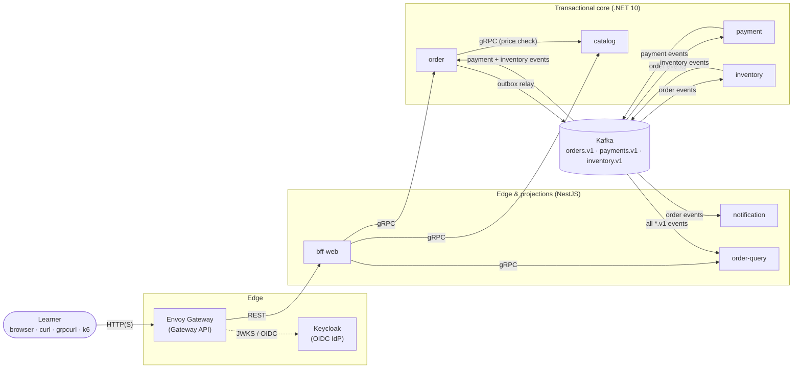
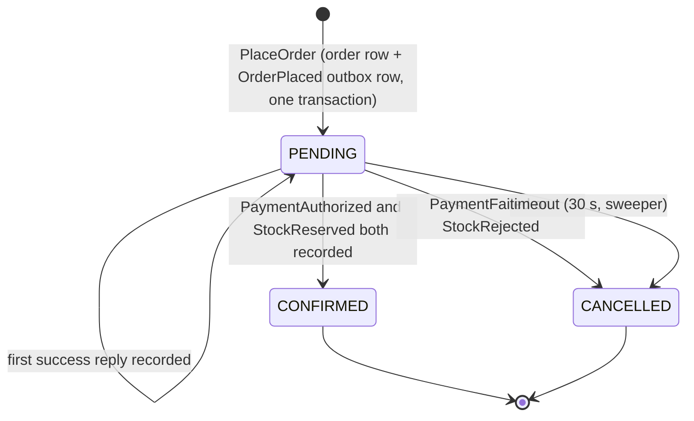
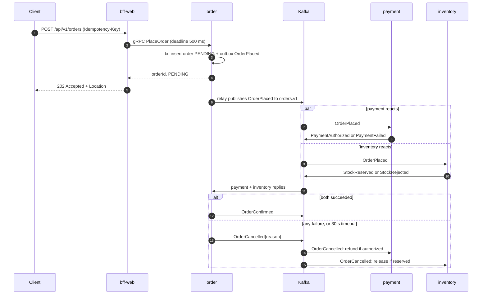

# Microservices Lab: System Design Specification

| | |
|---|---|
| **Status** | Draft, awaiting the learner's review |
| **Design session** | 2026-09-30 (brainstorming with Claude Code; decisions made by the learner) |
| **Repository** | `C:\microservices-lab`, published as the public GitHub repo `microservices-lab` in M0 |
| **Scope** | Whole-system architecture, stack, process and roadmap. Each milestone gets its own detailed spec (`docs/superpowers/specs/`) and implementation plan (`docs/superpowers/plans/`). |

> **How to review this spec.** The most important sections are:
>
> - §3, key decisions
> - §4, fundamentals and coverage
> - §5, system architecture
> - §7, environments
> - §14, roadmap
>
> The remaining sections record detail (stack versions, pitfalls, sources) so that later milestone specs don't
> have to rediscover it. Implementation starts only after you approve this spec. The next step is
> `superpowers:writing-plans` for M0.

---

## 1. Purpose

This is an educational system for learning microservices architecture end-to-end. Business logic is deliberately
trivial. All of the value is in the architecture and platform:

- how the system is split into services;
- how services talk synchronously and asynchronously;
- how they own their data and stay consistent without distributed transactions;
- how they fail, recover and scale;
- how they are secured, observed, delivered and documented.

Claude Code builds the system. The learner studies it, runs it and deliberately breaks it. The learner is a web
developer who is strong in Node/TypeScript and uses .NET (C#) at work.

## 2. Goals, non-goals, success criteria

**Goals**

- Implement fundamentals **1–36** (§4) so that each one can be demonstrated in the running system.
- Use a modern, big-tech-realistic stack (2026) that costs nothing.
- Work local-first on the learner's laptop, with an always-on free cloud deployment later.
- Treat docs, the roadmap and learning materials as first-class deliverables that never drift from the code.

**Non-goals**

- Real business functionality or UI polish.
- Production hardening beyond what teaches a fundamental.
- Tier-4 topics (§4.1): they are recorded as "future / not planned" only.
- Any paid service.

**Success criteria**

1. After the pre-flight steps (§17), `task up` brings the whole system up on the laptop.
2. Each of the 36 fundamentals has running code or config, a concept page, and at least one lab whose **Verify** step is scripted.
3. `task verify:mN` proves each milestone end-to-end, and CI's `ci-ok` gate is green on every merged PR.
4. Changes that let docs and the ROADMAP drift are blocked on `main` and in CI (§12.6).
5. A docs site on GitHub Pages and a Gemini Notebook learning pack of 50 files or fewer let the learner study the system.
6. In M14 the same system runs always-on in a free cloud cluster. In M16 a service written in a new language joins with **no changes** to existing services.

## 3. Key decisions

| # | Decision | Rationale |
|---|---|---|
| D1 | Scope is fundamentals 1–36 (Tiers 1–3) | The learner chose it; Tier 4 is deferred. |
| D2 | **.NET 10 LTS (C#)** for the transactional core: catalog, order, payment, inventory | It is the learner's work stack. It has first-class gRPC (Grpc.AspNetCore), EF Core with Npgsql, Polly and mature OpenTelemetry. Microsoft's own microservices reference (eShop) is .NET. |
| D3 | **Node 24 LTS + TypeScript + NestJS** for the edge and projection services: bff-web, notification, order-query | Node is the learner's strongest language. NestJS modules and dependency injection mirror ASP.NET Core, and Node suits I/O-heavy JSON aggregation. |
| D4 | **Go only as a late "polyglot proof"** (M16) | It proves that contract-first design lets a new language join without touching anything else. |
| D5 | **Commerce order flow** domain | It is the textbook example (eShop, microservices.io, Sam Newman), so outside reading maps one-to-one. |
| D6 | **Local first on kind**; cloud in M14 | The learner chose it. The laptop has 32 GB RAM, and the provider decision is deferred until then. |
| D7 | **Public GitHub monorepo** | Unlimited free Actions (including arm64 runners), free GHCR public images, and GitHub Pages. |
| D8 | **proto3 + Buf** for every contract; gRPC inside the system, REST at the BFF | Buf enforces lint and breaking-change rules. Editions support in the schema-registry tooling is unverified, so proto3 is the safe choice. |
| D9 | **Kafka (Strimzi, KRaft)** as the broker, with a **CloudEvents** envelope and the **Apicurio** registry | This is the big-tech event backbone. Apicurio is open source and exposes a Confluent-compatible API. |
| D10 | **Kubernetes Gateway API + Envoy Gateway** at the edge | ingress-nginx is retired. Envoy Gateway is the only open-source gateway with native JWT/OIDC, global rate limiting and circuit breaking. |
| D11 | **Istio ambient** service mesh (M11) | It is sidecar-less, low-footprint and GA, and gives mTLS, L7 policy and the Kiali topology view. |
| D12 | **Multi-arch images** (amd64 + arm64) from day one. Chiseled Ubuntu for .NET, distroless for Node. **No Native AOT** | This keeps the Arm cloud option open. AOT conflicts with reflection-heavy libraries and needs a native toolchain per architecture. |
| D13 | **Docs as code** with Docusaurus on GitHub Pages, plus a **Gemini Notebook** pack | Docusaurus is maintained and renders Mermaid. NotebookLM (now Gemini Notebook) has no API for personal accounts. |
| D14 | The **superpowers** loop for every milestone, and the **Explanatory** output style | The learner asked for both; the explanations serve the learning goal. |
| D15 | **Taskfile + Tilt**; tooling scripts written as Node `.mjs` with no dependencies | Portable on Windows. Tilt gives a live dashboard of the system. |
| D16 | **No Bitnami** images or charts | Bitnami's free catalog was withdrawn in 2025. |

M0 records these formally as ADRs 0001–0012 (§14, M0).

## 4. Fundamentals

### 4.1 Catalog and selection

**Tier 1: Core backbone (selected)**

1. **Containerization.** Multi-stage, multi-arch, minimal base images.
2. **Kubernetes orchestration.** Deployments, Services, probes, resources and namespaces.
3. **API gateway.** One entry point for routing, TLS termination and L7 load balancing.
4. **Edge authentication.** An OIDC identity provider issues tokens, and the gateway validates the JWTs.
5. **Rate limiting.** Local (per proxy) and global (shared counter store).
6. **Service discovery and load balancing.** Kubernetes DNS, and why gRPC needs per-request (L7) balancing.
7. **Contract-first synchronous RPC.** Protobuf and gRPC, with lint and breaking-change checks.
8. **Asynchronous messaging via a broker.** Topics, partitions, consumer groups and fan-out.
9. **Database per service.** No shared database, and no cross-service DB access.
10. **Health, readiness and graceful shutdown.** Probes and connection draining on SIGTERM.
11. **12-factor config and secrets.** Environment-based config and per-environment overlays.
12. **Observability.** OpenTelemetry traces (including across Kafka), metrics, and logs correlated by trace ID.
13. **CI per service.** Path-filtered lint, test, build and push.
14. **GitOps continuous delivery.** The cluster pulls its desired state from Git.
15. **Infrastructure as Code.** Clusters and infrastructure declared as code.

**Tier 2: Distributed data and resilience patterns (selected)**

16. **Event-driven architecture.** A standard event envelope, a schema registry and compatibility rules.
17. **Saga (choreography).** A multi-service business transaction with compensating actions.
18. **Transactional outbox.** An event is never lost once its DB change commits.
19. **Idempotent consumers.** Redelivery causes no duplicate effects.
20. **Retry topics and dead-letter queues.** Delayed retries and poison-message quarantine.
21. **CQRS read model.** A separate query service builds a materialized view from events.
22. **Cache-aside.** A distributed cache with TTLs and invalidation.
23. **Resilience policies.** Timeouts and deadlines, retries with backoff and jitter, circuit breakers and bulkheads.
24. **BFF / API composition.** One client-shaped API aggregating several services.
25. **Autoscaling.** HPA on CPU, and KEDA on Kafka consumer lag.
26. **API versioning.** v1 and v2 side by side, deprecation signalling, and backward compatibility.

**Tier 3: Big-tech platform and SRE (selected)**

27. **Service mesh.** Transparent mTLS, L7 traffic policy and mesh telemetry.
28. **Zero-trust authorization.** Identity-based service-to-service allow-lists, plus NetworkPolicies.
29. **Secrets management.** Secrets synced from a vault.
30. **Progressive delivery.** Canary releases with automated analysis and rollback.
31. **Supply-chain security.** Scanning, SBOMs, keyless signing and admission verification.
32. **Policy as code.** Admission guardrails, including free-tier cost guards.
33. **SLOs, error budgets and alerting.**
34. **Chaos engineering.** Fault injection to prove resilience.
35. **The microservice test pyramid.** Unit, integration, contract, end-to-end and load tests.
36. **Feature flags.** Decoupling deploy from release.

**Tier 4: Advanced stretch goals (future, not planned)**

37. Orchestrated saga with Temporal
38. Change data capture with Debezium
39. Event sourcing
40. Backstage developer portal
41. GraphQL federation
42. Dapr
43. Multi-cluster / multi-region
44. Strangler-fig migration from a monolith

### 4.2 Coverage matrix and lab ideas

| # | Fundamental | Where it lives | Milestone(s) | Lab idea ("break it and watch") |
|---|---|---|---|---|
| 1 | Containerization | Multi-stage Dockerfiles, buildx multi-arch, chiseled/distroless bases | M1 | Compare image sizes. Debug a shell-less container with `kubectl debug`. |
| 2 | K8s orchestration | Deployments, Services, probes, requests/limits, PDBs | M1, M8 | Kill pods and watch self-healing. Exceed a memory limit and watch OOMKilled. |
| 3 | API gateway | Envoy Gateway: Gateway, HTTPRoute, GRPCRoute, ReferenceGrant | M1, M7 | Break a cross-namespace route and read the Gateway/Route status conditions. |
| 4 | Edge auth | Keycloak plus a SecurityPolicy (JWT for APIs, OIDC for UIs) | M7 | Call with no token, a tampered token and an expired token: 401. A valid token: 200. |
| 5 | Rate limiting | BackendTrafficPolicy, local and global (Valkey) | M7 | Send a burst and get 429. Compare per-user and per-IP limits. |
| 6 | Discovery & LB | DNS, Services, EndpointSlices; client-side gRPC LB; waypoint L7 LB | M1, M3, M11 | gRPC connection pinning: kube-proxy L4 vs `round_robin` vs a waypoint. |
| 7 | Contract-first RPC | proto3 + Buf lint/breaking; C#/TS codegen | M1 | Make a breaking proto change and watch `buf breaking` fail CI. |
| 8 | Broker messaging | Strimzi Kafka: topics, partitions, consumer groups | M4 | Run more consumers than partitions and see idle members. Kill a broker and watch leader election. |
| 9 | DB per service | One CloudNativePG cluster per data-owning service | M3 | Try to read another service's DB and be denied. Discuss duplicated data. |
| 10 | Health & shutdown | Liveness/readiness/startup probes, preStop, SIGTERM draining | M1, M8 | A failing readiness probe removes the pod from Endpoints. Kill pods without preStop and count dropped requests. |
| 11 | Config & secrets | Env config, ConfigMaps/Secrets, Kustomize overlays, startup validation | M1 | Break a config value and watch the service fail fast with a clear error. |
| 12 | Observability | OTel SDKs → Collector → Prometheus/Loki/Tempo/Grafana | M2, M4 | Follow one order's trace across HTTP → gRPC → Kafka, then jump from the trace to its logs. |
| 13 | CI per service | Orchestrator workflow, path filters, reusable workflows, `ci-ok` | M0, M1 | A docs-only PR skips service jobs. A broken test turns `ci-ok` red. |
| 14 | GitOps CD | Argo CD ApplicationSets | M9 | Hand-edit a Deployment and watch Argo self-heal. Promote a version by PR. |
| 15 | IaC | OpenTofu: local bootstrap (M9), OCI (M14) | M9, M14 | Plan, apply and destroy. Detect drift with `tofu plan`. |
| 16 | Event-driven arch | CloudEvents headers, Apicurio, BACKWARD compatibility | M4 | Publish an incompatible schema and have the registry reject it. |
| 17 | Saga | Parallel choreography with compensations (§5.6) | M5 | An `OOS-*` order gets cancelled and refunded. Watch the event chain in the timeline. |
| 18 | Outbox | Outbox table + single relay (advisory lock) | M4 | Stop Kafka while placing orders. After recovery, no events are lost. |
| 19 | Idempotent consumers | Inbox table (.NET) vs Valkey TTL dedup (Node) vs upsert (order-query) | M4, M5 | Replay a topic from offset 0 and see no double effects. |
| 20 | Retry & DLQ | `retry-1` → `retry-2` → `dlq` per consumer group | M5 | A `poison` customer's message lands in the DLQ. Replay it after the "fix". |
| 21 | CQRS | order-query projector; rebuildable read model | M6 | Drop the read model and rebuild it through an offset reset. |
| 22 | Cache-aside | HybridCache (in-process L1 + Valkey L2) in catalog | M3 | Compare latency with and without the cache. See stale data, then invalidation. |
| 23 | Resilience policies | Deadlines, gRPC retries, Polly and cockatiel breakers, gateway policies | M3, M8 | Slow down catalog: the BFF circuit opens. Demo a retry storm, then add a retry budget. |
| 24 | BFF / composition | bff-web (REST, composition, graceful degradation) | M1, M6 | With one downstream down, the response is degraded but still useful. |
| 25 | Autoscaling | HPA (CPU); KEDA on Kafka lag | M8 | Flood orders: lag rises and notification scales out, capped by the partition count. |
| 26 | API versioning | `/v1` and `/v2`, Deprecation/Sunset headers, `buf breaking` | M6 | An old client keeps working on v1 while v2 ships. |
| 27 | Service mesh | Istio ambient (ztunnel, waypoints), Kiali | M11 | See mTLS padlocks in Kiali. Compare L4 and L7 policy. |
| 28 | Zero trust | AuthorizationPolicy + default-deny NetworkPolicy | M11 | Call payment from an unauthorized pod and be denied. |
| 29 | Secrets mgmt | External Secrets Operator + OpenBao | M12 | Rotate a secret in OpenBao and watch it propagate to the pods. |
| 30 | Progressive delivery | Argo Rollouts canary with Prometheus analysis | M10 | Ship a bad version and watch the automatic abort and rollback. |
| 31 | Supply chain | Trivy, Syft SBOM, cosign keyless, attestations | M12 | Inspect the SBOM. Verify a signature. Deploy an unsigned image and have it rejected. |
| 32 | Policy as code | Kyverno CEL `ValidatingPolicy` / `ImageValidatingPolicy` | M12, M14 | A pod without resource limits is rejected with an explanatory message. |
| 33 | SLOs & alerting | SLO rules, multi-window burn-rate alerts | M13 | Inject errors: the error budget burns and the alert fires. |
| 34 | Chaos engineering | Mesh fault injection; Chaos Mesh experiments | M11, M13 | GameDay: kill a broker under load and check whether the SLO holds. |
| 35 | Test pyramid | xUnit/Vitest, Testcontainers, Pact, e2e on kind, k6 | M1–M13 | Break a contract and watch Pact fail before deploy. |
| 36 | Feature flags | OpenFeature + flagd | M10 | Flip the payment failure-rate flag at runtime with no redeploy. |

## 5. System architecture

### 5.1 Context and container view



**Diagram description:**
- The learner reaches the system only through the Envoy-based gateway. The gateway validates identity against Keycloak (JWKS for APIs, OIDC for browser UIs) and forwards REST calls to the NestJS bff-web.
- bff-web makes synchronous gRPC calls to catalog, order and order-query. order also calls catalog synchronously to check prices when an order is placed.
- Everything after order placement is asynchronous through Kafka:
  - order publishes order events through its transactional outbox;
  - payment and inventory react to order events and publish their own results;
  - order consumes those results to decide the outcome;
  - notification reacts to final order events;
  - order-query consumes every `*.v1` topic to build a read model.
- Each service's private database and cache are omitted here; §5.7 lists them.

### 5.2 Services

Each service runs in **its own namespace**, named after the service, and follows the common service contract (§5.3).

| Service | Stack | Sync API (in) | Calls (out) | Events in → out | Data | Fundamentals |
|---|---|---|---|---|---|---|
| catalog | .NET | gRPC `ListProducts`, `GetProduct`, `BatchGetProducts`, `UpdatePrice` (admin) | none | none | Postgres + Valkey (HybridCache) | 7, 9, 22 |
| order | .NET | gRPC `PlaceOrder`, `GetOrder` | catalog | payments.v1, inventory.v1 → orders.v1 | Postgres: orders, order_lines, outbox, inbox | 17, 18, 19, 23 |
| payment | .NET | none | none | orders.v1 → payments.v1 | Postgres: payments, inbox | 17, 19, 25 |
| inventory | .NET | gRPC `GetStock` | none | orders.v1 → inventory.v1 | Postgres: stock_items (optimistic locking), reservations, inbox | 17, 19 |
| notification | NestJS | none | none | orders.v1 (Confirmed, Cancelled) | Valkey dedup keys with TTL | 19, 20, 25 |
| order-query | NestJS | gRPC `GetTimeline`, `ListOrders` | none | every `*.v1` topic → read model | Postgres (disposable, rebuildable) | 21 |
| bff-web | NestJS | REST `/api/v1` (and `/api/v2` from M6), Swagger UI; minimal web UI (M6) | catalog, order, order-query | none | Valkey (Idempotency-Key store) | 3, 24, 26 |

The Go `shipping` service (M16) will consume `orders.v1`, publish `shipping.v1`, and appear in the order
timeline without changes to any existing service. **Design constraint for M6:** order-query subscribes by topic
regex and projects any `com.lab.*` event generically, so new event types show up without code changes.

### 5.3 Common service contract (every service, both languages)

| Aspect | Contract |
|---|---|
| Ports | **8080**: HTTP/1.1 (`/info`, probes, REST). **8081**: gRPC over h2c, as a Service port with `appProtocol: kubernetes.io/h2c`. Kestrel needs a dedicated HTTP/2-only endpoint for cleartext gRPC, so gRPC gets its own port. |
| `GET /info` | JSON: `service`, `version`, `gitSha`, `buildTime`, `runtime`, `pod`, `node`, `namespace`, `startedAt`, `uptimeSeconds`, `dependencies[] {name, status: up\|down\|degraded, latencyMs}`. `pod`, `node` and `namespace` come from the Downward API. |
| `GET /healthz` | Liveness: the process is alive. It **never** checks dependencies. |
| `GET /readyz` | Readiness: the dependencies needed to serve traffic are reachable. |
| gRPC health | `grpc.health.v1` on 8081. Server reflection is enabled in local and CI profiles only. |
| Config | Environment variables (12-factor), validated at startup so misconfiguration fails fast: .NET options validation with `ValidateOnStart`, Node with a `zod` schema. Secrets come from Kubernetes Secrets, never from git. |
| Telemetry | OTLP to the Collector (`OTEL_EXPORTER_OTLP_ENDPOINT`). Resource attributes include `service.name`, `service.version` and `k8s.*`. W3C trace context is propagated over HTTP, gRPC **and Kafka headers**. |
| Logging | Structured JSON to stdout, carrying `trace_id` and `span_id`. |
| Shutdown | On SIGTERM: fail readiness, preStop sleep (about 5 s), drain in-flight work (25 s or less), exit. `terminationGracePeriodSeconds: 30`. |
| Pod security | Non-root, read-only root FS, all capabilities dropped, seccomp `RuntimeDefault`. |
| Resources | Requests and limits on every container. |
| Labels | `app.kubernetes.io/name`, `app.kubernetes.io/part-of=microservices-lab`, `app.kubernetes.io/version`, `app.kubernetes.io/component`. |

### 5.4 Synchronous APIs

The protos live under `proto/commerce/<context>/v1/` and follow Buf STANDARD lint (`<Rpc>Request` /
`<Rpc>Response`, versioned packages). The sketch below is **indicative**: each milestone spec finalizes its protos.

```proto
syntax = "proto3";

package commerce.catalog.v1;      // proto/commerce/catalog/v1/catalog.proto
service CatalogService {
  rpc ListProducts(ListProductsRequest) returns (ListProductsResponse);
  rpc GetProduct(GetProductRequest) returns (GetProductResponse);
  rpc BatchGetProducts(BatchGetProductsRequest) returns (BatchGetProductsResponse); // avoids N+1 in the BFF (AIP-231 style)
  rpc UpdatePrice(UpdatePriceRequest) returns (UpdatePriceResponse);               // admin role enforced from M7
}
// Other packages:
// commerce.order.v1        OrderService.PlaceOrder / GetOrder
// commerce.inventory.v1    InventoryService.GetStock
// commerce.orderquery.v1   OrderQueryService.GetTimeline / ListOrders
// commerce.common.v1       Money (modelled on google.type.Money), shared value types
```

**BFF REST surface** (OpenAPI generated by NestJS, Swagger UI at `/api/docs`):

| Method and path | Behaviour |
|---|---|
| `GET /api/v1/products`, `GET /api/v1/products/{sku}` | Proxies catalog, with deadlines. |
| `POST /api/v1/orders` | Requires an `Idempotency-Key` header. Returns **202 Accepted** plus `Location`, because the outcome is decided later by the saga. This teaches eventual consistency. |
| `GET /api/v1/orders/{id}` | A composed view: order + timeline + product names (one `BatchGetProducts` call). Degrades gracefully when a downstream is unavailable. |
| `GET /api/v1/system/status` | Fans out to every service's `/info`. This is the "metadata and status" view of the whole system. |
| `/api/v2/...` (M6) | Changed response shapes. v1 responses gain `Deprecation` and `Sunset` headers. |

**Errors:**
- Inside the system, services use gRPC status codes.
- The BFF maps them to RFC 9457 `application/problem+json`: `NOT_FOUND` → 404, `INVALID_ARGUMENT` → 400, `UNAVAILABLE` → 503, `DEADLINE_EXCEEDED` → 504.
- Every gRPC call carries a deadline: BFF → downstream defaults to 500 ms, and order → catalog to 300 ms.

### 5.5 Events and messaging

**Topics:** one topic per aggregate, so all events for one order share a partition and stay ordered.

| Topic | Key | Partitions | Replication (local / CI / cloud) | Owner (producer) |
|---|---|---|---|---|
| `orders.v1` | orderId | 6 | RF 3, min-ISR 2 / RF 1 / RF 1 | order |
| `payments.v1` | orderId | 6 | same | payment |
| `inventory.v1` | orderId | 6 | same | inventory |
| `shipping.v1` (M16) | orderId | 6 | same | shipping |

**Topic ownership:**
- Topics are declared as Strimzi `KafkaTopic` resources in the *producing* service's manifests.
- Retry and DLQ topics live in the *consuming* service's manifests.
- Retention is 7 days, with `cleanup.policy=delete`.

**Event types:**

| Topic | `ce_type` | Protobuf message |
|---|---|---|
| orders.v1 | `com.lab.order.placed.v1` / `.confirmed.v1` / `.cancelled.v1` | `commerce.order.v1.OrderPlaced` / `OrderConfirmed` / `OrderCancelled{reason}` |
| payments.v1 | `com.lab.payment.authorized.v1` / `.failed.v1` / `.refunded.v1` | `commerce.payment.v1.PaymentAuthorized` / `PaymentFailed` / `PaymentRefunded` |
| inventory.v1 | `com.lab.inventory.reserved.v1` / `.rejected.v1` / `.released.v1` | `commerce.inventory.v1.StockReserved` / `StockRejected` / `StockReleased` |

**Envelope:** CloudEvents 1.0 in **binary content mode**, following the Kafka protocol binding.
- Headers:
  - `ce_specversion`, `ce_source` (for example `/services/order`) and `ce_time`.
  - `ce_id` is a **UUIDv7** and doubles as the idempotency key.
  - `ce_type` as in the table above; `ce_subject` is the orderId.
  - `content-type: application/x-protobuf`, plus `traceparent` and `tracestate`.
- The value is Protobuf in the Confluent wire format, produced by Confluent serializers against Apicurio's Confluent-compatible API.
- Schema subjects use `TopicRecordNameStrategy` (several event types per topic). Consumers dispatch on `ce_type`.
- **Compatibility:** a global BACKWARD rule.
- **Auto-registration:** on only in the local profile. CI registers schemas explicitly and fails on incompatibility.

**Producer and consumer settings:**
- Producers: `acks=all`, `enable.idempotence=true`, key = orderId.
- Consumers: manual commits, made after processing succeeds.

**Consumer groups:**

| Group | Service | Subscribes | Purpose |
|---|---|---|---|
| `payment` | payment | orders.v1 | Authorize on Placed; refund on Cancelled |
| `inventory` | inventory | orders.v1 | Reserve on Placed; release on Cancelled |
| `order` | order | payments.v1, inventory.v1 | Resolve the saga |
| `notification` | notification | orders.v1 | "Notify" on Confirmed/Cancelled |
| `order-query` | order-query | regex `^[a-z-]+\.v1$` | Project the timeline. The regex deliberately excludes retry and DLQ topics. |

**Retries and DLQ (per consumer group):**
1. A retryable failure republishes the original record, with its headers and value plus `x-retry-count`, `x-original-topic` and `x-error`, to `<group>.<topic>.retry-1`.
2. The retry consumer processes a record only after `timestamp + 5 s`. A second failure moves it to `.retry-2` (30 s), and a third to `.dlq`.
3. Non-retryable failures (deserialization, validation, the `poison` customer) go straight to `.dlq`.
4. `task dlq:replay` (M5) re-injects DLQ records after a fix.
5. **Retry topics trade per-key ordering for availability.** The saga's tombstones (§5.6) restore safety.

**Idempotency, three contrasting implementations:**

| Where | How | Guarantee |
|---|---|---|
| .NET services | `inbox(ce_id PRIMARY KEY, processed_at)` written **in the same transaction** as the state change | Exactly-once *effect* |
| notification (Node) | Valkey `SET <ce_id> NX EX 86400` | Best-effort. Teaches why a side effect can still repeat. |
| order-query (Node) | Upsert keyed by `(order_id, ce_id)` | Naturally idempotent projection |

### 5.6 Order saga (parallel choreography)



**Diagram description:**
- An order starts in PENDING in the same database transaction that writes the OrderPlaced event into the outbox.
- It stays PENDING while it collects replies. It becomes CONFIRMED only when both a payment authorization and a stock reservation have been recorded, in either order.
- Any failure reply, or a 30-second timeout detected by a background sweeper, moves it to CANCELLED.
- CONFIRMED and CANCELLED are terminal: later replies are acknowledged and ignored.



**Diagram description:**
1. The client posts an order with an idempotency key. bff-web calls order over gRPC with a deadline.
2. order writes the order and its OrderPlaced event in one transaction and returns immediately. The client gets 202 Accepted, because the outcome is decided later.
3. The outbox relay publishes OrderPlaced. payment and inventory process it in parallel, each publishing a success or failure reply.
4. order consumes both replies:
   - if both succeeded, it publishes OrderConfirmed;
   - if either failed, or no decision was reached within 30 seconds, it publishes OrderCancelled.
5. The cancellation causes payment to refund and inventory to release any stock it reserved. These are the compensating actions.
6. notification and order-query consume the same events in the background (not drawn).

**Rules:**
- **Outbox relay:**
  - Exactly one relay is active at a time, holding a Postgres advisory lock. This keeps outbox order.
  - The outbox row stores `traceparent`, so the trace continues across the relay hop.
- **Sweeper:** finds PENDING orders older than 30 s using `SELECT … FOR UPDATE SKIP LOCKED`, so it is safe with several replicas. It cancels them with reason `TIMEOUT`, in a transaction that also writes the outbox row.
- **Participant state machines:**
  - payment: `NONE → AUTHORIZED | FAILED`, and `AUTHORIZED → REFUNDED`.
  - inventory: `NONE → RESERVED | REJECTED`, and `RESERVED → RELEASED`.
- **Tombstones:**
  - If `OrderCancelled` arrives for an order a participant has never seen, the participant records `TOMBSTONED`. A later `OrderPlaced` for that order is then a no-op.
  - Without retry topics, per-partition ordering prevents that case. With retry topics or DLQ replays it is real: a failed `OrderPlaced` waits in `retry-1` while the timeout cancels the order.
- **Late replies:** once an order is terminal, order acknowledges and records late replies but ignores them. Compensations are triggered only by `OrderCancelled`.

### 5.7 Data ownership

| Owner | Store (local) | Contents | Notes |
|---|---|---|---|
| catalog | CloudNativePG cluster `catalog-db` (database `catalog`); Valkey `catalog-cache` | products, prices | HybridCache: in-process L1 + Valkey L2; invalidated on `UpdatePrice` |
| order | CNPG `orders-db` (database `orders`) | orders, order_lines, outbox, inbox | Uses `orders`, not the SQL reserved word `order` |
| payment | CNPG `payments-db` (database `payments`) | payments, inbox | — |
| inventory | CNPG `inventory-db` (database `inventory`) | stock_items (available, reserved, row version), reservations, inbox | Optimistic concurrency |
| order-query | CNPG `orderquery-db` (database `orderquery`) | order_timeline, order_summary | Disposable; rebuilt from Kafka by an offset reset |
| notification | Valkey `notification-dedup` | dedup keys with TTL | — |
| bff-web | Valkey `bff-idem` | Idempotency-Key → stored response (24 h TTL) | — |
| keycloak (platform) | CNPG `keycloak-db` | realm data | — |
| rate limiter (platform) | Valkey `ratelimit` | rate-limit counters | — |

**Access and migrations:**
- Credentials are per service, in Secrets generated by CNPG. From M11, network and mesh policies block cross-service DB access.
- .NET services migrate with EF Core; the M3 spec chooses between a migration bundle Job and an init container.
- order-query's schema-migration approach is chosen in the M6 spec.
- The cloud-slim profile shares one CNPG cluster, with a database and role per service (recorded in an ADR in M14).

### 5.8 Deterministic lab triggers

These let a lab produce a specific failure on demand, without random chance.

| Trigger | Effect |
|---|---|
| SKU prefix `OOS-` | inventory rejects the stock, and the saga compensates |
| Order total > 999 | payment fails, and the saga compensates |
| Customer id `poison` | notification treats the message as non-retryable, and it goes to the DLQ |
| `LAB_FAULTS_FAILURE_RATE` (0–1) and `LAB_FAULTS_LATENCY_MS` env vars on payment/inventory | Random failures and latency. In M10 these become flagd flags (`payment-failure-rate`, `payment-latency-ms`) with no redeploy needed. |

## 6. Platform architecture

### 6.1 Edge (M1, extended in M7)

**Exposure and routing**
- Envoy Gateway implements Gateway API (`GatewayClass envoy`).
- An `EnvoyProxy` resource exposes the proxy as a NodePort Service on **30080/30443**.
- kind maps **127.0.0.1:80 → 30080** and **127.0.0.1:443 → 30443**, binding on loopback only.
- The Gateway `lab-gateway` lives in namespace `gateway`.
- Hostnames use `*.localtest.me`, a public wildcard that resolves to 127.0.0.1:

  | Hostname | Serves |
  |---|---|
  | `api.` | the BFF REST API |
  | `grpc.` | GRPCRoutes for learning with grpcurl |
  | `app.` | the UI (M6) |
  | `grafana.`, `kafka-ui.`, `keycloak.`, `kiali.`, `argocd.` | tool UIs |

- Routes in other namespaces require `ReferenceGrant`s. This is intentional: it teaches cross-namespace trust.

**TLS (M7)**
- cert-manager issues a wildcard certificate for `*.localtest.me` from a CA ClusterIssuer backed by the learner's mkcert root CA.
- **TLS lands before OIDC**, because Envoy Gateway requires an `https://` issuer.

**Identity (M7)**
- The Keycloak Operator runs Keycloak with a realm import:
  - realm `lab`;
  - users `alice` and `bob` (customers) and `admin`;
  - a confidential client for gateway OIDC, and a CLI client for lab tokens.
- Keycloak's hostname is `https://keycloak.localtest.me`, with dynamic backchannel, so the `iss` claim stays stable.
- The JWKS and token endpoints are reached through the **in-cluster** Service.
- `authorizationEndpoint` and `tokenEndpoint` are set explicitly, so Envoy Gateway skips discovery.
- Tools that insist on discovery (Argo CD, Kiali) get a CoreDNS rewrite to the gateway ("hairpin") and trust the local CA.

**Auth policy (M7)**
- A `SecurityPolicy` does JWT validation for `api.`/`grpc.` and maps claims to headers: `sub` → `x-user-id`, roles → `x-user-roles`.
- OIDC login protects the browser UIs.

**Rate limiting (M7)**
- A `BackendTrafficPolicy` sets local token-bucket limits per route.
- Global limits are keyed by `x-user-id` and by client IP, using Envoy's rate-limit service backed by Valkey (Envoy Gateway requires Redis-protocol storage for this).

### 6.2 Messaging (M4)

- **Kafka:** Strimzi 1.x (v1 CRDs) in namespace `kafka`. The cluster `lab-kafka` has a `KafkaNodePool` of 3 combined controller+broker nodes locally, and 1 in CI and cloud.
  - The internal listener is plaintext. mTLS arrives with the mesh in M11.
  - Topics are managed by the Topic Operator.
- **Apicurio Registry 3** uses KafkaSQL storage, so it needs no extra database.
- **kafbat UI** is available at `kafka-ui.localtest.me`.
- **Clients:** Confluent.Kafka for .NET and `@confluentinc/kafka-javascript` for Node. Both are official librdkafka-based clients.
  - They are used directly, not through framework transports, so offsets, commits and rebalances stay visible.
  - The M4 spec verifies the licensing of any higher-level .NET messaging library before considering it.

### 6.3 Data (M3)

- **Postgres:** the CloudNativePG operator runs in `cnpg-system`. Each `Cluster` lives in its owner's namespace and has 1 instance locally.
  - Storage uses kind's default local-path StorageClass.
  - Backups are out of scope locally; the M14 spec decides the cloud approach.
- **Valkey:** the official valkey-io Helm chart or plain manifests (chosen in the M3 spec; never Bitnami).

### 6.4 Observability (M2)

**Pipeline**
- The OTel SDKs send to an **OpenTelemetry Collector** (contrib), which runs in two forms:
  - a gateway Deployment receiving OTLP;
  - a DaemonSet agent with a `filelog` receiver for container logs.
- The Collector exports to:
  - **Prometheus 3**, via kube-prometheus-stack: the Prometheus Operator, Prometheus with its OTLP receiver enabled, Alertmanager, Grafana, node-exporter and kube-state-metrics;
  - **Loki** in single-binary mode, with OTLP ingestion;
  - **Tempo** in monolithic mode, with a metrics-generator producing service-graph and span metrics.

**Grafana**
- Datasources are provisioned, with trace↔log links through `trace_id` and exemplars.
- Dashboards cover per-service RED metrics, Kafka lag, saga outcomes, the gateway, and the platform.

**Tracing across Kafka**
- The `traceparent` header is written by producers and read by consumers in both languages. This manual propagation is itself a teaching point.
- The outbox relay continues the stored `traceparent`.

### 6.5 Service mesh and zero trust (M11)

- **Istio ambient:**
  - Namespaces are labelled `istio.io/dataplane-mode=ambient`, and PeerAuthentication is set to `STRICT`.
  - Waypoints are deployed only where L7 policy is needed.
- **AuthorizationPolicies** allow-list callers by service account. For example, only bff-web may call catalog, order and order-query; only order may call catalog.
- **Envoy Gateway integration:** `routingType: Service` plus the namespace label `istio.io/ingress-use-waypoint=true`. Without these, the gateway sends traffic straight to pod IPs and bypasses the waypoints.
- **NetworkPolicy** is default-deny per namespace. The allowances must include HBONE port 15008 and the ambient probe address `169.254.7.127`.
- **Kiali** shows the topology.

### 6.6 Secrets, supply chain and policy (M12)

- **Secrets:** External Secrets Operator and OpenBao (KV v2), seeded by OpenTofu. One `ExternalSecret` per service.
- **Supply chain in CI:**
  - Trivy scans images and fails on CRITICAL findings that have a fix.
  - Syft produces an SPDX SBOM, attached as a cosign attestation.
  - cosign signs **keylessly** with the GitHub OIDC identity of the repo's workflow.
- **Admission (Kyverno 1.19+, CEL policies only):** `ClusterPolicy` is deprecated in 1.19 and removed in 1.20.
  - `ValidatingPolicy`: requires requests/limits, probes, non-root, the standard labels, and no `:latest`.
  - `ImageValidatingPolicy`: verifies signatures, scoped to the GitOps namespaces, because images built by Tilt are unsigned.

### 6.7 Resilience and scaling (introduced in M3, completed in M8)

- **.NET gRPC clients:**
  - Service-config retries (for example, `UNAVAILABLE` with at most 3 attempts and backoff) plus deadlines.
  - A Polly circuit breaker inside a **gRPC interceptor**, because HTTP-level resilience handlers never see `grpc-status`, which travels in trailers.
- **Node (bff-web):** cockatiel for retries with exponential backoff and jitter, a circuit breaker, a bulkhead and a timeout around each downstream client.
- **Gateway:** a `BackendTrafficPolicy` with retries (plus a budget), timeouts, circuit-breaker thresholds and outlier detection.
- **Kubernetes:**
  - PDBs (`minAvailable: 1`) and topology spread across the 2 workers.
  - HPA on CPU for bff-web and catalog, using metrics-server.
  - A KEDA `ScaledObject` on notification, triggered by Kafka lag, with `maxReplicas` at most the partition count (6).
- **Retry storms:** a lab shows them, then fixes them with retry budgets.

### 6.8 Delivery

**CI (GitHub Actions, from M0)**
- `ci.yml` is the orchestrator:
  1. A `changes` job runs a paths filter, pinned by SHA.
  2. Conditional jobs follow: `docs`, `scripts`, `proto`, `dotnet`, `node`, `images`, `e2e-smoke`.
  3. An **always-running `ci-ok` gate** is the required check. Skipped path-filtered workflows never report a status, which would otherwise block merges.
- Reusable workflows: `_dotnet.yml`, `_node.yml`, `_image.yml`.
- All actions are pinned by commit SHA, with least-privilege `permissions:` and concurrency groups.

**Images**
- Built **natively per architecture**, on `ubuntu-24.04` and `ubuntu-24.04-arm`. They are never built under QEMU, because the Node Kafka client downloads a native binary per architecture.
- Pushed by digest on `main`, then merged with `docker buildx imagetools create`.
- Tags are `sha-<short>` (immutable) and `main` (moving, for humans only). Manifests reference only digests or `sha-` tags; `latest` is never used.
- GHCR packages are set to public on first push, since they default to private.

**Local deploy**
- Tilt: `docker_build` pushes to the local registry at `:5001`. Services are deployed with Kustomize and platform components with Helm.
- `task up` runs `tilt ci`, a one-shot convergence. `task dev` runs `tilt up` for live development.

**GitOps (M9)**
- Argo CD with ApplicationSets manages a `gitops-local` environment. Whether that is separate namespaces or a second kind cluster is decided in the M9 spec.
- CI opens PRs that bump image digests in `deploy/envs/gitops-local` (promotion by PR).

**Progressive delivery (M10)**
- Argo Rollouts, using the Gateway API traffic-router plugin.
- `AnalysisTemplate`s query Prometheus for error rate and latency.

**IaC (M9, M14)**
- `infra/tofu/local`: the kind cluster, registry caches and the Argo CD bootstrap.
- `infra/tofu/oci`: VCN, OKE Basic, the A1 node pool and budget alerts.
- Remote state for OCI is decided in M14. OpenTofu has no native OCI backend, and the S3-compatible route is deprecated by Oracle.

### 6.9 Feature flags (M10)

- **flagd** (OpenFeature), reading flags from a ConfigMap, or run by the OpenFeature Operator (chosen in the M10 spec).
- OpenFeature SDKs in .NET and Node.
- Flags: `payment-failure-rate`, `payment-latency-ms`, `inventory-oos-mode`, `bff-v2-default`.
- Replacing the env-var switches (§5.8) with flags is itself part of the lesson.

### 6.10 Testing strategy (the pyramid)

| Layer | Tooling | From |
|---|---|---|
| Unit (TDD) | xUnit v3 (.NET), Vitest (Node) | M1 |
| Component / API | `WebApplicationFactory` (.NET), NestJS testing module | M1 |
| Integration | Testcontainers: Postgres, Kafka, Valkey | M3 |
| Contract | `buf breaking` for protos (M1); registry compatibility for events (M4); Pact for UI↔BFF HTTP (M6) | M1 |
| End-to-end | Vitest suite in `tests/e2e` against the gateway, on kind in CI (`ci` profile) | M1 |
| Load | k6 with thresholds | M8 |
| Chaos | Mesh fault injection (M11), Chaos Mesh (M13) | M11 |
| Lab verification | Scripted Verify blocks, run by `task verify:mN` | M1 |

## 7. Environments and local cluster

### 7.1 Profiles and resource budget

Figures are steady-state estimates, in GB.

| Component group | core | full | cloud-slim (M14) |
|---|---|---|---|
| kind (1 control plane + 2 workers), registries and caches | 2.1 | 2.1 | 1.0 (OKE) |
| Envoy Gateway, rate limiting, cert-manager, metrics-server | 0.6 | 0.6 | 0.5 |
| Kafka ×3, Strimzi, Apicurio, kafbat UI | 2.8 | 2.8 | 1.3 (1 broker, no UI) |
| CNPG: 6 Postgres instances; 4 Valkey instances | 1.0 | 1.0 | 0.4 (one shared cluster) |
| Keycloak | 0.75 | 0.75 | 0.5 |
| Observability: Prometheus stack, Loki, Tempo, Collector | 2.2 | 2.2 | 0.2 (Grafana Cloud Free) |
| 7 services + KEDA | 1.25 | 1.45 | 1.0 |
| Istio + Kiali, Argo CD + Rollouts, Kyverno, ESO + OpenBao, Chaos Mesh, flagd | — | 3.2 | 0.9 |
| VM overhead | 1.2 | 1.2 | — |
| **Total** | **≈11.9** | **≈15.3** | **≈5.8** |

**Profiles**
- Select a profile with `task up PROFILE=core|full`; the default is `core`.
- The `ci` profile (GitHub runner) runs services, the edge, 1 Kafka broker and the data stores. It has no observability, and uses a test JWKS (`localJWKS`) instead of Keycloak.
- If `full` proves too heavy, Tier-3 add-ons are toggleable per profile.
- The Docker VM needs at least 18 GiB for `full`. The pre-flight `.wslconfig` in §17 sets it to 20 GB.

### 7.2 Local cluster topology

- **Cluster:** kind cluster `lab`, with 1 control-plane node and 2 workers.
  - The node image is pinned **by digest** to Kubernetes **1.36**, one minor behind the latest release, so every operator supports it. The digest is recorded in `deploy/kind/cluster.yaml` in M1 and bumped through `stack-check`.
- **Registries:** Docker containers on the `kind` network, wired in through containerd `config_path` (`/etc/containerd/certs.d`).
  - `lab-registry` on `:5001` receives local pushes from Tilt.
  - Pull-through caches: `cache-dockerio` (uses the learner's Docker Hub login, since anonymous pulls are limited to 10 per hour), `cache-quay`, `cache-ghcr` and `cache-k8s` (registry.k8s.io).
  - The `local-registry-hosting` ConfigMap (KEP-1755) lets tools discover the local registry.
- **DNS:** `*.localtest.me` resolves to 127.0.0.1. In-cluster hairpin DNS is added in M7 (§6.1). `task doctor` catches routers whose DNS-rebinding protection blocks this.

### 7.3 Namespaces

| Kind | Namespaces |
|---|---|
| Services | `catalog`, `order`, `payment`, `inventory`, `notification`, `order-query`, `bff-web` |
| Edge | `envoy-gateway-system`, `gateway`, `cert-manager`, `keycloak` |
| Data and messaging | `cnpg-system`, `kafka` (Strimzi, Kafka, Apicurio, kafbat) |
| Observability | `observability` |
| Platform (by milestone) | `keda`, `argocd`, `argo-rollouts`, `istio-system`, `kyverno`, `external-secrets`, `openbao`, `chaos-mesh`, `flagd` |

### 7.4 Commands (Taskfile)

| Command | Purpose |
|---|---|
| `task setup` | Tool install hints |
| `task doctor` | Environment checks (§17); fails only on tools the current milestone needs |
| `task up [PROFILE=core\|full]` | Cluster, caches, platform and services (`tilt ci`) |
| `task dev` | `tilt up`, the live inner loop with the dashboard |
| `task down` / `task reset` / `task status` | Lifecycle |
| `task test` / `task test:e2e` | Unit + integration tests / end-to-end tests through the gateway |
| `task verify:mN` | Milestone proof: reset → up → tests → e2e → lab Verify blocks |
| `task docs:dev` / `docs:build` / `docs:lint` | Docs site |
| `task lab -- <name>` (M1+), `task learning-pack` (M2+), `task dlq:replay` (M5+) | Learning and operations helpers |

### 7.5 Cloud target (M14): research summary, to be re-verified at M14

Oracle Cloud Infrastructure **Always Free** is the only forever-free option that includes managed Kubernetes. At design time:

- **Compute:** the Ampere A1 (arm64) allowance was **cut to 2 OCPU / 12 GB** in mid-2026 without an announcement. It had been 4 / 24.
- **Cluster:** an OKE **Basic** cluster has a free control plane. The Console defaults to the paid **Enhanced** cluster, so the type must be set explicitly. Creating OKE clusters likely requires a **Pay-As-You-Go** upgrade, which is still $0 within the limits.
- **Charges you can hit by accident:**
  - a LoadBalancer Service without annotations gets the paid 100 Mbps shape. Use the flexible 10 Mbps shape annotations or an NLB;
  - PVCs are at least 50 GB, and the free 200 GB includes boot volumes (at least 47 GB each);
  - **OCIR charges for storage**, so images stay on GHCR;
  - budgets only alert, and are evaluated every 24 hours.
- **Other constraints:**
  - Idle Always Free instances can be reclaimed: 95th-percentile CPU, network and memory all under 20% over 7 days.
  - The home region is permanent.
  - A1 capacity can run out ("Out of host capacity").

**Alternatives are time-limited credits only:**

| Provider | Credit |
|---|---|
| GCP | $300 for 90 days |
| Azure | $200 for 30 days; Azure for Students $100 a year |
| AWS | $100–200, with a free plan of 6 months or less |
| DigitalOcean | $200 for 60 days |
| Civo | $250 for the first month |

The M14 spec writes the provider ADR from fresh research.

## 8. Technology stack

Versions were verified on 2026-09-30. `stack-check` re-verifies them at the start of every milestone.

| Area | Choice (version) | Why | Rejected alternatives |
|---|---|---|---|
| .NET runtime | .NET 10 LTS: ASP.NET Core minimal APIs, Grpc.AspNetCore, EF Core + Npgsql, HybridCache, xUnit v3 | D2 | — |
| Node runtime | Node 24 LTS, TypeScript, NestJS, pnpm workspaces, Vitest | D3 | Express 5 / Fastify (less structure) |
| Node gRPC | NestJS native gRPC transport (grpc-js) + ts-proto; protobuf-es for event payloads | OTel instrumentation exists for grpc-js | Connect-ES (no OTel instrumentation) |
| Contracts | proto3 + Buf CLI 1.73 (STANDARD lint, FILE breaking) | D8 | Protobuf Editions (registry support unverified) |
| Broker | Apache Kafka 4.3 (KRaft) via Strimzi 1.2 | Big-tech standard; CNCF operator | Redpanda (BSL), NATS JetStream, RabbitMQ 4 |
| Kafka clients | Confluent.Kafka 2.x; `@confluentinc/kafka-javascript` 1.x | Official; mechanics stay visible | KafkaJS (unmaintained); framework transports |
| Schema registry | Apicurio Registry 3.3 (KafkaSQL storage) | Apache-2.0; Confluent-compatible API | Confluent SR (community license); Buf Schema Registry (hosted) |
| Gateway | Gateway API 1.6 + Envoy Gateway 1.9 | D10 | ingress-nginx (retired), Kong OSS (frozen at 3.9.1), Traefik OSS (JWT/OIDC paid), Istio gateway (clunky global rate limits) |
| Identity | Keycloak (Operator) | Most widely used open-source OIDC IdP | Dex, Zitadel |
| TLS | cert-manager + mkcert CA | Standard | — |
| Data | CloudNativePG 1.30; Valkey 9.1 | CNCF operator; BSD-licensed Redis fork | Redis 8 (AGPL / source-available); Bitnami charts (withdrawn) |
| Observability | OpenTelemetry (SDKs + Collector 0.16x), Prometheus 3.13 LTS, Loki 3.7, Tempo 3.1, Grafana | Vendor-neutral; the LGTM stack | Grafana Alloy (Grafana's Collector distribution) |
| Local cluster | kind 0.33 (K8s 1.36 pinned), Tilt 0.37, Taskfile 3.53, Helm 4.3, Kustomize 5.8 | Multi-node; same tool as CI (`kind-action`) | k3d, minikube, Skaffold, make |
| GitOps / delivery | Argo CD 3.5, Argo Rollouts 1.10 | CNCF; its UI is educational | Flux 2.9 (fallback for cloud-slim) |
| IaC | OpenTofu 1.12 | MPL-2.0, CNCF sandbox | Terraform (BSL) |
| Mesh | Istio 1.31 ambient + Kiali 2.x | D11 | Linkerd (stable releases are enterprise-only), Cilium (replaces the CNI) |
| Policy | Kyverno 1.19 (CEL policies) | CNCF graduated; YAML/CEL | OPA Gatekeeper (Rego) |
| Secrets | External Secrets Operator 2.x + OpenBao 2.6 | Realistic vault pattern | Sealed Secrets; SOPS (license under CNCF review) |
| Supply chain | Trivy, Syft, cosign 3 (keyless) | Standard open-source toolchain | — |
| Scaling / chaos / load | KEDA 2.21, Chaos Mesh 2.8, k6 2.x | CNCF / Grafana | LitmusChaos |
| Registry / CI | GHCR, GitHub Actions (arm64 runners) | Free for public repos | OCIR (charges), Docker Hub (pull limits) |
| Docs | Docusaurus 3.10 + Mermaid, GitHub Pages | Best-maintained option | Material for MkDocs (maintenance mode), Zensical (alpha), Starlight (pre-1.0) |
| Images | .NET: `aspnet:10.0-noble-chiseled`; Node: `gcr.io/distroless/nodejs24-debian13:nonroot` | Small, non-root, glibc (needed by librdkafka) | Alpine (musl), Native AOT |

## 9. Repository layout

```
.claude/{settings.json,hooks/,skills/,agents/,rules/}   .githooks/   .github/{workflows,actions}
docs/{architecture,adr,fundamentals,labs,services,runbooks,reference,superpowers/{specs,plans}}  docs/glossary.md
website/            Docusaurus site; reads ../docs; published to GitHub Pages
proto/              buf.yaml, buf.gen.yaml, commerce/<context>/v1/*.proto
services/<svc>/     src/, test/, k8s/base/, Dockerfile
libs/dotnet/Lab.*   ServiceDefaults: info/health, Kestrel ports, OTel, resilience, Kafka/outbox helpers
libs/node/*         platform module: info/health, config (zod), shutdown, OTel, Kafka helpers
deploy/             kind/, platform/<component>/ (Helm umbrella charts), envs/{local,ci,gitops-local,cloud}/, argocd/
infra/tofu/         local/, oci/
tests/              e2e/, load/, contract/, chaos/
scripts/*.mjs       docs-drift, doctor, learning-pack, event-catalog, versions table (Node, no dependencies)
CLAUDE.md  ROADMAP.md  README.md  Taskfile.yml  Tiltfile  lab.slnx  global.json  Directory.*.props  pnpm-workspace.yaml
```

## 10. Engineering conventions

**Commits and branches**
- **Commits:** Conventional Commits. The scope is a service or area: `catalog`, `order`, `payment`, `inventory`, `notification`, `order-query`, `bff`, `proto`, `platform`, `deploy`, `ci`, `docs` or `tooling`. The body explains *why*.
- **Branches and PRs:**
  - Branches are named `mN/<slug>`.
  - PRs are squash-merged, with a DoD checklist in the PR template.
  - Each milestone is tagged `mN` and gets a GitHub Release.

**Code standards**
- **.NET:** nullable reference types on, warnings as errors, invariant globalization, central package management (`Directory.Packages.props`), and a `lab.slnx` solution.
- **Node:** strict TypeScript, ESLint and Prettier, pnpm workspaces.

**Non-negotiables**
- No secrets in git, no Bitnami, no `:latest`, and never `--no-verify`.
- Images are always multi-arch, and contracts are always proto3.
- Every service implements §5.3.
- Every Mermaid diagram is followed by a prose "Diagram description".
- Tooling scripts are dependency-free Node `.mjs`.

**Licensing hygiene:** prefer OSI-licensed components. Record each component's license in `docs/architecture/tech-stack.md`, and flag any source-available choice (BSL, SSPL, AGPL) in an ADR.

## 11. Development process

Every milestone runs the same loop.

1. **`stack-check`:** verify the versions and breaking changes of the milestone's components, and update `docs/architecture/tech-stack.md`.
2. **`superpowers:brainstorming`:** write the milestone spec in `docs/superpowers/specs/YYYY-MM-DD-mN-<topic>-design.md`. It is short when this master spec already covers the design.
3. **`superpowers:writing-plans`:** write `docs/superpowers/plans/YYYY-MM-DD-mN-<topic>.md`. The learner reviews it and chooses how it is executed; subagent-driven is recommended.
4. **Branch** `mN/<slug>`, then execute with **`superpowers:subagent-driven-development`**, test-first (TDD).
5. **`superpowers:requesting-code-review`**, then **`superpowers:verification-before-completion`**, which runs `task verify:mN` and CI.
6. **Update** the docs, labs, learning pack, ROADMAP status and changelog.
7. **PR:** squash-merge with `ci-ok` green.
8. **Tag** `mN`, publish a GitHub Release, then **`superpowers:finishing-a-development-branch`**.

**Definition of Done (every milestone)**
- Running code and config.
- **One concept page per fundamental covered**, with the template complete including "Check your understanding".
- **At least one lab per fundamental**, with a scripted Verify.
- Updated service, ADR and runbook pages, and regenerated references.
- ROADMAP updated.
- `task verify:mN` and `ci-ok` green.
- Learning pack rebuilt (from M2).
- Tag and release published.

## 12. Documentation and learning system

### 12.1 Structure

| Path | Contents |
|---|---|
| `docs/architecture/` | Overview (C4 context and containers), flows, `tech-stack.md` (versions, licenses, rationale), environments, `dev-workflow.md` (superpowers loop, Claude skills/agents/hooks, CI). `dev-workflow.md` is the page that `.claude/` and `.github/` changes must update. |
| `docs/adr/` | MADR 4 decision records and an index |
| `docs/fundamentals/` | 36 concept pages plus `index.md` (number, name, status, milestone, links) |
| `docs/labs/` | Hands-on experiments |
| `docs/services/` | One page per service |
| `docs/runbooks/` | Operating and troubleshooting guides |
| `docs/reference/` | **Generated**: API reference from protos, event catalog, versions table |
| `docs/superpowers/` | Specs and plans: the design history |
| `docs/glossary.md` | Terms |

### 12.2 Templates (created in M0)

- **Concept page:** What / Why / How it's built here (links to code and manifests) / See it (commands, dashboards) / Break it (links to labs) / Trade-offs / Big-tech examples / Further reading / Check your understanding (3–5 questions).
- **Lab:** Goal / Profile / Setup / Steady state / Break it / Observe / Explain / Fix / Verify (scripted) / Cleanup.
- **Service page:** Purpose / APIs / Events / Data / Config (table) / Resilience / SLOs / Runbooks.
- **ADR:** MADR 4 format. **Runbook:** Symptoms / Diagnosis / Fix / Prevention.

### 12.3 Docs site

- `website/` is a Docusaurus 3.10 site whose docs plugin reads `../docs`.
- Configuration: the Mermaid theme, `onBrokenLinks: 'throw'`, and `markdown.format: 'detect'`.
- Sidebar: Start here · Architecture · Fundamentals (by tier) · Labs · Services · ADRs · Runbooks · Reference · Roadmap · Design history.
- It is deployed to GitHub Pages by `pages.yml` from M0. It is the primary learning interface.

### 12.4 Labs

- Every lab names its profile (`core` or `full`).
- Its **Verify** step is a Node script, `tests/labs/<lab>.verify.mjs`. The script asserts through APIs (gateway, Prometheus/Tempo/Loki HTTP APIs, `kubectl -o json`), never through screenshots.
- `task verify:mN` runs every Verify for that milestone, so the labs double as regression tests.

### 12.5 Gemini Notebook (formerly NotebookLM) learning pack

- **Builder:** `task learning-pack` (from M2) runs `scripts/learning-pack.mjs`, which writes at most 50 single-topic Markdown sources to `learning-pack/` (gitignored):
  - `00-start-here`;
  - architecture overview;
  - request lifecycle;
  - events and saga;
  - platform;
  - development process;
  - one file per fundamental (36);
  - services;
  - glossary;
  - roadmap.

  That is 44 files, under the free-tier limit of 50 sources per notebook.
- **Transformation:** Mermaid code blocks are replaced by their "Diagram description", because the notebook ingests text only. Links become plain-text references, and each file opens with a summary.
- **Publishing:** each milestone release attaches `learning-pack-mN.zip` and `LOADING-GUIDE.md`. The guide suggests prompts:
  - Audio Overviews, such as a Deep Dive on the architecture and a Debate on "choreography vs orchestration";
  - Video Overviews;
  - flashcards per fundamental;
  - quizzes.
- **Constraint:** personal accounts have **no API**, so the learner uploads the pack. An optional later automation writes the pack as Google Docs through the claude.ai Google Drive connector, so a notebook sourced from Drive re-syncs automatically. It needs the learner to authorize that connector.

### 12.6 Freshness enforcement: five layers

**Path classes** (shared by all layers; implemented in `scripts/docs-drift.mjs`)

| Class | Paths |
|---|---|
| Code | `services/`, `libs/`, `proto/`, `deploy/`, `infra/`, `scripts/`, `.github/`, `.claude/`, `Taskfile.yml`, `Tiltfile` |
| Docs | `docs/**` **except** `docs/superpowers/**`, plus `ROADMAP.md` and `README.md` |

The script suggests likely pages from the paths that changed. For example, `services/catalog/**` → `docs/services/catalog.md`, and `deploy/platform/envoy-gateway/**` → the API-gateway concept page.

**Layers**

1. **Claude `PreToolUse` hook on `git commit`**, for both the Bash and PowerShell tools:
   - on `main`, code staged without docs is **denied**, and the message suggests pages to update;
   - on other branches the commit is allowed with a reminder, so test-first micro-commits aren't blocked;
   - `[skip-docs]` in the message bypasses it;
   - it fails open on internal errors (CI is the real gate).
2. **git `commit-msg` hook**, in `.githooks/` via `core.hooksPath`, with the same logic, for commits made outside Claude.
3. **CI docs-drift on the PR diff**, required through `ci-ok`. The `skip-docs` label bypasses it.
4. **Generated references** (API docs, event catalog, versions table) are regenerated and diffed in CI.
5. A **`docs-auditor`** subagent does a semantic sweep before each milestone PR, alongside the DoD checklist in the PR template.

## 13. Claude Code project tooling

Tooling is created **when first needed**. Skills are written with `superpowers:writing-skills`.

| When | Hooks / scripts | Skills | Agents | Rules / MCP |
|---|---|---|---|---|
| M0 | `.claude/hooks/docs-guard.mjs`; `.claude/hooks/session-context.mjs`; `scripts/docs-drift.mjs` (+ `node --test`); `.githooks/commit-msg` | `roadmap` (manual invocation only), `adr`, `update-docs`, `stack-check` | `docs-auditor` (read-only) | `.claude/rules/docs.md`, `.claude/rules/github-actions.md`; `.mcp.json` with Context7 |
| M1 | — | `lab`, `dev-env` (up/down/reset/doctor) | `learning-writer`, `k8s-reviewer` (read-only) | `dotnet.md`, `node.md`, `k8s.md`; kubernetes-mcp-server (read-only) |
| M2 | — | `learning-pack` | — | mcp-grafana (`--disable-write`) |
| M3 | — | `new-service` (golden-path scaffold for dotnet or node: code, Dockerfile, k8s base, Tilt entry, CI filter, docs page, ROADMAP line), extracted from the first real services | — | — |
| M14 | — | `cost-guard` (free-tier checks) | — | — |

**Behaviour**
- **`docs-guard.mjs`:**
  1. Reads the hook JSON from stdin and detects `git commit`, including `git -C <path> commit`.
  2. Lists staged files and classifies them (§12.6).
  3. On `main`, returns `permissionDecision: "deny"` with suggested docs. On other branches it allows, adding `additionalContext` as a reminder.
- **`session-context.mjs`:** at SessionStart, parses the first line of `ROADMAP.md` (`**Current milestone:** …`) and that milestone's open DoD items and latest spec/plan. It injects a summary of 1 KB or less.
- **`.claude/settings.json`:**
  - `"outputStyle": "Explanatory"`;
  - deny rules for reading `.env*`, `git push --force` and `git commit --no-verify`;
  - the two hooks, run through `node` with the script path passed as an argument, which avoids quoting problems on Windows.
  - The exact schema (for example an `args` exec form, and a `PowerShell(...)` matcher) is checked against the current Claude Code docs during M0.
- **CLAUDE.md**, 150 lines or fewer:
  - mission and non-negotiables (§10);
  - a learner profile: strong in Node/TS, uses .NET at work, wants the Kubernetes and cloud-native "why" explained;
  - the superpowers loop and conventions;
  - commands, a repo map and environment facts;
  - pointers to `.claude/rules/`.

## 14. Roadmap ("plan of plans")

`ROADMAP.md` (created in M0) holds this table. Each row adds a status (planned, in-progress, done or deferred) and
links to its spec, plan and tag. Its first line is machine-readable:

```text
**Current milestone:** M0 — Foundation · in-progress
```

| M | Goal | Fundamentals | Key deliverables | Proof (`task verify:mN`) | Size |
|---|---|---|---|---|---|
| 0 | Foundation | 13 (CI skeleton) | Toolchain installed (winget, with the learner's approval), CLAUDE.md, ROADMAP, docs skeleton and templates (including `dev-workflow.md`, `tech-stack.md` and the 36-row fundamentals index), ADRs 0001–0012, Docusaurus + Pages, `docs-drift` + hooks + M0 skills and agent, Taskfile (`setup`, `doctor`, `docs:*`, `test`, `verify`), CI (`changes`, `docs`, `scripts`, `ci-ok`, `pages`, `links`), public GitHub repo with secret scanning and push protection | `task doctor` green; hook denies on `main` and reminds on a branch; `ci-ok` green; Pages live; new session shows the milestone | S |
| 1 | Walking skeleton | 1, 2, 3, 6, 7, 10, 11, 13, 24, 35 | Buf contracts; `Lab.ServiceDefaults`; catalog (.NET) with seeded products; Node platform lib; bff-web (NestJS) over gRPC; Dockerfiles (multi-arch); kind + registry caches; Envoy Gateway + routes; Kustomize base/overlays; Tilt + Taskfile; CI with native multi-arch builds to GHCR and e2e smoke on kind; M1 tooling | `curl http://api.localtest.me/api/v1/products` returns 200; `grpcurl` works through the gateway; e2e green locally and in CI; both platforms listed by `imagetools inspect` | L |
| 2 | Observability | 12 | Collector (OTLP + filelog), Prometheus/Loki/Tempo/Grafana, dashboards, trace↔log links, learning-pack builder | The BFF→catalog trace is found in Tempo, and its logs are found in Loki by `trace_id` | M |
| 3 | Data ownership | 9, 22, 23, 6 | CNPG per service, migrations, HybridCache + Valkey, order-service (PlaceOrder with sync price check), gRPC LB lab, `new-service` skill | Cross-DB access is denied; cache hit/miss is visible; `round_robin` spreads load across pods | M |
| 4 | Event backbone | 8, 16, 18, 19, 12 | Strimzi (3 KRaft nodes), Apicurio, CloudEvents helpers (.NET + Node), outbox relay, inbox, notification consumer, traces across Kafka, generated event catalog | One trace spans order → Kafka → notification; an incompatible schema is rejected; no events are lost with Kafka down during order placement | L |
| 5 | Saga | 17, 19, 20 | payment + inventory, compensations, timeout sweeper, tombstones, retry topics + DLQ, `dlq:replay`, saga e2e | An `OOS-*` order ends CANCELLED with Released/Refunded within 10 s; killing payment mid-flight causes no double charge; a `poison` message reaches the DLQ | L |
| 6 | CQRS, BFF composition, versioning | 21, 24, 26 | order-query projector (generic, regex subscription), rebuild via offset reset, composition with degradation, Idempotency-Key, API v2 + Deprecation/Sunset, minimal UI, Pact | The read model rebuilds; a degraded response is returned when one downstream is down; v1 and v2 both work | M |
| 7 | Edge security | 3, 4, 5 | cert-manager + mkcert CA, Keycloak (Operator + realm import), JWT and claim headers, OIDC for UIs, local + global rate limits | 401 without a token, 200 with one, 429 over the limit | L |
| 8 | Resilience & scaling | 23, 25, 2, 10 | Polly/cockatiel/gateway policies, retry-storm lab, PDBs, topology spread, HPA, KEDA on lag, k6 | k6 thresholds pass; KEDA scales out and back in | M |
| 9 | IaC & GitOps | 14, 15 | OpenTofu bootstrap (kind, caches, Argo CD), ApplicationSets, gitops-local environment, promotion by PR | Argo apps Synced/Healthy; drift self-heals | L |
| 10 | Progressive delivery & flags | 30, 36 | Argo Rollouts canary + Prometheus analysis; flagd replaces the env switches | A bad canary aborts automatically; a flag flip takes effect with no redeploy | M |
| 11 | Mesh & zero trust | 27, 28, 6, 34 | Istio ambient, waypoints, default-deny AuthorizationPolicy + NetworkPolicy, Kiali, fault injection | Plaintext calls and calls from the wrong service account are denied; fault-injection lab passes | L |
| 12 | Secrets, supply chain, policy | 29, 31, 32 | ESO + OpenBao, Trivy, SBOM, keyless signing and attestations, Kyverno CEL policies | An unsigned image and a pod without limits are both rejected; a rotated secret propagates | L |
| 13 | SRE | 33, 34, 35 | SLOs with burn-rate alerts, Chaos Mesh GameDays, full e2e + k6 in CI | A burn-rate alert fires during chaos, and the SLO holds within budget otherwise | L |
| 14 | Cloud | 15, 32 | Provider ADR (fresh research), OpenTofu OKE Basic (if OCI still qualifies), cloud-slim overlay, cost guardrail policies, Grafana Cloud, `cost-guard` | The same e2e suite passes against the cloud URL; `cost-guard` reports $0 exposure | L |
| 15 | Learning experience | all | Course-style navigation on the site, labs index, final learning pack + loading guide, retrospective | Every fundamental links concept → lab → code; the pack has 50 files or fewer | M |
| 16 | Polyglot proof | 7, 16 | Go `shipping` service joins via contracts only (`orders.v1` → `shipping.v1`) | The shipping event appears in the order timeline, with no diff outside `services/shipping`, `proto/`, `deploy/` and docs | M |
| — | Future / not planned | Tier 4 (37–44) | Temporal, Debezium CDC, event sourcing, Backstage, GraphQL federation, Dapr, multi-cluster, strangler fig | — | — |

**ADRs written in M0:**

| # | Title |
|---|---|
| 0001 | Record decisions with MADR |
| 0002 | Scope: fundamentals 1–36, Tier 4 deferred |
| 0003 | Local-first on kind; cloud later |
| 0004 | Language split: .NET core, Node/NestJS edge, Go later |
| 0005 | Commerce domain and service decomposition |
| 0006 | Monorepo, squash-merged PRs and the `ci-ok` gate |
| 0007 | Docs as code and freshness enforcement |
| 0008 | Taskfile, Tilt and Node tooling scripts |
| 0009 | proto3 + Buf; gRPC inside, REST at the BFF |
| 0010 | Chiseled/distroless multi-arch images, no AOT |
| 0011 | Gateway API + Envoy Gateway |
| 0012 | Cloud target research: OCI OKE Basic (status: proposed / deferred to M14) |

## 15. Risks and pitfalls by milestone (from research)

| Milestone | Pitfall → mitigation |
|---|---|
| M1 | Docker Hub limits kind nodes' anonymous pulls → **pull-through caches**. |
| M1 | Docker Desktop's kubectl 1.32 is on the machine PATH and shadows newer versions → reorder PATH; `task doctor` checks. |
| M1 | Port 80/443 conflicts → bind 127.0.0.1 only; a runbook covers "port 80 busy". |
| M1 | Cleartext gRPC in Kestrel needs an HTTP/2-only endpoint → the dual-port contract (§5.3). Envoy needs `appProtocol: kubernetes.io/h2c`. |
| M1 | GHCR packages default to private → make them public on first push. |
| M1 | Path-filtered required checks block merges → the `ci-ok` gate job. |
| M1 | Superpowers' `.worktrees/` must be ignored by git, Docker, Tilt and Docusaurus. |
| M2 | Node's OTel logs SDK is less mature → container logs come through the Collector's `filelog` receiver. Prometheus needs its OTLP receiver enabled. |
| M3 | .NET gRPC client-side load balancing needs a headless Service with `dns:///` and `round_robin`. EF Core migrations must not race across replicas (Job or init container). |
| M4 | `@confluentinc/kafka-javascript` downloads a per-architecture native binary at install time → install production dependencies per target architecture, on native runners. Use a glibc-based distroless image. Smoke-test Confluent.Kafka on chiseled images. |
| M4 | Strimzi 1.x requires v1 CRDs and `KafkaNodePool`. |
| M4 | More than one outbox relay reorders events → advisory lock. |
| M5 | Retry topics break per-key ordering → tombstones (§5.6). |
| M5 | DLQ replays can resurrect cancelled work → tombstones + inbox. |
| M6 | order-query must project generically (regex subscription, CloudEvents attributes) for M16's zero-change promise. |
| M7 | Envoy Gateway OIDC requires an `https://` issuer → TLS first. Keycloak `hostname` + dynamic backchannel; in-cluster JWKS URL; explicit endpoints; CoreDNS hairpin; pods calling Keycloak must trust the mkcert CA. |
| M8 | HTTP resilience handlers can't see `grpc-status` → gRPC service config plus an interceptor. KEDA replicas beyond the partition count sit idle. |
| M9 | The `tehcyx/kind` OpenTofu provider is unverified → fallback: Tofu `local-exec`, or keep cluster creation in the Taskfile. |
| M10 | GRPCRoute support in the Argo Rollouts Gateway API plugin is unverified → canary HTTP routes first. |
| M11 | Envoy Gateway bypasses waypoints unless `routingType: Service` is set. NetworkPolicies must allow 15008 and 169.254.7.127. |
| M12 | Kyverno `ClusterPolicy` is deprecated → CEL policies only. Scope image verification to GitOps namespaces (Tilt images are unsigned). |
| M13 | Chaos Mesh NetworkChaos needs netem in the WSL2 kernel (unverified). Chaos Mesh runs against kind's containerd socket. |
| M14 | OCI terms changed without notice in 2026 → fresh research and a new ADR. All the paid-by-default traps in §7.5. Arm-only nodes → multi-arch images. |

## 16. Items to re-verify (the `stack-check` backlog)

| Item | Checked at |
|---|---|
| Protobuf Editions support in Confluent serializers and Apicurio (irrelevant while we use proto3) | — |
| `@confluentinc/schemaregistry` works with protobuf-es v2 | M4 |
| Tempo 3 monolithic mode without Kafka | M2 |
| WSL `kernelCommandLine` sysctls reach the Docker Desktop VM (inotify limits for kind) | M1 |
| Operator support for Kubernetes 1.36 (Strimzi, CNPG, Keycloak, Istio, Argo, Kyverno, KEDA, Chaos Mesh) | Each milestone |
| The `tehcyx/kind` OpenTofu provider | M9 |
| GRPCRoute in the Argo Rollouts Gateway API plugin | M10 |
| Fault injection through ambient waypoints | M11 |
| Sloth vs Pyrra maintenance status (SLO generator choice) | M13 |
| netem in the WSL2 kernel | M13 |
| OCI Always Free terms, OKE Basic availability without PAYG, OpenTofu state backend on OCI | M14 |
| Claude Code hook schema (`args` exec form, `PowerShell(...)` matcher) | M0 |

## 17. Developer machine facts and pre-flight

**Machine (checked 2026-09-30)**

| Aspect | State |
|---|---|
| OS and hardware | Windows 11 Home; i9-13900HX (24 cores / 32 threads); 31.7 GB RAM; about 158 GB free on C: |
| Docker | Docker Desktop (Docker 28.1.1) on WSL2; the VM currently has 15.5 GiB |
| Installed | git 2.53, gh (keyring login `Eyal-Avni` is valid), Go 1.21 (old), Node 20.17 via nvm4w (end of life), Python 3.10, Java 21, .NET SDK 9.0.301, Rust 1.88, winget, gcloud |
| Needs fixing | kubectl 1.32 (Docker Desktop's copy, too old); no kube contexts |
| Missing | kind, helm, tilt, task, buf, tofu, istioctl, argocd, k9s |
| Environment problems | An **invalid user-scope `GITHUB_TOKEN`** shadows the valid gh login. Git has `core.autocrlf=true` system-wide (the repo overrides it). `LongPathsEnabled=0`. |

**Pre-flight (the learner, before M0 execution)**

1. Remove the invalid token: `[Environment]::SetEnvironmentVariable('GITHUB_TOKEN',$null,'User')`. Restart VS Code, then check `gh auth status`.
2. **(admin)** Set `HKLM\SYSTEM\CurrentControlSet\Control\FileSystem\LongPathsEnabled = 1`, then run `git config --global core.longpaths true`.
3. **(admin)** Move `%LOCALAPPDATA%\Microsoft\WinGet\Links` ahead of `C:\Program Files\Docker\Docker\resources\bin` in the machine PATH.
4. Create `%UserProfile%\.wslconfig`:

   ```ini
   [wsl2]
   memory=20GB
   processors=16
   swap=8GB
   [experimental]
   sparseVhd=true
   ```

   Then run `wsl --shutdown`, update Docker Desktop, and run `docker login`.

**Installed during M0, with the learner's approval**
- winget:

  ```text
  Microsoft.DotNet.SDK.10  Kubernetes.kubectl  Kubernetes.kind  Helm.Helm  Task.Task
  bufbuild.buf  fullstorydev.grpcurl  Derailed.k9s
  ```

- Node: `nvm install 24`, `nvm use 24`, `corepack enable` (for pnpm).
- Tilt: the official `install.ps1` (Tilt is not in winget).

**Installed at later milestones**

| Milestone | Tools |
|---|---|
| M7 | `FiloSottile.mkcert` |
| M8 | `GrafanaLabs.k6` |
| M9 | `OpenTofu.Tofu`, `argoproj.argocd` |
| M11 | `Istio.Istio` |
| M12 | `Sigstore.Cosign`, `Anchore.Syft`, `AquaSecurity.Trivy` |
| M16 | `GoLang.Go` |

**`task doctor` checks**
- Versions: Node 24, pnpm 10, .NET SDK per `global.json`.
- Docker VM memory is at least 18 GiB for `full`.
- kubectl is 1.36 or newer and is not Docker Desktop's copy.
- kind, Helm 4, Task, Buf and Tilt are present.
- gh works without a `GITHUB_TOKEN` override.
- The repo has `autocrlf=false` and `core.hooksPath=.githooks`.
- Long paths are enabled.
- Ports 80/443 are free, and `api.localtest.me` resolves to 127.0.0.1.
- At least 40 GB of disk is free.
- The Docker Hub login is present.
- It fails only on the current milestone's needs and warns about later ones.

## 18. Research log and sources

Research was collected on 2026-09-30 by research subagents and a design-review subagent. Every fact above that
carries a version or date comes from these sources. `stack-check` re-verifies them before each milestone.

**Cloud and free tiers**

- OCI Always Free resources: https://docs.oracle.com/en-us/iaas/Content/FreeTier/freetier_topic-Always_Free_Resources.htm
- OCI free-tier change (InfoQ, Jul 2026): https://www.infoq.com/news/2026/07/oracle-cloud-free-tier-limits/
- OKE pricing: https://www.oracle.com/cloud/cloud-native/kubernetes-engine/pricing/
- Basic clusters: https://docs.oracle.com/en-us/iaas/Content/ContEng/Tasks/contengcreatingbasicclusters.htm
- Service limits: https://docs.oracle.com/en-us/iaas/Content/General/service-limits/default.htm
- PVCs on Block Volume: https://docs.oracle.com/en-us/iaas/Content/ContEng/Tasks/contengcreatingpersistentvolumeclaim_topic-Provisioning_PVCs_on_BV.htm
- OKE load balancers: https://docs.oracle.com/en-us/iaas/Content/ContEng/Tasks/contengcreatingloadbalancers-subtopic.htm
- LB annotations: https://docs.oracle.com/en-us/iaas/Content/ContEng/Tasks/contengcreatingloadbalancer_topic-Summaryofannotations.htm
- OCIR: https://docs.oracle.com/en-us/iaas/Content/Registry/Concepts/registryoverview.htm
- Budgets: https://docs.oracle.com/en-us/iaas/Content/Billing/Concepts/budgetsoverview.htm
- Out of host capacity: https://docs.oracle.com/en-us/iaas/Content/Compute/Tasks/troubleshooting-out-of-host-capacity.htm
- Free tier FAQ / home region: https://docs.oracle.com/en-us/iaas/Content/FreeTier/freetier.htm
- Terraform state on OCI Object Storage: https://docs.oracle.com/en-us/iaas/Content/dev/terraform/object-storage-state.htm
- OpenTofu OCI backend issue: https://github.com/opentofu/opentofu/issues/1011
- GitHub Actions billing: https://docs.github.com/en/billing/concepts/product-billing/github-actions
- arm64 runners for public repos: https://github.blog/changelog/2025-08-07-arm64-hosted-runners-for-public-repositories-are-now-generally-available/
- GitHub Packages billing: https://docs.github.com/en/billing/concepts/product-billing/github-packages
- GitHub Packages permissions: https://docs.github.com/en/packages/learn-github-packages/about-permissions-for-github-packages
- GitHub Pages limits: https://docs.github.com/en/pages/getting-started-with-github-pages/github-pages-limits
- Grafana Cloud pricing: https://grafana.com/pricing/
- HCP Terraform free tier: https://www.hashicorp.com/en/blog/continuing-hcp-terraform-s-enhanced-free-tier-experience

**Stack**

- ingress-nginx retirement: https://kubernetes.io/blog/2025/11/11/ingress-nginx-retirement/
- Gateway API v1.6: https://kubernetes.io/blog/2026/08/03/gateway-api-v1-6-release/
- Envoy Gateway releases: https://gateway.envoyproxy.io/news/releases/
- Envoy Gateway global rate limiting: https://gateway.envoyproxy.io/docs/tasks/traffic/global-rate-limit/
- Envoy Gateway JWT authentication: https://gateway.envoyproxy.io/docs/tasks/security/jwt-authentication/
- Envoy Gateway OIDC types: https://github.com/envoyproxy/gateway/blob/main/api/v1alpha1/oidc_types.go
- Keycloak hostname: https://www.keycloak.org/server/hostname
- Kong OSS status: https://github.com/Kong/kong/discussions/14628
- Traefik 3.7: https://traefik.io/blog/traefik-proxy-3-7-is-available
- Istio performance: https://istio.io/latest/docs/ops/deployment/performance-and-scalability/
- Istio ambient NetworkPolicy: https://istio.io/latest/docs/ambient/usage/networkpolicy/
- Envoy Gateway + ambient (CNCF): https://www.cncf.io/blog/2025/08/26/use-envoy-gateway-as-the-unified-ingress-gateway-and-waypoint-proxy-for-ambient-mesh/
- Linkerd releases: https://linkerd.io/releases/
- Kafka downloads: https://kafka.apache.org/community/downloads/
- Strimzi: https://strimzi.io/downloads/
- Redpanda licensing: https://docs.redpanda.com/current/get-started/licensing/overview/
- Confluent Schema Registry: https://docs.confluent.io/platform/current/schema-registry/
- Apicurio + protobuf-es: https://github.com/Apicurio/apicurio-registry/issues/5357 and https://github.com/bufbuild/protobuf-es/releases
- confluent-kafka-javascript: https://github.com/confluentinc/confluent-kafka-javascript
- confluent-kafka-dotnet: https://github.com/confluentinc/confluent-kafka-dotnet
- librdkafka changelog: https://github.com/confluentinc/librdkafka/blob/master/CHANGELOG.md
- Connect-ES OTel: https://github.com/connectrpc/connect-es/issues/523
- OpenTelemetry status: https://opentelemetry.io/status/
- Prometheus downloads: https://prometheus.io/download/
- otel-lgtm image: https://github.com/grafana/docker-otel-lgtm
- Argo CD lifecycle: https://endoflife.date/argo-cd
- Flux 2.9: https://fluxcd.io/blog/2026/06/flux-v2.9.0/
- OpenTofu lifecycle: https://endoflife.date/opentofu
- Helm 3 end of life: https://helm.sh/blog/helm-v3-end-of-life/
- CloudNativePG: https://www.cncf.io/projects/cloudnativepg/
- Redis licenses: https://redis.io/legal/licenses/
- Protobuf editions: https://protobuf.dev/editions/overview/
- Kyverno 1.19: https://kyverno.io/blog/2026/08/20/announcing-kyverno-release-1.19/
- cosign releases: https://github.com/sigstore/cosign/releases
- ESO stability: https://external-secrets.io/latest/introduction/stability-support/
- SOPS CNCF review: https://github.com/cncf/toc/issues/2098
- Bitnami deprecation: https://www.chkk.io/blog/bitnami-deprecation
- Distroless Node.js: https://github.com/GoogleContainerTools/distroless/blob/main/nodejs/README.md
- Docker Hub rate limits: https://www.sonatype.com/blog/using-sonatype-nexus-repository-with-the-new-docker-hub-rate-limits
- WSL configuration: https://learn.microsoft.com/en-us/windows/wsl/wsl-config
- Docker Desktop license: https://docs.docker.com/subscription/desktop-license/
- winget packages: https://github.com/microsoft/winget-pkgs
- Tilt install: https://docs.tilt.dev/install.html

**Learning, docs and Claude Code**

- Gemini Notebook (rename): https://blog.google/innovation-and-ai/products/gemini-notebook/notebooklm-gemini-notebook/
- Sources: https://support.google.com/notebooklm/answer/16215270
- Limits: https://support.google.com/notebooklm/answer/16213268
- Audio Overviews: https://support.google.com/gemininotebook/answer/16212820
- Video Overviews: https://support.google.com/gemininotebook/answer/16454555
- Sharing: https://support.google.com/notebooklm/answer/16322204
- Enterprise API: https://docs.cloud.google.com/gemini/enterprise/notebooklm-enterprise/docs/api-notebooks
- Material for MkDocs / MkDocs 2.0: https://squidfunk.github.io/mkdocs-material/blog/2026/02/18/mkdocs-2.0/
- Zensical: https://zensical.org/upcoming-changes/
- Docusaurus 3.10: https://docusaurus.io/blog/releases/3.10
- Docusaurus diagrams: https://docusaurus.io/docs/markdown-features/diagrams
- Claude Code skills: https://code.claude.com/docs/en/skills
- Claude Code subagents: https://code.claude.com/docs/en/sub-agents
- Claude Code hooks: https://code.claude.com/docs/en/hooks
- Claude Code output styles: https://code.claude.com/docs/en/output-styles
- Claude Code memory: https://code.claude.com/docs/en/memory
- Claude Code plugins: https://code.claude.com/docs/en/plugins/org
- MCP servers:
  - GitHub: https://github.com/github/github-mcp-server
  - Kubernetes: https://github.com/containers/kubernetes-mcp-server
  - Context7: https://github.com/upstash/context7
  - Grafana: https://github.com/grafana/mcp-grafana
